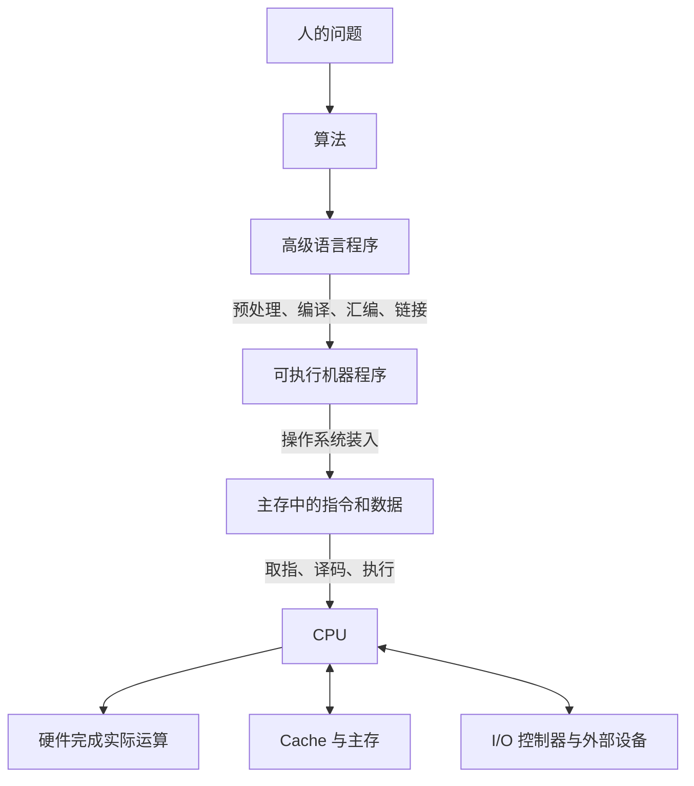

import { Accordion, Accordions } from 'fumadocs-ui/components/accordion';
import { InlineTOC } from 'fumadocs-ui/components/inline-toc';
import { Step, Steps } from 'fumadocs-ui/components/steps';
import { Tab, Tabs } from 'fumadocs-ui/components/tabs';
import { Binary, Cpu, Gauge, Languages, Layers3, TriangleAlert } from 'lucide-react';

<Callout title="本章定位" type="info">
  本章不是要求立刻掌握 CPU、存储器和指令系统的全部细节，而是先建立一张完整的“计算机地图”。其中，**性能计算是最高频考点**；冯·诺依曼机、语言转换和程序执行过程通常以概念辨析题出现。
</Callout>

<Cards>
  <Card title="系统结构" icon={<Layers3 />}>
    软硬件组成、系统层次、ISA、微体系结构与透明性。
  </Card>
  <Card title="程序执行" icon={<Cpu />}>
    存储程序、取指译码、指令与数据的区分、C 程序转换过程。
  </Card>
  <Card title="语言转换" icon={<Languages />}>
    机器语言、汇编语言、高级语言，以及编译、解释、汇编和链接。
  </Card>
  <Card title="性能分析" icon={<Gauge />}>
    主频、时钟周期、CPI、CPU 时间、MIPS、FLOPS、性能比与加速比。
  </Card>
</Cards>

<InlineTOC items={toc}>本章目录</InlineTOC>

## 一、知识地图



系统的核心关系可以压缩为：

```text
问题 → 算法 → 程序 → 机器指令 → 主存 → CPU 执行 → 得到结果
```

### 考试重要程度

<Tabs items={['必须完全掌握', '理解并辨析', '快速记忆']}>
  <Tab value="必须完全掌握">
    <ul>
      <li>冯·诺依曼机的基本思想与五大部件；</li>
      <li>CPU 如何区分指令和数据；</li>
      <li>三种程序设计语言与四类翻译程序；</li>
      <li>C 程序到可执行文件的四个阶段；</li>
      <li>CPU 执行时间、平均 CPI、性能比、加速比和 MIPS；</li>
      <li>为什么主频高不一定意味着性能高。</li>
    </ul>
  </Tab>
  <Tab value="理解并辨析">
    <ul>
      <li>系统软件与应用软件；</li>
      <li>ISA 与微体系结构；</li>
      <li>计算机体系结构与计算机组成；</li>
      <li>吞吐量与响应时间；</li>
      <li>软件与硬件的逻辑功能等价性；</li>
      <li>透明性的相对含义。</li>
    </ul>
  </Tab>
  <Tab value="快速记忆">
    <ul>
      <li>计算机硬件的四代发展；</li>
      <li>摩尔定律；</li>
      <li>机器字长的基本含义；</li>
      <li>FLOPS 的常用数量级。</li>
    </ul>
  </Tab>
</Tabs>

## 二、计算机系统的组成

一个完整的计算机系统由硬件和软件共同构成：

```math
\text{计算机系统}=\text{硬件系统}+\text{软件系统}
```

### 1. 硬件系统

硬件是能够直接观察到的物理设备，例如 CPU、主存、磁盘、总线、I/O 接口、键盘和显示器。

现代计算机可以从功能上概括为：

```text
CPU + 主存 + I/O 系统
```

其中 CPU 传统上由运算器和控制器构成：

```math
\text{CPU}=\text{运算器}+\text{控制器}
```

现代教材也常写成：

```math
\text{CPU}=\text{数据通路}+\text{控制单元}
```

- **数据通路**：ALU、寄存器、多路选择器和内部连接通路，负责保存并处理数据；
- **控制单元**：产生控制信号，组织取指、译码和执行。

<Callout title="快速理解" type="idea">
  运算器负责“干活”，控制器负责“指挥”；数据通路负责“数据怎样流动和运算”，控制单元负责“何时让哪个部件动作”。
</Callout>

### 2. 软件系统

软件不仅包括程序，还包括程序运行所需的数据和相关文档。

| 类型 | 作用 | 典型例子 |
| --- | --- | --- |
| 系统软件 | 管理硬件、控制系统运行、提供基础服务 | 操作系统、编译器、汇编器、数据库管理系统、标准程序库 |
| 应用软件 | 解决特定领域的实际问题 | 浏览器、游戏、财务软件、图像编辑器、办公软件 |

<Callout title="高频易错" type="warn" icon={<TriangleAlert />}>
  **数据库管理系统和编译器属于系统软件。**“由普通用户使用”不等于“应用软件”，分类关键在于它是否为整个系统或其他程序提供基础服务。
</Callout>

### 3. 存储器、外设与总线

| 部件 | 核心作用 | 关键特征 |
| --- | --- | --- |
| 寄存器 | 保存 CPU 当前使用的数据、地址和状态 | 容量最小，速度最快 |
| Cache | 缓存近期可能访问的指令和数据 | 位于 CPU 与主存之间 |
| 主存 | 保存正在运行的程序和数据 | CPU 可通过指令直接访问 |
| 外存 | 长期保存程序和数据 | 容量大，断电后通常不丢失 |
| I/O 控制器 | 控制外部设备并与主机通信 | 屏蔽设备内部细节 |
| 总线 | 在部件之间传输信息 | 传输数据、地址和控制信息 |

程序通常按下面的路径运行：

```text
外存中的可执行文件
        ↓ 操作系统装入
主存中的指令和数据
        ↓
CPU 取指并执行
```

## 三、计算机发展与机器字长

### 1. 硬件发展的四代

| 代次 | 主要逻辑元件 | 典型特点 |
| --- | --- | --- |
| 第一代 | 电子管 | 体积大、功耗高、速度低，主要使用机器语言 |
| 第二代 | 晶体管 | 体积和功耗下降，高级语言及编译程序发展 |
| 第三代 | 中小规模集成电路 | 半导体存储器发展，操作系统逐渐成熟 |
| 第四代 | 大规模、超大规模集成电路 | 微处理器、Cache、流水线和并行处理普及 |

<Callout title="记忆线索">
  计算机分代的主要依据是**逻辑元器件**：电子管 → 晶体管 → 集成电路 → 大规模、超大规模集成电路。
</Callout>

### 2. 摩尔定律

传统表述是：在价格大致不变时，集成电路中可容纳的晶体管数量大约每 18 个月翻一番。

考试通常只要求理解它反映的趋势：集成度提高推动了计算机体积减小、性能提高和成本下降，不要求讨论现代芯片是否仍严格遵循这一规律。

### 3. 机器字长

机器字长是 CPU 能够自然处理的数据宽度，通常与通用寄存器和 ALU 的基本宽度密切相关。

<Callout title="必须避免的误解" type="warn">
  64 位 CPU 不表示所有部件都恰好是 64 位，也不表示任何程序都会比 32 位 CPU 快一倍。指令寄存器、浮点寄存器、总线和 Cache 行宽都可能采用不同宽度。
</Callout>

## 四、冯·诺依曼计算机

### 1. 五个基本思想

<Cards>
  <Card title="存储程序">
    程序运行前，指令和数据先装入主存，启动后机器自动连续执行。
  </Card>
  <Card title="五大部件">
    运算器、控制器、存储器、输入设备和输出设备。
  </Card>
  <Card title="同形存储" icon={<Binary />}>
    指令和数据在存储器中都表现为二进制位串。
  </Card>
  <Card title="二进制表示">
    二进制规则简单，也容易由具有两个稳定状态的物理器件实现。
  </Card>
  <Card title="指令结构">
    一条指令通常由操作码和地址码组成：操作码说明做什么，地址码说明操作谁。
  </Card>
</Cards>

冯·诺依曼机原始五大部件是：

```text
运算器、控制器、存储器、输入设备、输出设备
```

现代实现通常把运算器和控制器集成到 CPU 中，但考试问“五大部件”时仍应回答原始划分。

### 2. 指令和数据如何区分

指令和数据在主存中都只是二进制位串，CPU **不是**根据二进制内容本身进行区分，也不是简单依据某个固定存储区域进行区分。

<Callout title="核心结论" type="success">
  CPU 主要根据**指令周期所处阶段和访问方式**区分指令与数据：取指阶段由 PC 指向并送入指令寄存器的内容被当作指令；执行阶段根据寻址方式取得的内容被当作数据。
</Callout>

例如：

```text
地址 100：LOAD 指令
地址 200：整数 35
```

当 PC 指向地址 100 时，CPU 将其中的内容作为指令取出并译码；译码后若指令要求读取地址 200，则地址 200 的内容在这次访问中被解释为数据。

因此，**指令或数据的身份由 CPU 的使用语境决定，而不是由位串自身决定。**

## 五、存储程序与指令执行

程序运行前，操作系统先把程序的指令和数据装入主存，并把第一条待执行指令的地址送入程序计数器 PC。

<Steps>
  <Step>
    ### 取指

    PC 保存下一条待执行指令的地址。CPU 按 PC 访问主存，将指令送入指令寄存器。
  </Step>
  <Step>
    ### 译码

    控制器分析操作码，确定当前指令需要完成的功能、使用的操作数和寻址方式。
  </Step>
  <Step>
    ### 取操作数

    根据地址码和寻址方式，从寄存器、主存、指令本身或 I/O 端口获得操作数。
  </Step>
  <Step>
    ### 执行

    ALU、访存单元、分支单元或其他功能部件完成实际操作。
  </Step>
  <Step>
    ### 写回与更新 PC

    将结果写回寄存器或主存，并确定下一条指令地址。普通顺序指令通常让 PC 前移，跳转指令则把 PC 改为目标地址。
  </Step>
</Steps>

顺序执行时：

```math
PC_{\text{new}}=PC_{\text{old}}+\text{当前指令长度}
```

发生跳转时：

```math
PC_{\text{new}}=\text{跳转目标地址}
```

### 条件语句如何变成机器操作

高级语言：

```c title="条件语句"
if (a > 0) {
  b = b + 1;
}
```

可能被转换为：

```asm title="示意性汇编" lineNumbers
LOAD  R1, a
CMP   R1, 0
JLE   END
LOAD  R2, b
ADD   R2, 1
STORE b, R2
END:
```

一个高级语言语句可能对应多条机器指令。CPU 通过比较指令设置条件状态，再由条件跳转指令决定是否执行加法和写回。

## 六、程序设计语言与翻译程序

### 1. 三种语言

```text tab="机器语言" tab-group="language-level"
10110000 00000101
```

```asm tab="汇编语言"
MOV AX, 5
ADD AX, BX
```

```c tab="高级语言"
c = a + b;
```

| 语言 | 表达形式 | 是否可由硬件直接执行 | 可移植性 |
| --- | --- | --- | --- |
| 机器语言 | 二进制机器指令编码 | 是 | 最差，与 ISA 强相关 |
| 汇编语言 | 机器指令助记符 | 否，必须汇编 | 较差，与机器结构相关 |
| 高级语言 | 接近人的问题描述 | 否，必须编译或解释 | 通常较好 |

<Callout title="必背结论" type="success">
  **只有机器语言程序能够被计算机硬件直接执行。**汇编语言虽然接近机器指令，但仍是符号表示，必须经过汇编器转换。
</Callout>

### 2. 四类处理程序

<Tabs items={['汇编器', '编译器', '解释器', '链接器']}>
  <Tab value="汇编器">

```text
汇编语言源程序 → 机器语言目标文件
```

把助记符形式的汇编指令转换为对应机器指令编码。

  </Tab>
  <Tab value="编译器">

```text
高级语言源程序 → 汇编程序或机器级目标程序
```

通常先分析并翻译整个源程序，再运行生成的目标程序。

  </Tab>
  <Tab value="解释器">

```text
读一句 → 翻译一句 → 立即执行一句
```

通常不生成可独立运行的目标文件。“翻译一句，执行一句”是最典型的识别特征。

  </Tab>
  <Tab value="链接器">

```text
目标模块 + 库文件 + 启动代码 → 可执行文件
```

主要完成外部符号解析、模块组合、地址重定位和库函数连接，不负责把高级语言翻译为机器语言。

  </Tab>
</Tabs>

### 3. 从 C 源程序到可执行文件

<Steps>
  <Step>
    ### 预处理：`.c → .i`

    展开头文件、替换宏、处理条件编译，并进行注释等文本处理。预处理仍然没有把高级语言转换为机器语言。
  </Step>
  <Step>
    ### 编译：`.i → .s`

    完成词法分析、语法分析、语义分析、中间代码生成、优化和目标代码生成，教材流程中通常输出汇编程序。
  </Step>
  <Step>
    ### 汇编：`.s → .o`

    将汇编语言转换为机器指令，得到可重定位目标文件。目标文件已经包含机器码，但外部符号可能尚未解析。
  </Step>
  <Step>
    ### 链接：`.o → 可执行文件`

    组合目标模块、库函数和启动代码，完成符号解析与地址重定位，生成最终可执行文件。
  </Step>
</Steps>

```text title="C 程序转换主线"
hello.c → hello.i → hello.s → hello.o → hello
  预处理      编译       汇编       链接
```

<Callout title="顺序口诀" type="idea">
  预处理 → 编译 → 汇编 → 链接。可以记成：**先展开文本，再翻译高级语言，再翻译汇编，最后合并模块。**
</Callout>

## 七、系统层次、ISA 与透明性

### 1. 系统层次结构

```text
应用问题层
    ↓
算法层
    ↓
高级语言层
    ↓
操作系统层
    ↓
指令集体系结构 ISA
    ↓
微体系结构
    ↓
数字逻辑与物理器件
```

每一层使用下层提供的功能，同时向上层隐藏不必要的实现细节。分层的价值在于降低复杂度：高级语言程序员无须直接组织逻辑门，应用程序也无须直接控制磁盘机械结构。

### 2. ISA 与微体系结构

<Tabs items={['ISA：规定做什么', '微体系结构：决定怎么做']}>
  <Tab value="ISA：规定做什么">

ISA 是软件和硬件之间的接口，通常规定：

<ul>
  <li>机器指令及其格式；</li>
  <li>寻址方式；</li>
  <li>程序员可见寄存器；</li>
  <li>数据类型；</li>
  <li>异常、中断和程序员可见状态。</li>
</ul>

软件只要遵循 ISA，就可以使用处理器承诺提供的能力。

  </Tab>
  <Tab value="微体系结构：决定怎么做">

微体系结构决定处理器内部如何实现 ISA，例如：

<ul>
  <li>使用何种加法器；</li>
  <li>流水线分为多少级；</li>
  <li>Cache 多大；</li>
  <li>分支预测如何设计；</li>
  <li>一条指令由哪些内部控制步骤完成。</li>
</ul>

同一个 ISA 可以由不同微体系结构实现。

  </Tab>
</Tabs>

### 3. 计算机体系结构与计算机组成

| 问题 | 所属领域 | 原因 |
| --- | --- | --- |
| 是否提供乘法指令 | 计算机体系结构 | 程序员可以观察和使用 |
| 有哪些寻址方式 | 计算机体系结构 | 属于 ISA 对软件的接口 |
| 乘法器采用阵列还是移位加法实现 | 计算机组成 | 属于内部硬件实现 |
| Cache 多大、流水线几级 | 计算机组成 | 通常不改变程序使用的指令语义 |

可以压缩记忆为：

```text
体系结构：机器对程序员承诺什么
计算机组成：硬件内部怎样兑现承诺
```

### 4. 透明性

在计算机领域，“某细节对用户透明”表示该用户**感受不到、也不需要知道**该细节，而不是表示它清晰可见。

透明性具有相对性：流水线级数通常对高级语言程序员透明，但对处理器设计者并不透明。

### 5. 软件与硬件的逻辑功能等价性

同一种功能可以由硬件实现，也可以由软件模拟。例如没有硬件乘法器时，可以用加法和移位完成乘法。

```math
7\times 4=7+7+7+7
```

二者可以得到相同逻辑结果，但在速度、成本、功耗、灵活性和设计复杂度上并不相同。

| 实现方式 | 优势 | 代价 |
| --- | --- | --- |
| 硬件实现 | 通常速度快 | 成本高、修改困难 |
| 软件实现 | 灵活、易修改、成本低 | 通常执行较慢 |

## 八、计算机性能的统一模型

### 1. 响应时间与吞吐量

| 指标 | 关注的问题 | 示例 |
| --- | --- | --- |
| 响应时间 | 单个任务多久完成 | 一个程序运行 2 秒、查询 100 ms 返回 |
| 吞吐量 | 单位时间完成多少任务 | 每秒处理 1000 个请求 |

增加 CPU 核心可能显著提高服务器吞吐量，但某个无法并行的单线程程序响应时间未必按同样比例缩短。

### 2. 时钟周期与主频

主频表示每秒包含多少个时钟周期，时钟周期表示一个周期持续多久。二者互为倒数：

```math
T=\frac{1}{f}
```

```math
f=\frac{1}{T}
```

例如主频为 2 GHz：

```math
\begin{aligned}
T
&=\frac{1}{2\times 10^9}\\
&=0.5\times 10^{-9}\ \mathrm{s}\\
&=0.5\ \mathrm{ns}
\end{aligned}
```

常用单位：

```math
1\ \mathrm{MHz}=10^6\ \mathrm{Hz}
```

```math
1\ \mathrm{GHz}=10^9\ \mathrm{Hz}
```

```math
1\ \mathrm{ms}=10^{-3}\ \mathrm{s},\quad
1\ \mathrm{\mu s}=10^{-6}\ \mathrm{s},\quad
1\ \mathrm{ns}=10^{-9}\ \mathrm{s}
```

### 3. CPI 与 IPC

CPI 表示平均每条指令消耗的时钟周期数：

```math
\mathrm{CPI}=\frac{\text{总时钟周期数}}{\text{指令条数}}
```

IPC 表示平均每个时钟周期完成的指令数。在简化模型中：

```math
\mathrm{IPC}=\frac{1}{\mathrm{CPI}}
```

现代超标量处理器能够在同一周期并行完成多条指令，因此可能出现 CPI 小于 1、IPC 大于 1 的情况。

### 4. 平均 CPI

若第 i 类指令占比为 α，单类 CPI 为对应的 CPI，则平均 CPI 必须按指令比例加权：

```math
\mathrm{CPI}_{\text{avg}}=\sum_i \alpha_i\mathrm{CPI}_i
```

并且：

```math
\sum_i\alpha_i=1
```

例如：

| 指令类型 | 比例 | CPI |
| --- | ---: | ---: |
| A | 50% | 2 |
| B | 20% | 3 |
| C | 10% | 4 |
| D | 20% | 5 |

```math
\begin{aligned}
\mathrm{CPI}_{\text{avg}}
&=0.5\times 2+0.2\times 3+0.1\times 4+0.2\times 5\\
&=3
\end{aligned}
```

<Callout title="高频错误" type="warn">
  不能把不同类型的 CPI 简单相加后除以指令种类数，除非每类指令数量完全相同。
</Callout>

### 5. CPU 执行时间

设指令条数为 IC、平均 CPI 为 CPI、主频为 f，则总时钟周期数为：

```math
\text{总时钟周期数}=IC\times \mathrm{CPI}
```

CPU 执行时间为：

```math
T_{\mathrm{CPU}}=IC\times \mathrm{CPI}\times T
```

代入时钟周期与主频的倒数关系：

```math
\boxed{
T_{\mathrm{CPU}}=\frac{IC\times \mathrm{CPI}}{f}
}
```

<Callout title="全章最重要公式" type="success">
  所有性能题先写出“CPU 执行时间 = 指令条数 × 平均 CPI ÷ 主频”，再判断题目改变了哪一项。不要仅凭主频、MIPS 或某个局部指标直接下结论。
</Callout>

### 6. 为什么主频高不一定更快

机器 A：主频 3 GHz，CPI 为 3；机器 B：主频 2 GHz，CPI 为 1。若两者执行相同数量的指令，则平均每条指令耗时分别为：

```math
\frac{3}{3\times 10^9}=1\ \mathrm{ns}
```

```math
\frac{1}{2\times 10^9}=0.5\ \mathrm{ns}
```

机器 A 主频更高，但机器 B 的平均指令耗时更短。因此性能由指令条数、CPI 和主频共同决定。

### 7. 性能比与加速比

性能与执行时间成反比：

```math
\text{性能}\propto\frac{1}{\text{执行时间}}
```

两台机器的性能比为：

```math
\frac{P_A}{P_B}=\frac{T_B}{T_A}
```

加速比为：

```math
S=\frac{T_{\text{old}}}{T_{\text{new}}}
```

执行时间越小，性能越高，所以性能比与时间比的方向必须相反。

## 九、典型性能题型

<Tabs items={['主频与 CPI', '编译优化', '局部加速', '平均 CPI']}>
  <Tab value="主频与 CPI">

已知 M1 主频为 2 GHz，运行程序需要 10 s。M2 执行同一程序时，平均 CPI 是 M1 的 1.5 倍。若 M2 要在 6 s 内完成，求最低主频。

M1 总时钟周期数：

```math
C_1=10\times 2\times 10^9=2\times 10^{10}
```

由于指令条数相同，M2 的总周期数为：

```math
C_2=1.5C_1=3\times 10^{10}
```

因此：

```math
\begin{aligned}
f_2
&=\frac{C_2}{T_2}\\
&=\frac{3\times 10^{10}}{6}\\
&=5\times 10^9\ \mathrm{Hz}\\
&=5\ \mathrm{GHz}
\end{aligned}
```

答案：5 GHz。

  </Tab>
  <Tab value="编译优化">

原执行时间为 20 s。优化后指令条数变为原来的 70%，平均 CPI 变为原来的 1.2 倍，主频不变。

```math
\frac{T_{\text{new}}}{T_{\text{old}}}
=0.7\times 1.2
=0.84
```

```math
T_{\text{new}}=20\times 0.84=16.8\ \mathrm{s}
```

指令条数减少并不意味着执行时间按相同比例减少，因为 CPI 也可能发生变化。

  </Tab>
  <Tab value="局部加速">

程序总运行时间为 100 s，其中 CPU 时间为 90 s，I/O 时间为 10 s。CPU 速度提高 50%，I/O 不变。

速度提高 50% 表示新速度是原来的 1.5 倍，因此：

```math
T_{\mathrm{CPU,new}}=\frac{90}{1.5}=60\ \mathrm{s}
```

```math
T_{\text{new}}=60+10=70\ \mathrm{s}
```

不能把整个 100 s 都除以 1.5，因为只有 CPU 部分被加速。

  </Tab>
  <Tab value="平均 CPI">

程序执行 10000 条指令，其中 80% 的指令 CPI 为 1，20% 的指令 CPI 为 10，主频为 1 GHz。

```math
\mathrm{CPI}_{\text{avg}}=0.8\times 1+0.2\times 10=2.8
```

```math
\text{总周期数}=10000\times 2.8=28000
```

```math
\begin{aligned}
T_{\mathrm{CPU}}
&=\frac{28000}{10^9}\\
&=2.8\times 10^{-5}\ \mathrm{s}\\
&=28\ \mathrm{\mu s}
\end{aligned}
```

  </Tab>
</Tabs>

## 十、IPS、MIPS 与 FLOPS

### 1. IPS 与 MIPS

IPS 表示每秒执行的指令数：

```math
\mathrm{IPS}=\frac{\text{指令条数}}{T_{\mathrm{CPU}}}
```

结合 CPU 执行时间公式：

```math
\mathrm{IPS}=\frac{f}{\mathrm{CPI}}
```

MIPS 表示每秒执行多少百万条指令：

```math
\mathrm{MIPS}=\frac{f}{\mathrm{CPI}\times 10^6}
```

当主频直接使用 MHz 表示时：

```math
\mathrm{MIPS}=\frac{\text{主频（MHz）}}{\mathrm{CPI}}
```

例如主频为 1.2 GHz，平均 CPI 为 3：

```math
\mathrm{MIPS}=\frac{1.2\times 10^9}{3\times 10^6}=400
```

### 2. MIPS 的局限

不同 ISA 中，一条指令完成的工作量可能不同。某台机器每秒执行更多“简单指令”，并不代表它更快完成同一实际任务。

<Callout title="适用边界" type="warn">
  MIPS 更适合在 ISA、程序和编译条件相近时进行参考比较，不适合单独用于跨 ISA 判断真实应用性能。
</Callout>

### 3. FLOPS

FLOPS 表示每秒执行的浮点运算次数，常用于科学计算、GPU、人工智能训练和超级计算机。

| 单位 | 数量级 |
| --- | ---: |
| MFLOPS | 10⁶ FLOPS |
| GFLOPS | 10⁹ FLOPS |
| TFLOPS | 10¹² FLOPS |
| PFLOPS | 10¹⁵ FLOPS |
| EFLOPS | 10¹⁸ FLOPS |
| ZFLOPS | 10²¹ FLOPS |

例如：

```math
93\ \mathrm{PFLOPS}=93\times 10^{15}=9.3\times 10^{16}\ \mathrm{FLOPS}
```

```text
MIPS：每秒执行多少百万条机器指令
FLOPS：每秒完成多少次浮点运算
```

## 十一、基准程序

基准程序是一组用于评价计算机性能的典型程序。不同机器运行相同或标准化负载，再比较执行时间或处理能力。

单看主频无法代表真实性能，因为结果还会受到以下因素影响：

- 指令条数和平均 CPI；
- Cache 与主存；
- 编译器优化；
- 分支预测；
- I/O 系统；
- 操作系统；
- 负载自身特征。

<Callout title="评价原则" type="idea">
  应选择能够代表真实使用场景的一组基准程序，而不是依赖单个简单测试。科学计算、数据库、游戏和编译任务对硬件资源的依赖并不相同。
</Callout>

## 十二、高频易错点

<Accordions type="multiple">
  <Accordion title="1. 汇编语言能被 CPU 直接执行吗？">
    不能。只有机器语言可以由硬件直接执行，汇编语言必须先经过汇编器转换为机器指令。
  </Accordion>
  <Accordion title="2. 编译器与链接器有什么区别？">
    编译器把高级语言转换为低级目标程序；链接器把目标文件、库函数和启动代码组合成可执行文件。
  </Accordion>
  <Accordion title="3. CPU 根据二进制编码区分指令和数据吗？">
    不是。CPU 依据当前指令周期阶段和访问方式区分：PC 取出的内容作为指令，执行阶段按寻址方式访问的内容作为数据。
  </Accordion>
  <Accordion title="4. 主频更高一定性能更强吗？">
    不一定。必须同时考虑指令条数、平均 CPI 和主频，真实程序还受到存储系统、分支和 I/O 等因素影响。
  </Accordion>
  <Accordion title="5. 性能比为什么与时间比方向相反？">
    性能与执行时间成反比。A 用时越少，A 性能越高，因此 A 与 B 的性能比等于 B 与 A 的时间比。
  </Accordion>
  <Accordion title="6. 速度提高 50% 等于时间减少 50% 吗？">
    不等于。新速度是原来的 1.5 倍，新时间是原时间除以 1.5，也就是原来的三分之二，时间约减少 33.3%。
  </Accordion>
  <Accordion title="7. 平均 CPI 可以直接取算术平均吗？">
    通常不能。必须根据每类指令在程序中的实际比例加权；只有各类指令数量相同才等价于算术平均。
  </Accordion>
  <Accordion title="8. MIPS 与 MFLOPS 是同一类指标吗？">
    不是。MIPS 衡量机器指令执行速率，MFLOPS 衡量浮点运算速率。
  </Accordion>
  <Accordion title="9. 存储容量和频率都按 1024 换算吗？">
    不是。KiB、MiB 等二进制容量单位按 2 的幂；GHz、GFLOPS 等频率和速率单位通常按 10 的幂。
  </Accordion>
</Accordions>

## 十三、章节自测

1. 冯·诺依曼机最核心的工作思想是什么？
2. 为什么同一串二进制既可能是指令，也可能是数据？
3. 汇编器、编译器、解释器和链接器分别处理什么输入？
4. C 源程序生成可执行文件的正确顺序是什么？
5. ISA 与微体系结构的区别是什么？
6. 若程序指令条数不变，主频提高 20%，CPI 也提高 20%，CPU 时间怎样变化？
7. 程序中某部分占总时间的 40%，将该部分加速 4 倍，新的总时间是原来的多少？
8. 为什么不能只用 MIPS 比较两种不同 ISA 的处理器？

<Accordions type="single">
  <Accordion title="查看参考答案">
    <ol>
      <li>存储程序：程序和数据先装入主存，机器按指令地址自动连续执行。</li>
      <li>指令与数据存储形式相同，身份由 CPU 当前执行阶段和访问方式决定。</li>
      <li>汇编器处理汇编语言；编译器处理高级语言；解释器边翻译边执行高级语言；链接器组合目标文件和库。</li>
      <li>预处理 → 编译 → 汇编 → 链接。</li>
      <li>ISA 规定软件可见的“做什么”，微体系结构决定硬件内部“怎样实现”。</li>
      <li>不变，因为 CPU 时间中的 CPI 和主频同时扩大 1.2 倍，比例相互抵消。</li>
      <li>原时间的 70%。未加速部分占 60%，加速部分变为 40% ÷ 4 = 10%，合计 70%。</li>
      <li>不同 ISA 的单条指令工作量不同，指令数更多或更少都不能直接代表完成真实任务的速度。</li>
    </ol>
  </Accordion>
</Accordions>

## 十四、公式总表

### 时钟周期与主频

```math
\boxed{T=\frac{1}{f}}
```

### 总时钟周期数

```math
\boxed{\text{总时钟周期数}=IC\times \mathrm{CPI}}
```

### CPU 执行时间

```math
\boxed{T_{\mathrm{CPU}}=\frac{IC\times \mathrm{CPI}}{f}}
```

### 平均 CPI

```math
\boxed{\mathrm{CPI}_{\text{avg}}=\sum_i\alpha_i\mathrm{CPI}_i}
```

### IPS 与 MIPS

```math
\boxed{\mathrm{IPS}=\frac{f}{\mathrm{CPI}}}
```

```math
\boxed{\mathrm{MIPS}=\frac{f}{\mathrm{CPI}\times 10^6}}
```

### 性能比与加速比

```math
\boxed{\frac{P_A}{P_B}=\frac{T_B}{T_A}}
```

```math
\boxed{S=\frac{T_{\text{old}}}{T_{\text{new}}}}
```

## 十五、考前一分钟速记

```text title="冯·诺依曼机"
存储程序
五大部件
指令和数据同形存储
二进制表示
指令由操作码和地址码组成
```

```text title="语言与翻译"
机器语言：直接执行
汇编语言：汇编后执行
高级语言：编译或解释后执行

高级变低级：编译
汇编变机器：汇编
一句一句执行：解释
多个模块组合：链接
```

```text title="程序转换"
.c → .i → .s → .o → 可执行文件
预处理 → 编译 → 汇编 → 链接
```

```text title="层次辨析"
ISA：规定做什么
微体系结构：决定怎么做
体系结构：程序员可见
计算机组成：内部怎样实现
```

```text title="性能核心"
CPU 执行时间 = 指令条数 × 平均 CPI ÷ 主频
性能与执行时间成反比
局部加速只能缩短被加速部分
平均 CPI 必须按指令比例加权
```

<Callout title="本章最终主线" type="success">
  程序必须先转换为机器指令并装入主存，CPU 再按照 PC 指示不断取指、译码和执行；性能计算则统一回到“指令条数、平均 CPI、主频”三个因素。
</Callout>
