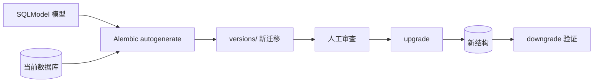

<Callout type="idea" title="目录定位">

`alembic/` 保存数据库结构的演进历史。模型文件描述“现在应该是什么样”，迁移脚本则记录“数据库怎样从旧状态一步步变成现在”。

</Callout>

## 目录结构

<Files>
  <Folder name="alembic" defaultOpen>
    <Folder name="versions" defaultOpen>
      <File name="e2412789... — 初始化 User 与 Item 表" />
      <File name="9c0a5491... — 限制字符串长度" />
      <File name="d98dd8ec... — 整数主键迁移为 UUID" />
      <File name="1a31ce60... — 外键级联删除" />
      <File name="fe56fa70... — 添加 created_at" />
    </Folder>
    <File name="env.py — 连接配置、模型元数据与迁移运行模式" />
    <File name="script.py.mako — 新迁移文件的生成模板" />
    <File name="README — 当前采用单数据库 Alembic 环境" />
  </Folder>
</Files>

## 迁移工作流

<Steps>
  <Step>
    ### 修改 SQLModel
    先在 `models.py` 中表达目标数据库结构。
  </Step>
  <Step>
    ### 生成候选迁移
    Alembic 比较 `SQLModel.metadata` 与当前数据库，生成 `upgrade()` / `downgrade()` 草稿。
  </Step>
  <Step>
    ### 人工审查脚本
    特别检查数据迁移、约束名称、非空字段和破坏性操作；自动生成并不等于一定安全。
  </Step>
  <Step>
    ### 执行并验证
    使用 `alembic upgrade head` 升级，再在测试数据库验证回滚与数据完整性。
  </Step>
</Steps>

## 文件导航

<Cards>
  <Card href="./env-py" title="env.py">理解 Alembic 如何拿到项目数据库 URL 和模型元数据。</Card>
  <Card href="./script-py-mako" title="script.py.mako">理解每个迁移文件的固定骨架。</Card>
  <Card href="./versions" title="versions/">按 revision 链阅读真实结构演进。</Card>
</Cards>

<Callout type="warn" title="迁移不是普通代码重构">

删除列、替换主键和新增非空约束都可能造成数据丢失或长时间锁表。生产迁移必须先备份、评估数据量，并设计可回滚方案。

</Callout>
