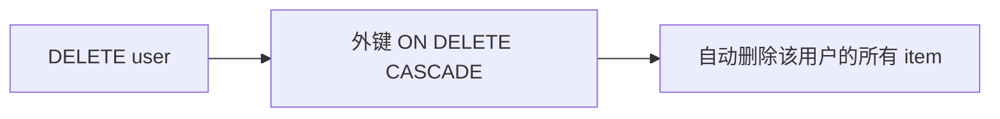

<Callout type="idea" title="迁移定位">

该迁移强化“项目必须属于用户”的业务不变量，并把用户删除后的项目清理交给数据库外键保证。

</Callout>

## 版本关系

| 字段 | 值 |
| --- | --- |
| 当前 revision | `1a31ce608336` |
| 父 revision | `d98dd8ec85a3` |
| 执行方向 | `upgrade()` 向前，`downgrade()` 回退 |

## Upgrade 的结构效果

- 将 `item.owner_id` 调整为 `NOT NULL`。
- 删除原有普通外键约束。
- 重新创建带 `ON DELETE CASCADE` 的所有权外键。
- 删除用户时，其拥有的项目会由数据库自动删除。

## 删除语义



## 带注释源码

> 原始路径：`backend/app/alembic/versions/1a31ce608336_add_cascade_delete_relationships.py`。注释用于解释迁移意图，执行语句保持不变。

```python title="1a31ce608336_add_cascade_delete_relationships.py" lineNumbers
"""Add cascade delete relationships

Revision ID: 1a31ce608336
Revises: d98dd8ec85a3
Create Date: 2024-07-31 22:24:34.447891

"""
from alembic import op
import sqlalchemy as sa
import sqlmodel.sql.sqltypes


# revision identifiers, used by Alembic.
revision = '1a31ce608336'
down_revision = 'd98dd8ec85a3'
branch_labels = None
depends_on = None


def upgrade():
    """收紧 owner_id，并把用户删除语义下沉到数据库。"""
    # ### commands auto generated by Alembic - please adjust! ###
    # 先保证所有 Item 都必须拥有所有者。
    op.alter_column('item', 'owner_id',
               existing_type=sa.UUID(),
               nullable=False)
    op.drop_constraint('item_owner_id_fkey', 'item', type_='foreignkey')
    op.create_foreign_key(None, 'item', 'user', ['owner_id'], ['id'], ondelete='CASCADE')  # [!code highlight]
    # ### end Alembic commands ###


def downgrade():
    """恢复普通外键并重新允许 owner_id 为空。"""
    # ### commands auto generated by Alembic - please adjust! ###
    op.drop_constraint('item_owner_id_fkey', 'item', type_='foreignkey')
    op.create_foreign_key('item_owner_id_fkey', 'item', 'user', ['owner_id'], ['id'])
    op.alter_column('item', 'owner_id',
               existing_type=sa.UUID(),
               nullable=True)
    # ### end Alembic commands ###
```

## 迁移审查重点

- 升级前必须确认没有 `owner_id IS NULL` 的历史项目。
- 级联删除是不可逆的数据删除语义，删除用户接口必须更加谨慎。
- 回滚会移除级联行为并允许 `owner_id` 为空，但不会恢复此前已级联删除的数据。
- 约束名称在不同数据库状态下可能不同，自动生成脚本需要核对。
