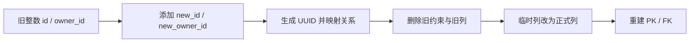

<Callout type="idea" title="迁移定位">

这是当前迁移链中最复杂、风险最高的一步。它不能直接修改主键类型，而是先创建临时 UUID 列、迁移数据和外键映射，再替换原主键与约束。

</Callout>

## 版本关系

| 字段 | 值 |
| --- | --- |
| 当前 revision | `d98dd8ec85a3` |
| 父 revision | `9c0a54914c78` |
| 执行方向 | `upgrade()` 向前，`downgrade()` 回退 |

## Upgrade 的结构效果

- 启用 PostgreSQL `uuid-ossp` 扩展。
- 为用户和项目创建临时 UUID 主键列，并为项目创建临时 UUID 所有者列。
- 为每条现有记录生成 UUID，并按旧整数外键建立新映射。
- 删除旧外键和整数主键列，再把临时列重命名为正式列。
- 重新创建主键与外键约束。

## 数据迁移策略



<Callout type="error" title="高风险迁移">

这类迁移应准备数据库备份、执行耗时评估、外部引用清单和失败恢复方案。仅验证迁移脚本“能跑完”还不够，还要核对行数、主外键映射和业务查询结果。

</Callout>

## 带注释源码

> 原始路径：`backend/app/alembic/versions/d98dd8ec85a3_edit_replace_id_integers_in_all_models_.py`。注释用于解释迁移意图，执行语句保持不变。

```python title="d98dd8ec85a3_edit_replace_id_integers_in_all_models_.py" lineNumbers
"""Edit replace id integers in all models to use UUID instead

Revision ID: d98dd8ec85a3
Revises: 9c0a54914c78
Create Date: 2024-07-19 04:08:04.000976

"""
from alembic import op
import sqlalchemy as sa
import sqlmodel.sql.sqltypes
from sqlalchemy.dialects import postgresql


# revision identifiers, used by Alembic.
revision = 'd98dd8ec85a3'
down_revision = '9c0a54914c78'
branch_labels = None
depends_on = None


def upgrade():
    """用临时列和数据映射把整数主键安全替换为 UUID。"""
    # UUID 生成函数来自 PostgreSQL 扩展。
    op.execute('CREATE EXTENSION IF NOT EXISTS "uuid-ossp"')

    # 第 1 阶段：先并行添加新列，保留旧主键供关系映射。
    op.add_column('user', sa.Column('new_id', postgresql.UUID(as_uuid=True), default=sa.text('uuid_generate_v4()')))
    op.add_column('item', sa.Column('new_id', postgresql.UUID(as_uuid=True), default=sa.text('uuid_generate_v4()')))
    op.add_column('item', sa.Column('new_owner_id', postgresql.UUID(as_uuid=True), nullable=True))

    # 第 2 阶段：生成 UUID，并根据旧 owner_id 回填新的外键。
    op.execute('UPDATE "user" SET new_id = uuid_generate_v4()')
    op.execute('UPDATE item SET new_id = uuid_generate_v4()')
    op.execute('UPDATE item SET new_owner_id = (SELECT new_id FROM "user" WHERE "user".id = item.owner_id)')  # [!code highlight]

    # Set the new_id as not nullable
    op.alter_column('user', 'new_id', nullable=False)
    op.alter_column('item', 'new_id', nullable=False)

    # 第 3 阶段：先拆约束，再替换列名，避免外键指向即将删除的列。
    op.drop_constraint('item_owner_id_fkey', 'item', type_='foreignkey')
    op.drop_column('item', 'owner_id')
    op.alter_column('item', 'new_owner_id', new_column_name='owner_id')

    op.drop_column('user', 'id')
    op.alter_column('user', 'new_id', new_column_name='id')

    op.drop_column('item', 'id')
    op.alter_column('item', 'new_id', new_column_name='id')

    # 第 4 阶段：为替换后的 UUID 列重建主键。
    op.create_primary_key('user_pkey', 'user', ['id'])
    op.create_primary_key('item_pkey', 'item', ['id'])

    # Recreate foreign key constraint
    op.create_foreign_key('item_owner_id_fkey', 'item', 'user', ['owner_id'], ['id'])

def downgrade():
    """重新分配整数主键并重建关系；数值不保证与原始 ID 相同。"""
    # Reverse the upgrade process
    op.add_column('user', sa.Column('old_id', sa.Integer, autoincrement=True))
    op.add_column('item', sa.Column('old_id', sa.Integer, autoincrement=True))
    op.add_column('item', sa.Column('old_owner_id', sa.Integer, nullable=True))

    # 为整数 ID 建立序列，再回填用户和项目的对应关系。
    # Generate sequences for the integer IDs if not exist
    op.execute('CREATE SEQUENCE IF NOT EXISTS user_id_seq AS INTEGER OWNED BY "user".old_id')
    op.execute('CREATE SEQUENCE IF NOT EXISTS item_id_seq AS INTEGER OWNED BY item.old_id')

    op.execute('SELECT setval(\'user_id_seq\', COALESCE((SELECT MAX(old_id) + 1 FROM "user"), 1), false)')
    op.execute('SELECT setval(\'item_id_seq\', COALESCE((SELECT MAX(old_id) + 1 FROM item), 1), false)')

    op.execute('UPDATE "user" SET old_id = nextval(\'user_id_seq\')')
    op.execute('UPDATE item SET old_id = nextval(\'item_id_seq\'), old_owner_id = (SELECT old_id FROM "user" WHERE "user".id = item.owner_id)')

    # Drop new columns and rename old columns back
    op.drop_constraint('item_owner_id_fkey', 'item', type_='foreignkey')
    op.drop_column('item', 'owner_id')
    op.alter_column('item', 'old_owner_id', new_column_name='owner_id')

    op.drop_column('user', 'id')
    op.alter_column('user', 'old_id', new_column_name='id')

    op.drop_column('item', 'id')
    op.alter_column('item', 'old_id', new_column_name='id')

    # Create primary key constraint
    op.create_primary_key('user_pkey', 'user', ['id'])
    op.create_primary_key('item_pkey', 'item', ['id'])

    # Recreate foreign key constraint
    op.create_foreign_key('item_owner_id_fkey', 'item', 'user', ['owner_id'], ['id'])
```

## 迁移审查重点

- 涉及主键、外键和历史数据重写，必须先在完整数据副本演练。
- 迁移期间可能长时间锁表，不适合在高流量下直接执行。
- 原代码使用列 `default` 描述，但真正历史数据填充依靠后续 `UPDATE`。
- 回滚会重新分配整数 ID，不保证恢复迁移前完全相同的数值。
- 外部系统若保存了旧整数 ID，需要同步迁移或建立映射表。
