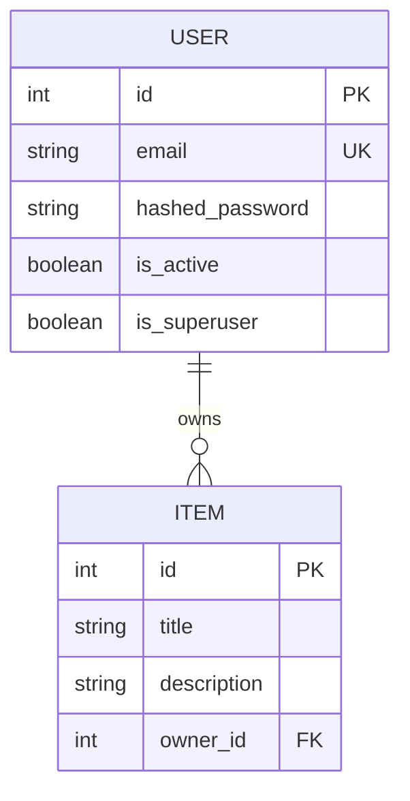

<Callout type="idea" title="迁移定位">

这是迁移链的根 revision，没有父版本。它把最初的 SQLModel 设计落成两张表，并建立用户与项目之间的所有权关系。

</Callout>

## 版本关系

| 字段 | 值 |
| --- | --- |
| 当前 revision | `e2412789c190` |
| 父 revision | `None（迁移链起点）` |
| 执行方向 | `upgrade()` 向前，`downgrade()` 回退 |

## Upgrade 的结构效果

- 创建 `user` 表，包含认证状态、姓名、整数主键和密码哈希。
- 在 `user.email` 上创建唯一索引，保证邮箱可作为登录身份。
- 创建 `item` 表，保存标题、描述、整数主键与 `owner_id`。
- 建立 `item.owner_id → user.id` 外键，但此时还没有级联删除。

## 初始关系模型



## 带注释源码

> 原始路径：`backend/app/alembic/versions/e2412789c190_initialize_models.py`。注释用于解释迁移意图，执行语句保持不变。

```python title="e2412789c190_initialize_models.py" lineNumbers
"""Initialize models

Revision ID: e2412789c190
Revises:
Create Date: 2023-11-24 22:55:43.195942

"""
import sqlalchemy as sa
import sqlmodel.sql.sqltypes
from alembic import op

# revision identifiers, used by Alembic.
revision = "e2412789c190"
down_revision = None
branch_labels = None
depends_on = None


def upgrade():
    """创建应用最初的数据表、索引和外键。"""
    # ### commands auto generated by Alembic - please adjust! ###
    op.create_table(
        "user",
        sa.Column("email", sqlmodel.sql.sqltypes.AutoString(), nullable=False),
        sa.Column("is_active", sa.Boolean(), nullable=False),
        sa.Column("is_superuser", sa.Boolean(), nullable=False),
        sa.Column("full_name", sqlmodel.sql.sqltypes.AutoString(), nullable=True),
        sa.Column("id", sa.Integer(), nullable=False),
        sa.Column(
            "hashed_password", sqlmodel.sql.sqltypes.AutoString(), nullable=False
        ),
        sa.PrimaryKeyConstraint("id"),
    )
    # 邮箱既用于登录查询，也必须在数据库层保证唯一。
    op.create_index(op.f("ix_user_email"), "user", ["email"], unique=True)  # [!code highlight]
    op.create_table(
        "item",
        sa.Column("description", sqlmodel.sql.sqltypes.AutoString(), nullable=True),
        sa.Column("id", sa.Integer(), nullable=False),
        sa.Column("title", sqlmodel.sql.sqltypes.AutoString(), nullable=False),
        sa.Column("owner_id", sa.Integer(), nullable=False),
        # 每个 Item 必须指向一个真实用户。
        sa.ForeignKeyConstraint(
            ["owner_id"],
            ["user.id"],
        ),
        sa.PrimaryKeyConstraint("id"),
    )
    # ### end Alembic commands ###


def downgrade():
    """按依赖逆序删除 Item、邮箱索引和 User 表。"""
    # ### commands auto generated by Alembic - please adjust! ###
    op.drop_table("item")
    op.drop_index(op.f("ix_user_email"), table_name="user")
    op.drop_table("user")
    # ### end Alembic commands ###
```

## 迁移审查重点

- 初始迁移通常只在空数据库执行；在已有同名表的数据库上会失败。
- 表名 `user` 在部分数据库中接近保留字，原脚本依靠 SQLAlchemy 正确引用。
- `downgrade()` 先删除依赖表 `item`，再删除用户索引和用户表，顺序不能颠倒。
- 数据库密码只保存哈希值，不能加入明文密码列。
