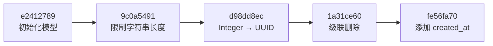

<Callout type="idea" title="阅读方法">

不要只按文件名排序阅读迁移。真正顺序由每个文件的 `revision` 与 `down_revision` 决定，它们共同组成迁移有向图。

</Callout>

## 当前迁移链

## 文件与影响

| Revision | 核心变化 | 风险关注 |
| --- | --- | --- |
| `e2412789c190` | 创建 `user`、`item`、唯一邮箱索引和外键 | 初始结构基线 |
| `9c0a54914c78` | 为邮箱、姓名、标题、描述设置 `VARCHAR(255)` | 现有超长数据可能阻止迁移 |
| `d98dd8ec85a3` | 将整数主键和外键转换为 UUID | 多步骤数据映射，风险最高 |
| `1a31ce608336` | `item.owner_id` 非空并启用 `ON DELETE CASCADE` | 删除用户会连带删除项目 |
| `fe56fa70289e` | 为用户和项目添加时区时间字段 | 当前允许为空，历史行不会自动补时间 |

## 文件导航

<Cards>
  <Card href="./e2412789c190_initialize_models-py" title="初始化模型">从零创建两张业务表。</Card>
  <Card href="./9c0a54914c78_add_max_length_for_string_varchar_-py" title="字符串长度">让数据库约束与 API 模型边界一致。</Card>
  <Card href="./d98dd8ec85a3_edit_replace_id_integers_in_all_models_-py" title="UUID 主键迁移">学习有数据情况下替换主键的多阶段策略。</Card>
  <Card href="./1a31ce608336_add_cascade_delete_relationships-py" title="级联关系">把所有权语义落实到数据库外键。</Card>
  <Card href="./fe56fa70289e_add_created_at_to_user_and_item-py" title="创建时间">为审计和排序增加时间字段。</Card>
</Cards>

<Callout type="warn" title="时间戳不等于执行顺序">

文件头的 `Create Date` 只用于记录生成时间；数据库真正依据 revision 依赖链决定执行顺序。

</Callout>
