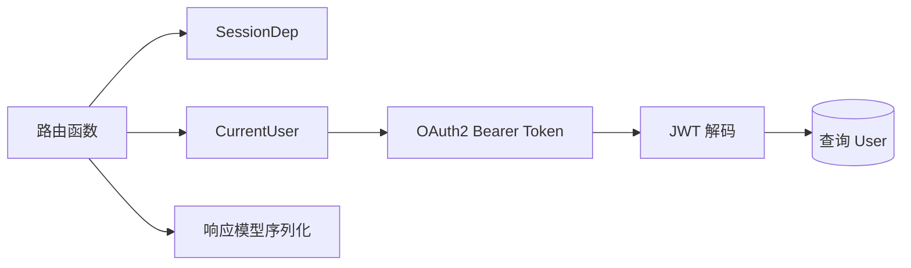

## 目录结构

<Files>
  <Folder name="api" defaultOpen>
    <Folder name="routes" defaultOpen>
      <File name="login.py — 登录与密码恢复" />
      <File name="users.py — 用户与个人资料" />
      <File name="items.py — 示例资源 CRUD" />
      <File name="utils.py — 邮件测试与健康检查" />
      <File name="private.py — 仅本地环境启用的内部接口" />
    </Folder>
    <File name="deps.py — 数据库会话、Token、当前用户和超级用户依赖" />
    <File name="main.py — 汇总所有子路由" />
    <File name="__init__.py — Python 包标识" />
  </Folder>
</Files>

## 请求处理分层

<Callout type="idea" title="依赖注入的价值">

路由函数只声明自己需要什么，FastAPI 负责创建数据库会话、提取令牌、验证用户并把结果传入函数。这样权限和资源释放逻辑能被复用与测试。

</Callout>
