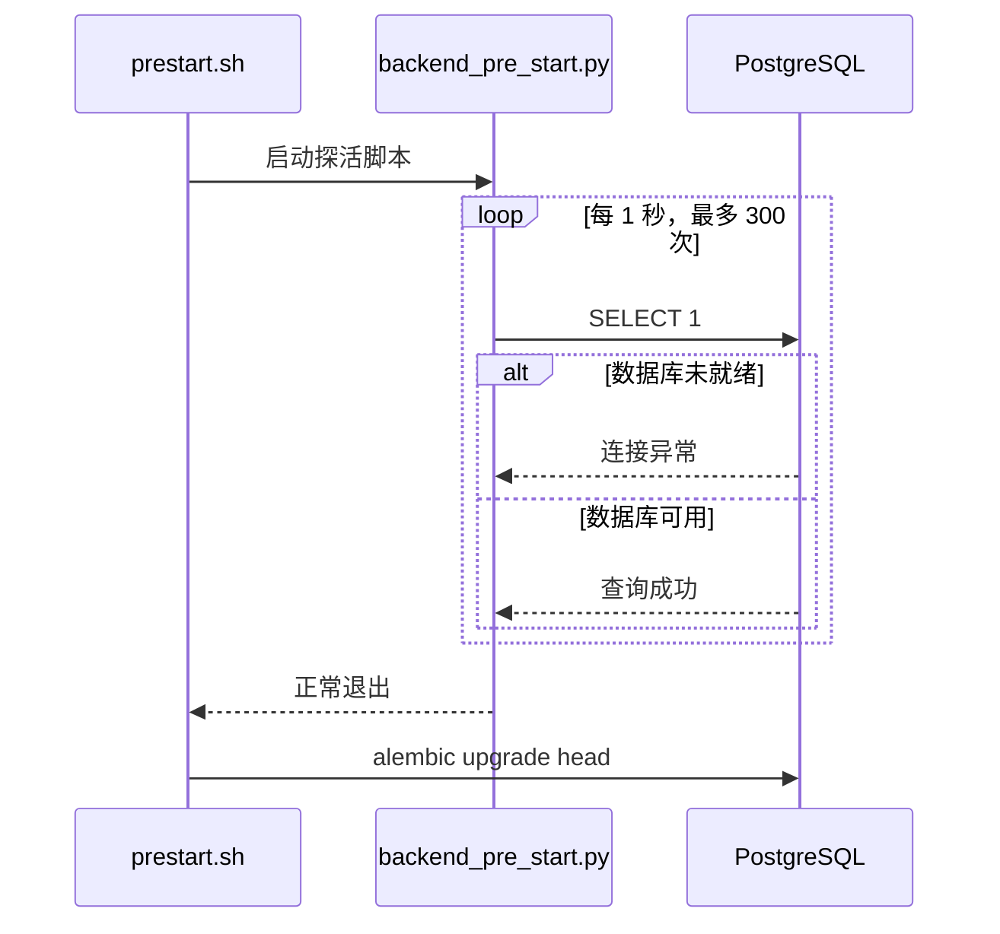

<Callout type="idea" title="文件定位">

这是生产或开发容器启动链中的“数据库就绪屏障”。容器已经启动并不代表 PostgreSQL 已经能接受查询，因此脚本会持续执行轻量检查，成功后才允许迁移和初始数据继续。

</Callout>

## 这个文件负责什么

- 使用项目统一的 SQLModel `engine` 建立短生命周期会话。
- 执行 `SELECT 1` 验证数据库连接，而不依赖任何业务表。
- 借助 Tenacity 按固定间隔重试，并记录每次尝试。
- 在达到最大次数后以异常退出，让容器或 CI 明确感知失败。

## 执行思路

1. 加载数据库引擎与日志配置。
2. Tenacity 调用 `init()`，每秒尝试一次。
3. 会话成功执行 `SELECT 1` 后结束重试。
4. `main()` 输出完成日志，后续脚本开始执行 Alembic 迁移。

## 与其他模块的关系

| 模块 | 关系 |
| --- | --- |
| `app/core/db.py` | 提供全局数据库引擎。 |
| `backend/scripts/prestart.sh` | 先调用本脚本，再迁移数据库并创建初始数据。 |
| `PostgreSQL` | 被检查的外部依赖；“容器运行中”不等于“数据库已就绪”。 |

## 启动时序



## 带注释源码

> 原始路径：`backend/app/backend_pre_start.py`。以下只补充学习性注释与高亮标记，不改变原始执行逻辑。

```python title="backend_pre_start.py" lineNumbers
import logging

from sqlalchemy import Engine
from sqlmodel import Session, select
from tenacity import after_log, before_log, retry, stop_after_attempt, wait_fixed

from app.core.db import engine

logging.basicConfig(level=logging.INFO)
logger = logging.getLogger(__name__)

# 最多重试 300 次，每次间隔 1 秒，总等待窗口约 5 分钟。
max_tries = 60 * 5  # 5 minutes
wait_seconds = 1


@retry(
    stop=stop_after_attempt(max_tries),
    wait=wait_fixed(wait_seconds),
    before=before_log(logger, logging.INFO),
    after=after_log(logger, logging.WARN),
)
def init(db_engine: Engine) -> None:
    """等待数据库可以建立会话并执行最小查询。"""
    try:
        with Session(db_engine) as session:
            # `SELECT 1` 不依赖业务表，适合作为最低成本的连接可用性检查。
            session.exec(select(1))  # [!code highlight]
    except Exception as e:
        # 记录本次失败后继续抛出，让 Tenacity 决定是否重试。
        logger.error(e)
        raise e


def main() -> None:
    """脚本入口：在迁移和应用启动前阻塞等待数据库。"""
    logger.info("Initializing service")
    init(engine)
    logger.info("Service finished initializing")


if __name__ == "__main__":
    main()
```

## 阅读重点

- `SELECT 1` 只能证明连接与基本查询可用，不能证明业务表已经迁移完成。
- 重试逻辑必须重新抛出异常，否则 Tenacity 会误判为成功。
- 固定 5 分钟窗口适合容器启动；更复杂系统可结合指数退避和健康检查。
