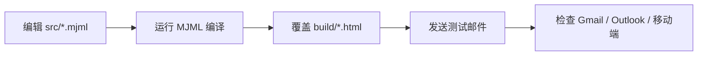

<Callout type="warn" title="生成目录">

`build/` 中的文件由 MJML 编译器生成。它们是运行时真正读取的模板，但不是日常编辑入口；任何手工修改都可能在下次构建时被覆盖。

</Callout>

## 文件组织

<Files>
  <Folder name="build" defaultOpen>
    <File name="new_account.html — 新账户邮件生成产物" />
    <File name="reset_password.html — 密码恢复邮件生成产物" />
    <File name="test_email.html — SMTP 测试邮件生成产物" />
  </Folder>
</Files>

## 为什么 HTML 看起来很复杂

<Accordions type="single">
  <Accordion title="大量 table 布局">
    许多邮件客户端对现代 CSS 布局支持有限，因此编译器会生成嵌套表格来保证版式稳定。
  </Accordion>
  <Accordion title="内联 style">
    Web 页面常用外部样式表，但邮件客户端可能剥离它们，所以关键样式会直接写入元素。
  </Accordion>
  <Accordion title="Outlook 条件注释">
    `<!--[if mso]>` 等片段专门为 Microsoft Outlook 的渲染引擎提供兼容结构。
  </Accordion>
  <Accordion title="保留模板变量">
    `{{ project_name }}`、`{{ link }}` 等占位符会穿过 MJML 编译过程，在发送前由 Jinja 渲染。
  </Accordion>
</Accordions>

## 正确维护流程

## 后续页面

本批次先整理生成目录的组织方式。三个完整 HTML 产物将在后续批次逐个补充结构导航，并保留完整源码供查阅。
