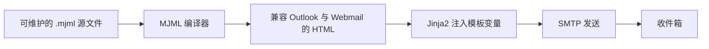

<Callout type="warn" title="生成产物，不要直接维护">

这是由 `email-templates/src/*.mjml` 编译得到的兼容性 HTML。日常修改应发生在 MJML 源文件中，再重新生成 `build/`；直接编辑这里的压缩 HTML 会在下次构建时被覆盖。

</Callout>

## 文件作用

用户发起忘记密码请求后，后端生成带过期时间的重置令牌，并把完整重置链接注入这封邮件。

## 模板变量

| 变量 | 运行时含义 |
| --- | --- |
| `{{ project_name }}` | 项目显示名称。 |
| `{{ username }}` | 用于称呼用户的邮箱或名称。 |
| `{{ link }}` | 包含密码重置令牌的前端地址。 |
| `{{ valid_hours }}` | 链接允许使用的小时数。 |

## 从 MJML 到最终邮件



## 语义骨架（学习版）

> 下面保留真正影响邮件内容的结构，并用注释解释关键点；浏览器兼容样式和 Outlook 条件注释由编译器自动生成。

```html title="reset_password.html-密码恢复邮件-semantic.html" lineNumbers
<main style="max-width: 600px; margin: auto; background: #fff">
  <h1>{{ project_name }} - Password Recovery</h1>
  <p>Hello {{ username }}</p>
  <p>Click the button below to reset your password.</p>

  <!-- 链接中通常携带短期 JWT；不要在日志或分析平台中记录完整 URL -->
  <a href="{{ link }}" target="_blank">Reset Password</a>
  <p>This link is valid for {{ valid_hours }} hours.</p>
</main>
```

<Accordions type="single">
  <Accordion title="查看完整 MJML 编译产物">

```html title="reset_password.html" lineNumbers
<!-- GENERATED FILE：请修改对应 .mjml 源文件后重新编译。 -->
<!doctype html><html xmlns="http://www.w3.org/1999/xhtml" xmlns:v="urn:schemas-microsoft-com:vml" xmlns:o="urn:schemas-microsoft-com:office:office"><head><title></title><!--[if !mso]><!-- --><meta http-equiv="X-UA-Compatible" content="IE=edge"><!--<![endif]--><meta http-equiv="Content-Type" content="text/html; charset=UTF-8"><meta name="viewport" content="width=device-width,initial-scale=1"><style type="text/css">#outlook a { padding:0; }
          .ReadMsgBody { width:100%; }
          .ExternalClass { width:100%; }
          .ExternalClass * { line-height:100%; }
          body { margin:0;padding:0;-webkit-text-size-adjust:100%;-ms-text-size-adjust:100%; }
          table, td { border-collapse:collapse;mso-table-lspace:0pt;mso-table-rspace:0pt; }
          img { border:0;height:auto;line-height:100%; outline:none;text-decoration:none;-ms-interpolation-mode:bicubic; }
          p { display:block;margin:13px 0; }</style><!--[if !mso]><!--><style type="text/css">@media only screen and (max-width:480px) {
            @-ms-viewport { width:320px; }
            @viewport { width:320px; }
          }</style><!--<![endif]--><!--[if mso]>
        <xml>
        <o:OfficeDocumentSettings>
          <o:AllowPNG/>
          <o:PixelsPerInch>96</o:PixelsPerInch>
        </o:OfficeDocumentSettings>
        </xml>
        <![endif]--><!--[if lte mso 11]>
        <style type="text/css">
          .outlook-group-fix { width:100% !important; }
        </style>
        <![endif]--><!--[if !mso]><!--><link href="https://fonts.googleapis.com/css?family=Ubuntu:300,400,500,700" rel="stylesheet" type="text/css"><style type="text/css">@import url(https://fonts.googleapis.com/css?family=Ubuntu:300,400,500,700);</style><!--<![endif]--><style type="text/css">@media only screen and (min-width:480px) {
        .mj-column-per-100 { width:100% !important; max-width: 100%; }
      }</style><style type="text/css"></style></head><body style="background-color:#fafbfc;"><div style="background-color:#fafbfc;"><!--[if mso | IE]><table align="center" border="0" cellpadding="0" cellspacing="0" class="" style="width:600px;" width="600" ><tr><td style="line-height:0px;font-size:0px;mso-line-height-rule:exactly;"><![endif]--><div style="background:#ffffff;background-color:#ffffff;Margin:0px auto;max-width:600px;"><table align="center" border="0" cellpadding="0" cellspacing="0" role="presentation" style="background:#ffffff;background-color:#ffffff;width:100%;"><tbody><tr><td style="direction:ltr;font-size:0px;padding:40px 20px;text-align:center;vertical-align:top;"><!--[if mso | IE]><table role="presentation" border="0" cellpadding="0" cellspacing="0"><tr><td class="" style="vertical-align:middle;width:560px;" ><![endif]--><div class="mj-column-per-100 outlook-group-fix" style="font-size:13px;text-align:left;direction:ltr;display:inline-block;vertical-align:middle;width:100%;"><table border="0" cellpadding="0" cellspacing="0" role="presentation" style="vertical-align:middle;" width="100%"><tr><td align="center" style="font-size:0px;padding:35px;word-break:break-word;"><div style="font-family:Arial, Helvetica, sans-serif;font-size:20px;line-height:1;text-align:center;color:#333333;">{{ project_name }} - Password Recovery</div></td></tr><tr><td align="center" style="font-size:0px;padding:10px 25px;padding-right:25px;padding-left:25px;word-break:break-word;"><div style="font-family:Arial, Helvetica, sans-serif;font-size:16px;line-height:1;text-align:center;color:#555555;"><span>Hello {{ username }}</span></div></td></tr><tr><td align="center" style="font-size:0px;padding:10px 25px;padding-right:25px;padding-left:25px;word-break:break-word;"><div style="font-family:Arial, Helvetica, sans-serif;font-size:16px;line-height:1;text-align:center;color:#555555;">We've received a request to reset your password. You can do it by clicking the button below:</div></td></tr><tr><td align="center" vertical-align="middle" style="font-size:0px;padding:15px 30px;word-break:break-word;"><table border="0" cellpadding="0" cellspacing="0" role="presentation" style="border-collapse:separate;line-height:100%;"><tr><td align="center" bgcolor="#009688" role="presentation" style="border:none;border-radius:8px;cursor:auto;padding:10px 25px;background:#009688;" valign="middle"><a href="{{ link }}" style="background:#009688;color:#ffffff;font-family:Ubuntu, Helvetica, Arial, sans-serif;font-size:18px;font-weight:normal;line-height:120%;Margin:0;text-decoration:none;text-transform:none;" target="_blank">Reset password</a></td></tr></table></td></tr><tr><td align="center" style="font-size:0px;padding:10px 25px;padding-right:25px;padding-left:25px;word-break:break-word;"><div style="font-family:Arial, Helvetica, sans-serif;font-size:16px;line-height:1;text-align:center;color:#555555;">Or copy and paste the following link into your browser:</div></td></tr><tr><td align="center" style="font-size:0px;padding:10px 25px;padding-right:25px;padding-left:25px;word-break:break-word;"><div style="font-family:Arial, Helvetica, sans-serif;font-size:16px;line-height:1;text-align:center;color:#555555;"><a href="{{ link }}">{{ link }}</a></div></td></tr><tr><td align="center" style="font-size:0px;padding:10px 25px;padding-right:25px;padding-left:25px;word-break:break-word;"><div style="font-family:Arial, Helvetica, sans-serif;font-size:16px;line-height:1;text-align:center;color:#555555;">This password will expire in {{ valid_hours }} hours.</div></td></tr><tr><td style="font-size:0px;padding:10px 25px;word-break:break-word;"><p style="border-top:solid 2px #cccccc;font-size:1;margin:0px auto;width:100%;"></p><!--[if mso | IE]><table align="center" border="0" cellpadding="0" cellspacing="0" style="border-top:solid 2px #cccccc;font-size:1;margin:0px auto;width:510px;" role="presentation" width="510px" ><tr><td style="height:0;line-height:0;"> &nbsp;
</td></tr></table><![endif]--></td></tr><tr><td align="center" style="font-size:0px;padding:10px 25px;padding-right:25px;padding-left:25px;word-break:break-word;"><div style="font-family:Arial, Helvetica, sans-serif;font-size:14px;line-height:1;text-align:center;color:#555555;">If you didn't request a password recovery you can disregard this email.</div></td></tr></table></div><!--[if mso | IE]></td></tr></table><![endif]--></td></tr></tbody></table></div><!--[if mso | IE]></td></tr></table><![endif]--></div></body></html>
```

  </Accordion>
</Accordions>

## 阅读重点

- 邮件 HTML 大量使用 `table`、内联样式和条件注释，是为了兼容 Outlook 等传统客户端，并不是普通网页推荐写法。
- `{ ... }` 在发送前由 Jinja2 替换；变量必须来自可信上下文，链接应使用 HTTPS。
- 账户密码通过邮件明文发送存在安全风险，真实系统更推荐发送一次性设置密码链接。
