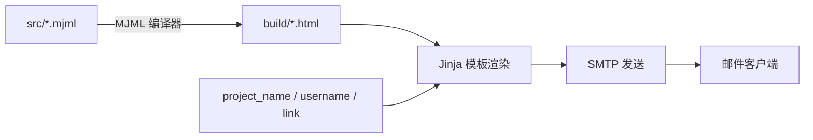

<Callout type="idea" title="目录定位">

项目使用 MJML 编写可维护的响应式邮件，再编译成兼容不同邮件客户端的 HTML。运行时只读取 `build/` 中的 HTML，并用模板变量填入真实内容。

</Callout>

## 目录结构

<Files>
  <Folder name="email-templates" defaultOpen>
    <Folder name="src" defaultOpen>
      <File name="new_account.mjml — 新账户欢迎邮件" />
      <File name="reset_password.mjml — 密码恢复邮件" />
      <File name="test_email.mjml — SMTP 测试邮件" />
    </Folder>
    <Folder name="build">
      <File name="new_account.html — 编译后的兼容 HTML" />
      <File name="reset_password.html — 编译后的兼容 HTML" />
      <File name="test_email.html — 编译后的兼容 HTML" />
    </Folder>
  </Folder>
</Files>

## 构建与发送链路

## 三类邮件

<Cards>
  <Card href="./src/new_account-mjml" title="新账户">向新用户提供登录入口和初始凭据。</Card>
  <Card href="./src/reset_password-mjml" title="密码恢复">发送带时效的重置链接，并提供安全提示。</Card>
  <Card href="./src/test_email-mjml" title="测试邮件">验证 SMTP、发件人和模板渲染是否工作。</Card>
</Cards>

<Callout type="warn" title="只编辑 src，不直接维护 build">

`build/*.html` 是生成产物，包含大量为 Outlook 等客户端准备的兼容代码。样式或内容修改应发生在 MJML 源文件，然后重新编译。

</Callout>
