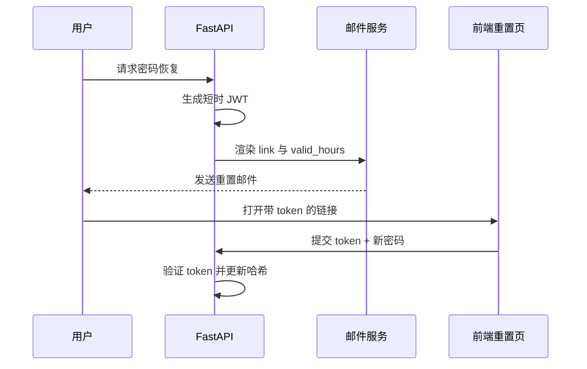

<Callout type="idea" title="模板定位">

用户发起“忘记密码”后，这个模板承载安全敏感的重置流程。它既提供明显按钮，也提供可复制的完整 URL，以兼容按钮被邮件客户端拦截的情况。

</Callout>

## 渲染数据

| 变量 | 含义 |
| --- | --- |
| `{{ project_name }}` | 邮件标题和品牌上下文。 |
| `{{ username }}` | 接收重置邮件的用户。 |
| `{{ link }}` | 包含重置令牌的前端地址。 |
| `{{ valid_hours }}` | 重置令牌剩余有效小时数。 |

## 内容组织思路

1. 说明系统收到密码恢复请求。
2. 提供醒目的 Reset password 按钮。
3. 再次显示完整 URL，作为按钮不可用时的备用方案。
4. 明确令牌有效时间，降低用户误解。
5. 提示非本人请求时可以忽略邮件。

## 安全链路



## 带注释模板

> 原始路径：`backend/app/email-templates/src/reset_password.mjml`。`{{ ... }}` 会在发送前由模板引擎替换。

```xml title="reset_password.mjml" lineNumbers
<mjml>
  <!-- 统一邮件画布背景。 -->
  <mj-body background-color="#fafbfc">
    <mj-section background-color="#fff" padding="40px 20px">
      <mj-column vertical-align="middle" width="100%">
        <!-- 清晰说明这是密码恢复邮件，降低钓鱼混淆。 -->
        <mj-text align="center" padding="35px" font-size="20px" font-family="Arial, Helvetica, sans-serif" color="#333">{{ project_name }} - Password Recovery</mj-text>
        <mj-text align="center" font-size="16px" padding-left="25px" padding-right="25px" font-family="Arial, Helvetica, sans-serif" color="#555"><span>Hello {{ username }}</span></mj-text>
        <mj-text align="center" font-size="16px" padding-left="25px" padding-right="25px" font-family="Arial, Helvetica, sans-serif" color="#555">We've received a request to reset your password. You can do it by clicking the button below:</mj-text>
        <!-- 带令牌的主操作链接；必须使用 HTTPS 并限制有效期。 -->
        <mj-button align="center" font-size="18px" background-color="#009688" border-radius="8px" color="#fff" href="{{ link }}" padding="15px 30px">Reset password</mj-button>
        <mj-text align="center" font-size="16px" padding-left="25px" padding-right="25px" font-family="Arial, Helvetica, sans-serif" color="#555">Or copy and paste the following link into your browser:</mj-text>
        <!-- 备用完整 URL，解决部分客户端按钮样式或跳转失效。 -->
        <mj-text align="center" font-size="16px" padding-left="25px" padding-right="25px" font-family="Arial, Helvetica, sans-serif" color="#555"><a href="{{ link }}">{{ link }}</a></mj-text>
        <!-- 实际过期时间来自后端 token 配置。 -->
        <mj-text align="center" font-size="16px" padding-left="25px" padding-right="25px" font-family="Arial, Helvetica, sans-serif" color="#555">This password will expire in {{ valid_hours }} hours.</mj-text>
        <mj-divider border-color="#ccc" border-width="2px"></mj-divider>
        <mj-text align="center" font-size="14px" padding-left="25px" padding-right="25px" font-family="Arial, Helvetica, sans-serif" color="#555">If you didn't request a password recovery you can disregard this email.</mj-text>
      </mj-column>
    </mj-section>
  </mj-body>
</mjml>
```

## 阅读重点

- 重置 URL 中的令牌应短时有效、不可预测，并在使用后失效。
- 接口响应不应泄露某邮箱是否注册，防止账户枚举。
- 链接应使用 HTTPS，邮件中不要展示或记录密码。
- 用户完成重置后，系统可考虑使旧会话或旧令牌失效。
