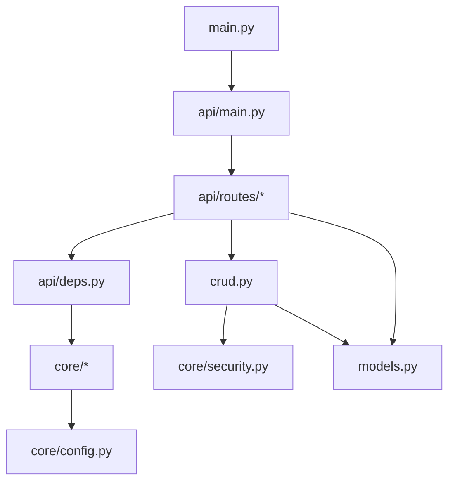

## 目录结构

<Files>
  <Folder name="app" defaultOpen>
    <Folder name="core" defaultOpen>
      <File name="config.py — 环境配置" />
      <File name="db.py — 数据库引擎与初始化" />
      <File name="security.py — 密码哈希与 JWT" />
    </Folder>
    <Folder name="api" defaultOpen>
      <Folder name="routes"><File name="具体 HTTP 接口" /></Folder>
      <File name="deps.py — 会话、令牌与当前用户依赖" />
      <File name="main.py — 路由聚合" />
    </Folder>
    <Folder name="alembic"><File name="数据库结构演进" /></Folder>
    <Folder name="email-templates"><File name="邮件模板" /></Folder>
    <File name="main.py — 应用组装入口" />
    <File name="models.py — 模型定义" />
    <File name="crud.py — 数据操作" />
    <File name="utils.py — 邮件与令牌辅助函数" />
    <File name="initial_data.py — 初始数据创建" />
    <File name="backend_pre_start.py — 启动前数据库检查" />
  </Folder>
</Files>

## 依赖方向

<Callout type="warn" title="避免循环依赖">

基础设施层应尽量位于依赖图下方。模型不应反向导入路由，核心配置也不应依赖具体业务接口。

</Callout>
