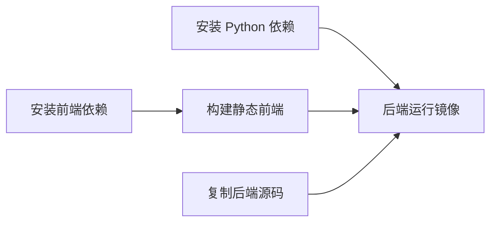

<Callout type="idea" title="配置层的目标">

后端配置需要同时服务于本地开发、CI 和生产镜像。关键做法是把依赖安装、源码复制和运行参数分层，从而获得更好的缓存、可复现性与安全性。

</Callout>

## 文件分工

| 文件 | 职责 | 阅读重点 |
| --- | --- | --- |
| `Dockerfile` | 构建前端并组装后端运行镜像 | 多阶段构建、依赖缓存、非开发运行方式 |
| `pyproject.toml` | 声明后端依赖与工具规则 | FastAPI/SQLModel 依赖、测试和静态检查配置 |
| `alembic.ini` | 配置迁移脚本位置与日志 | `script_location` 与迁移日志 |
| `.dockerignore` | 缩小 Docker 构建上下文 | 排除缓存、虚拟环境和测试产物 |
| `.gitignore` | 避免提交本地产物 | Python 缓存、覆盖率和虚拟环境 |

## Docker 多阶段构建



---

The original files are consolidated here for easier reading. Their contents are preserved verbatim inside code blocks.

## `.dockerignore`

> Original file: `backend/.dockerignore`

```text title=".dockerignore"
# Python
__pycache__
app.egg-info
*.pyc
.mypy_cache
.coverage
htmlcov
.venv

```

## `.gitignore`

> Original file: `backend/.gitignore`

```text title=".gitignore"
__pycache__
app.egg-info
*.pyc
.mypy_cache
.coverage
htmlcov
.cache
.venv

```

## `alembic.ini`

> Original file: `backend/alembic.ini`

```ini title="alembic.ini"
# A generic, single database configuration.

[alembic]
# path to migration scripts
script_location = app/alembic

# template used to generate migration files
# file_template = %%(rev)s_%%(slug)s

# timezone to use when rendering the date
# within the migration file as well as the filename.
# string value is passed to dateutil.tz.gettz()
# leave blank for localtime
# timezone =

# max length of characters to apply to the
# "slug" field
#truncate_slug_length = 40

# set to 'true' to run the environment during
# the 'revision' command, regardless of autogenerate
# revision_environment = false

# set to 'true' to allow .pyc and .pyo files without
# a source .py file to be detected as revisions in the
# versions/ directory
# sourceless = false

# version location specification; this defaults
# to alembic/versions.  When using multiple version
# directories, initial revisions must be specified with --version-path
# version_locations = %(here)s/bar %(here)s/bat alembic/versions

# the output encoding used when revision files
# are written from script.py.mako
# output_encoding = utf-8

# Logging configuration
[loggers]
keys = root,sqlalchemy,alembic

[handlers]
keys = console

[formatters]
keys = generic

[logger_root]
level = WARN
handlers = console
qualname =

[logger_sqlalchemy]
level = WARN
handlers =
qualname = sqlalchemy.engine

[logger_alembic]
level = INFO
handlers =
qualname = alembic

[handler_console]
class = StreamHandler
args = (sys.stderr,)
level = NOTSET
formatter = generic

[formatter_generic]
format = %(levelname)-5.5s [%(name)s] %(message)s
datefmt = %H:%M:%S

```

## `Dockerfile`

> Original file: `backend/Dockerfile`

```dockerfile title="Dockerfile"
FROM oven/bun:1 AS frontend-build

WORKDIR /app

COPY package.json bun.lock /app/
COPY frontend/package.json /app/frontend/

WORKDIR /app/frontend

RUN bun install

COPY ./frontend /app/frontend

ARG VITE_API_URL=

RUN bun run build


FROM python:3.14

ENV PYTHONUNBUFFERED=1

# Install uv
# Ref: https://docs.astral.sh/uv/guides/integration/docker/#installing-uv
COPY --from=ghcr.io/astral-sh/uv:0.9.26 /uv /uvx /bin/

# Compile bytecode
# Ref: https://docs.astral.sh/uv/guides/integration/docker/#compiling-bytecode
ENV UV_COMPILE_BYTECODE=1

# uv Cache
# Ref: https://docs.astral.sh/uv/guides/integration/docker/#caching
ENV UV_LINK_MODE=copy

WORKDIR /app/

# Place executables in the environment at the front of the path
# Ref: https://docs.astral.sh/uv/guides/integration/docker/#using-the-environment
ENV PATH="/app/.venv/bin:$PATH"

# Install dependencies
# Ref: https://docs.astral.sh/uv/guides/integration/docker/#intermediate-layers
RUN --mount=type=cache,target=/root/.cache/uv \
    --mount=type=bind,source=uv.lock,target=uv.lock \
    --mount=type=bind,source=pyproject.toml,target=pyproject.toml \
    uv sync --frozen --no-install-workspace --package app

COPY ./backend/scripts /app/backend/scripts

COPY ./backend/pyproject.toml ./backend/alembic.ini /app/backend/

COPY ./backend/app /app/backend/app

COPY --from=frontend-build /app/backend/app/frontend /app/backend/app/frontend

# Sync the project
# Ref: https://docs.astral.sh/uv/guides/integration/docker/#intermediate-layers
RUN --mount=type=cache,target=/root/.cache/uv \
    --mount=type=bind,source=uv.lock,target=uv.lock \
    --mount=type=bind,source=pyproject.toml,target=pyproject.toml \
    uv sync --frozen --package app

WORKDIR /app/backend/

CMD ["fastapi", "run", "--workers", "4"]

```

## `pyproject.toml`

> Original file: `backend/pyproject.toml`

```toml title="pyproject.toml"
[project]
name = "app"
version = "0.1.0"
description = ""
requires-python = ">=3.14,<4.0"
dependencies = [
    "fastapi[standard]>=0.141.1,<1.0.0",
    "python-multipart<1.0.0,>=0.0.27",
    "email-validator<3.0.0.0,>=2.1.0.post1",
    "tenacity<10.0.0,>=8.2.3",
    "pydantic>2.0",
    "emails>=1.1.2,<2.0",
    "jinja2<4.0.0,>=3.1.4",
    "alembic<2.0.0,>=1.12.1",
    "httpx<1.0.0,>=0.25.1",
    "psycopg[binary]>=3.3.4,<4.0.0",
    "sqlmodel>=0.0.39,<1.0.0",
    "pydantic-settings<3.0.0,>=2.2.1",
    "sentry-sdk[fastapi]>=2.66.1,<3.0.0",
    "pyjwt<3.0.0,>=2.13.0",
    "pwdlib[argon2,bcrypt]>=0.3.0",
]

[dependency-groups]
dev = [
    "pytest<10.0.0,>=7.4.3",
    "mypy<3.0.0,>=1.8.0",
    "ty>=0.0.25",
    "ruff<1.0.0,>=0.2.2",
    "coverage<8.0.0,>=7.4.3",
]

[build-system]
requires = ["hatchling"]
build-backend = "hatchling.build"

[tool.mypy]
strict = true
exclude = ["venv", ".venv", "alembic"]

[tool.ruff]
target-version = "py314"
exclude = ["alembic"]

[tool.ruff.lint]
select = [
    "E",  # pycodestyle errors
    "W",  # pycodestyle warnings
    "F",  # pyflakes
    "I",  # isort
    "B",  # flake8-bugbear
    "C4",  # flake8-comprehensions
    "UP",  # pyupgrade
    "ARG001", # unused arguments in functions
    "T201",   # print statements are not allowed
]
ignore = [
    "E501",  # line too long, handled by black
    "B008",  # do not perform function calls in argument defaults
    "W191",  # indentation contains tabs
    "B904",  # Allow raising exceptions without from e, for HTTPException
]

[tool.ruff.lint.pyupgrade]
# Preserve types, even if a file imports `from __future__ import annotations`.
keep-runtime-typing = true

[tool.coverage.run]
source = ["app"]
dynamic_context = "test_function"

[tool.coverage.report]
show_missing = true
sort = "-Cover"

[tool.coverage.html]
show_contexts = true

[tool.ty.terminal]
error-on-warning = true

[tool.fastapi]
entrypoint = "app.main:app"

```
