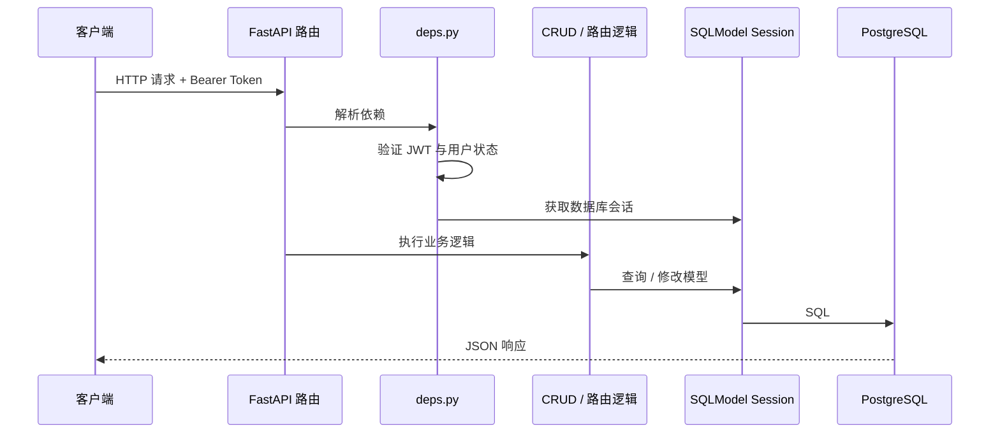

<Callout type="idea" title="后端学习主线">

先追踪一次请求如何进入应用，再理解依赖注入、权限判断、CRUD、模型和数据库会话。不要一开始就逐个文件孤立阅读。

</Callout>

## 目录职责

<Files>
  <Folder name="backend" defaultOpen>
    <Folder name="app" defaultOpen>
      <Folder name="api"><File name="路由聚合、依赖注入和接口实现" /></Folder>
      <Folder name="core"><File name="配置、数据库引擎与安全基础设施" /></Folder>
      <Folder name="alembic"><File name="数据库迁移环境与版本脚本" /></Folder>
      <Folder name="email-templates"><File name="MJML 源模板与构建后的 HTML" /></Folder>
      <File name="main.py — FastAPI 应用入口" />
      <File name="models.py — SQLModel 数据与接口模型" />
      <File name="crud.py — 可复用数据库操作" />
      <File name="utils.py — 邮件和重置令牌工具" />
    </Folder>
    <Folder name="tests"><File name="Pytest 测试与测试数据工具" /></Folder>
    <Folder name="scripts"><File name="启动前检查、格式化、检查和测试脚本" /></Folder>
    <File name="Dockerfile — 多阶段生产镜像" />
    <File name="pyproject.toml — Python 依赖与工具配置" />
    <File name="alembic.ini — 数据库迁移配置" />
  </Folder>
</Files>

## 一次请求的完整路径

## 建议阅读顺序

<Cards>
  <Card href="./app/main-py" title="1. 应用入口">理解 FastAPI 实例、中间件、路由与静态前端挂载。</Card>
  <Card href="./app/core" title="2. 核心设施">理解配置加载、数据库引擎和密码/JWT。</Card>
  <Card href="./app/api" title="3. API 层">理解依赖注入、鉴权和路由聚合。</Card>
  <Card href="./app/models-py" title="4. 数据模型">理解数据库实体与请求/响应模型如何分离。</Card>
  <Card href="./app/crud-py" title="5. 数据操作">理解事务边界、密码哈希和认证流程。</Card>
</Cards>
