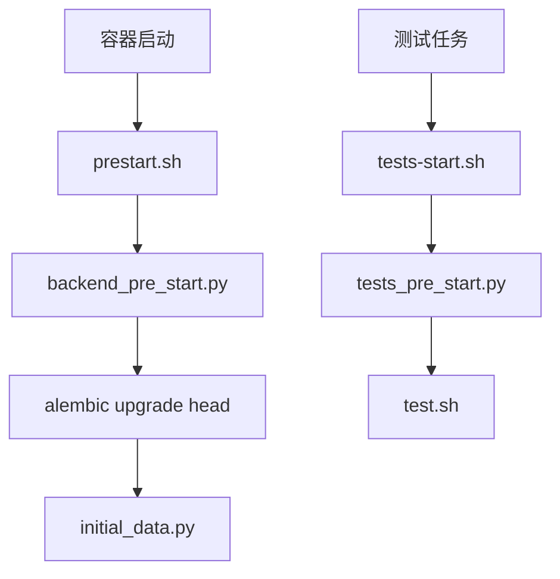

<Callout type="idea" title="目录定位">

`scripts/` 把一组容易遗漏或顺序敏感的命令封装成稳定入口。开发者、Docker 和 CI 调用同一脚本，可以减少“本地能过、流水线失败”的差异。

</Callout>

## 文件结构

<Files>
  <Folder name="scripts" defaultOpen>
    <File name="format.sh — 自动修复 Ruff 规则并格式化 Python" />
    <File name="lint.sh — 执行 mypy、ty、Ruff 检查" />
    <File name="prestart.sh — 等待数据库、迁移、初始化数据" />
    <File name="test.sh — 运行 Pytest 和覆盖率报告" />
    <File name="tests-start.sh — 测试数据库探活后调用 test.sh" />
  </Folder>
</Files>

## 使用场景

| 场景 | 建议入口 |
| --- | --- |
| 修改 Python 后统一格式 | `bash scripts/format.sh` |
| 提交前只检查不改文件 | `bash scripts/lint.sh` |
| 启动后端容器 | `bash scripts/prestart.sh` |
| 本地已有可用数据库时跑测试 | `bash scripts/test.sh` |
| CI / 测试容器完整启动 | `bash scripts/tests-start.sh` |

