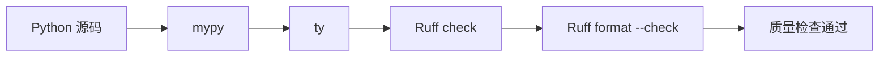

<Callout type="idea" title="脚本定位">

这是 CI 和提交前验证入口。与 `format.sh` 不同，它不会主动改源码；任何类型、规范或格式问题都会让命令失败。

</Callout>

## 这个文件负责什么

- 用 mypy 检查类型注解和调用关系。
- 用 ty 进行第二套快速类型分析。
- 用 Ruff 检查导入、风格和常见错误。
- 用 Ruff format 的 check 模式确认代码已格式化。

## 执行思路

1. 依次运行两个类型检查器。
2. 运行 Ruff 静态规则。
3. 仅比较格式化结果，不写回文件。
4. 任一步失败立即停止并返回非零退出码。

## 与其他模块的关系

| 模块 | 关系 |
| --- | --- |
| `format.sh` | 开发者可用它自动修复 lint 与格式问题。 |
| `pyproject.toml` | 集中配置 mypy、ty 与 Ruff。 |
| `GitHub Actions` | 可把脚本作为合并前必过检查。 |

## 四道门禁



## 带注释源码

> 原始路径：`backend/scripts/lint.sh`。以下只补充学习性注释与高亮标记，不改变原始执行逻辑。

```bash title="lint.sh" lineNumbers
#!/usr/bin/env bash

# 任一质量门禁失败都让脚本返回非零状态。
set -e
# 输出命令，便于知道具体卡在哪一个检查器。
set -x

# 成熟且生态广泛的静态类型检查器。
mypy app
# 使用另一套快速类型检查器交叉发现问题。
ty check app
# 检查代码规范，但不自动修改。
ruff check app
# 验证格式化结果，发现差异即失败。
ruff format app --check
```

## 阅读重点

- 两个类型检查器可能覆盖不同能力，也可能产生重复诊断。
- CI 中应使用 check 模式，避免流水线悄悄修改源码。
- 静态检查通过不代表运行时一定正确，仍需测试覆盖。
