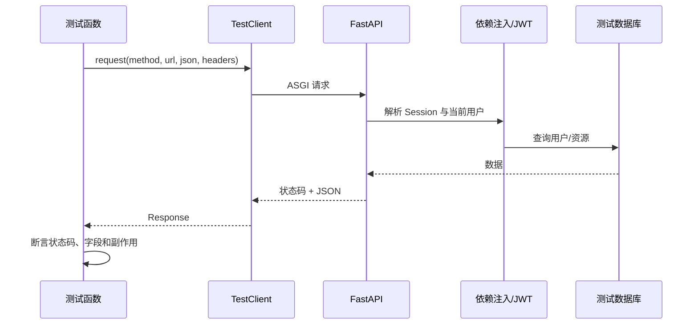

<Callout type="idea" title="目录定位">

这里的测试不会直接调用路由函数，而是通过 `TestClient` 发起真实风格的 HTTP 请求。这样可以同时覆盖路由匹配、依赖注入、JWT、状态码和响应序列化。

</Callout>

## 文件组织

<Files>
  <Folder name="api" defaultOpen>
    <Folder name="routes" defaultOpen>
      <File name="test_login.py — 登录、令牌验证、找回密码与重置密码" />
      <File name="test_users.py — 管理员用户管理和当前用户自助操作" />
      <File name="test_items.py — Item CRUD、所有权和权限边界" />
      <File name="test_private.py — 本地环境私有接口" />
      <File name="__init__.py — 路由测试包边界" />
    </Folder>
    <File name="__init__.py — API 测试包边界" />
  </Folder>
</Files>

## 一条 API 测试的执行路径

## 共享 Fixture

| 参数 | 来源 | 用途 |
| --- | --- | --- |
| `client` | `conftest.py` | 发起 HTTP 请求 |
| `db` | `conftest.py` | 准备数据或验证数据库副作用 |
| `superuser_token_headers` | `conftest.py` | 测试管理员接口 |
| `normal_user_token_headers` | `conftest.py` | 测试普通用户权限 |

## 阅读检查表

- 同一接口至少关注成功、未认证、无权限、资源不存在和输入非法等分支。
- 不只断言状态码，还要检查响应体和数据库最终状态。
- 测试数据应由工厂随机生成，避免与其他用例冲突。
- 权限测试要验证“看不到/改不了别人的资源”，而不只是正常 CRUD。

<Cards>
  <Card href="../conftest-py" title="共享 Fixture">理解客户端、数据库和 Token 从哪里来。</Card>
  <Card href="./routes" title="路由测试">下一批将逐个整理具体接口用例。</Card>
</Cards>
