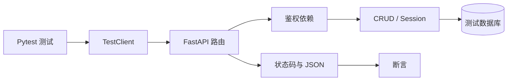

<Callout type="idea" title="目录定位">

这里使用 FastAPI `TestClient` 从 HTTP 层调用真实路由。与直接测试 CRUD 函数不同，它会覆盖路由匹配、依赖注入、认证、Pydantic/SQLModel 校验、异常映射与响应序列化。

</Callout>

## 测试分层

## 文件地图

<Cards>
  <Card href="./test_items-py" title="test_items.py">围绕资源所有权构造成功、404 与 403 三类路径。</Card>
  <Card href="./test_login-py" title="test_login.py">验证 OAuth2 表单登录、令牌使用、密码恢复和哈希迁移。</Card>
  <Card href="./test_users-py" title="test_users.py">覆盖普通用户与超级管理员的完整权限矩阵。</Card>
  <Card href="./test_private-py" title="test_private.py">验证测试环境专用的用户创建辅助接口。</Card>
</Cards>

## 一个高质量路由测试应断言什么

<Steps>
  <Step>
    ### HTTP 契约
    断言状态码、JSON 字段和错误 `detail`，确认客户端实际可观察到的行为。
  </Step>
  <Step>
    ### 权限边界
    同一资源分别使用所有者、非所有者与超级管理员凭据调用，避免只覆盖“快乐路径”。
  </Step>
  <Step>
    ### 数据库副作用
    创建、更新、删除后刷新或重新查询数据库，确认状态真正持久化。
  </Step>
  <Step>
    ### 安全行为
    对不存在邮箱返回通用消息、拒绝无效令牌，并避免泄露用户是否存在。
  </Step>
</Steps>

<Callout type="warn" title="不要依赖测试顺序">

每个测试都应自己准备数据，并由 fixture 在测试后清理。测试顺序一旦成为隐式前提，并行执行和单文件调试就会变得不可靠。

</Callout>
