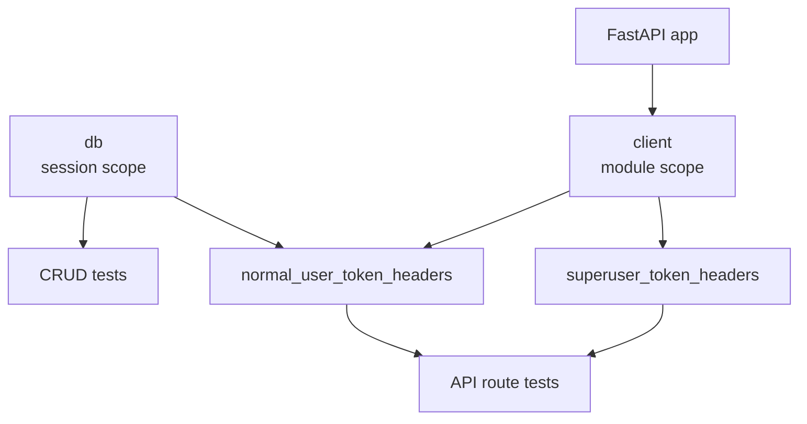

<Callout type="idea" title="Fixture 中心">

Pytest 会自动发现本文件中的 fixture。测试模块只需在函数参数中声明 `client`、`db` 或认证头，就能获得已经准备好的依赖。

</Callout>

## 这个文件负责什么

- 在整个测试 session 内复用一个数据库 Session。
- 测试开始时保证初始管理员存在。
- 测试结束后按外键顺序清理 Item 与 User。
- 为每个模块提供 FastAPI `TestClient`。
- 创建超级管理员和普通用户的 Bearer 请求头。

## 执行思路

1. Pytest 启动并自动执行 `db` fixture。
2. 初始化基础数据，`yield` 后开始运行测试。
3. 测试函数按名称注入客户端和认证头 fixture。
4. 全部测试完成后回到 `yield` 之后执行清理。
5. 提交删除事务并关闭 Session。

## 与其他模块的关系

| 模块 | 关系 |
| --- | --- |
| `app/main.py` | 提供被 TestClient 加载的真实 FastAPI 应用。 |
| `app/core/db.py` | 提供引擎和初始数据函数。 |
| `tests/utils/user.py` | 创建或登录普通测试用户。 |
| `tests/utils/utils.py` | 获取超级管理员 Token。 |
| `各测试模块` | 通过函数参数声明需要的 fixture。 |

## Fixture 依赖图



## Scope 对比

| Fixture | Scope | 原因 |
| --- | --- | --- |
| `db` | `session` | 初始化与最终清理只做一次 |
| `client` | `module` | 每个测试模块共享应用客户端生命周期 |
| 两种 token headers | `module` | 避免每个用例重复登录 |

## 带注释源码

> 原始路径：`backend/tests/conftest.py`。以下只补充学习性注释与高亮标记，不改变原始执行逻辑。

```python title="conftest.py" lineNumbers
from collections.abc import Generator

import pytest
from fastapi.testclient import TestClient
from sqlmodel import Session, delete

from app.core.config import settings
from app.core.db import engine, init_db
from app.main import app
from app.models import Item, User
from tests.utils.user import authentication_token_from_email
from tests.utils.utils import get_superuser_token_headers


@pytest.fixture(scope="session", autouse=True)
def db() -> Generator[Session]:
    """为整次测试会话提供数据库 Session，并在结束后清理数据。"""
    with Session(engine) as session:
        # 确保超级管理员等基础数据存在，再把会话交给测试。
        init_db(session)
        yield session  # [!code highlight]
        # teardown：先删依赖 User 的 Item，再删 User，遵守外键关系。
        statement = delete(Item)
        session.execute(statement)
        statement = delete(User)
        session.execute(statement)
        session.commit()


@pytest.fixture(scope="module")
def client() -> Generator[TestClient]:
    """为每个测试模块复用 FastAPI TestClient 生命周期。"""
    with TestClient(app) as c:
        yield c


@pytest.fixture(scope="module")
def superuser_token_headers(client: TestClient) -> dict[str, str]:
    """登录初始超级管理员并返回 Bearer 请求头。"""
    return get_superuser_token_headers(client)


@pytest.fixture(scope="module")
def normal_user_token_headers(client: TestClient, db: Session) -> dict[str, str]:
    """按测试邮箱创建/登录普通用户，并返回认证请求头。"""
    return authentication_token_from_email(
        client=client, email=settings.EMAIL_TEST_USER, db=db
    )
```

## 阅读重点

- `yield` 前是 setup，`yield` 后是 teardown，这是 Pytest fixture 的核心生命周期模式。
- `autouse=True` 让数据库 fixture 无需显式声明也会执行。
- Session 级清理会让用例共享数据库状态；每个测试仍应创建自己的数据并避免依赖顺序。
- 清理顺序必须遵守外键，先删除 Item 再删除 User。
- 最重要的安全前提是测试数据库与生产数据库完全隔离。
