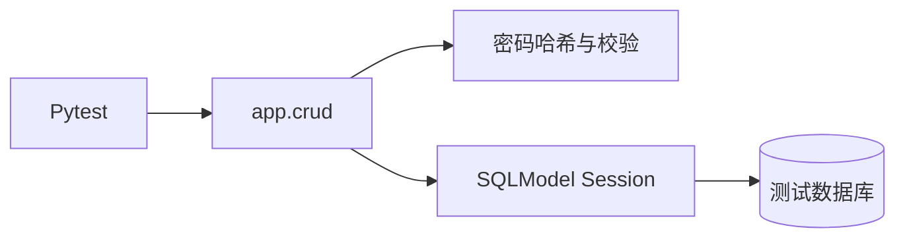

<Callout type="idea" title="为什么还需要 CRUD 测试">

路由测试证明外部 API 契约正确；CRUD 测试则把问题缩小到数据库与业务函数层。失败时可以更快判断是路由依赖、序列化问题，还是数据访问逻辑本身出错。

</Callout>

## 测试边界

<Cards>
  <Card href="./test_user-py" title="test_user.py">覆盖用户创建、认证、状态判断、查询、更新和旧哈希升级。</Card>
</Cards>

## 与 API 路由测试的区别

| 维度 | CRUD 测试 | 路由测试 |
| --- | --- | --- |
| 调用入口 | Python 函数 | HTTP 请求 |
| 覆盖范围 | 数据访问、哈希、持久化 | 路由、依赖、认证、响应模型 |
| 定位速度 | 更快、更精确 | 更接近真实客户端 |
| 两者关系 | 不能替代路由测试 | 不能替代底层函数测试 |
