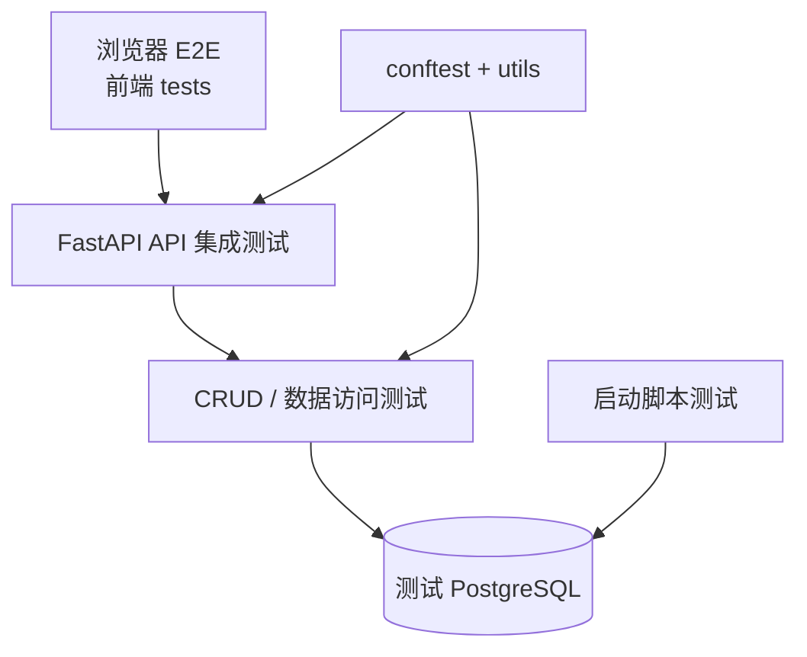

<Callout type="idea" title="测试目录定位">

后端测试以真实 FastAPI 应用和测试数据库为核心，既验证 HTTP 行为，也直接验证 CRUD 与启动脚本。`conftest.py` 提供共享环境，各子目录按被测层次组织。

</Callout>

## 目录结构

<Files>
  <Folder name="tests" defaultOpen>
    <Folder name="api" defaultOpen>
      <Folder name="routes"><File name="登录、用户、项目和私有接口测试" /></Folder>
    </Folder>
    <Folder name="crud"><File name="直接验证用户 CRUD 与认证逻辑" /></Folder>
    <Folder name="scripts"><File name="验证启动前脚本可以执行" /></Folder>
    <Folder name="utils"><File name="随机数据、用户和项目测试工厂" /></Folder>
    <File name="conftest.py — Session、TestClient 与认证头 fixture" />
    <File name="__init__.py — 测试包边界" />
  </Folder>
</Files>

## 测试层次

## 推荐阅读顺序

<Cards>
  <Card href="./conftest-py" title="1. conftest.py">先理解数据库清理、TestClient 和认证 fixture。</Card>
  <Card href="./api" title="2. API 测试">沿真实 HTTP 请求验证状态码、响应体和权限。</Card>
  <Card href="./crud" title="3. CRUD 测试">绕过 HTTP 层，聚焦数据库操作和密码验证。</Card>
  <Card href="./utils" title="4. 测试工具">理解随机数据和可复用工厂如何减少重复代码。</Card>
</Cards>

<Callout type="warn" title="数据库隔离">

测试配置必须指向独立数据库。当前 session fixture 会清空 `Item` 与 `User`，如果误连生产库会造成严重数据丢失。

</Callout>
