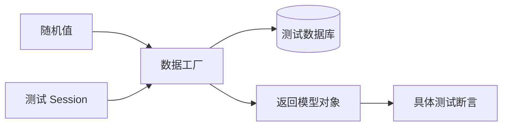

<Callout type="idea" title="目录定位">

`tests/utils/` 提供测试数据工厂和登录辅助函数。它们不是被测业务逻辑，而是让每个测试能够快速、独立地准备前置状态。

</Callout>

## 文件结构

<Files>
  <Folder name="utils" defaultOpen>
    <File name="item.py — 随机 Item 工厂" />
    <File name="user.py — 随机用户与认证头" />
    <File name="utils.py — 基础随机值与超级管理员 token" />
  </Folder>
</Files>

## 设计原则

- **唯一性**：邮箱和标题使用随机值，减少唯一约束冲突。
- **显式依赖**：数据库会话和 TestClient 通过参数传入，不使用隐藏全局状态。
- **返回业务对象**：工厂返回已持久化模型，测试可继续读取其 ID 和 owner。
- **少做断言**：辅助函数负责准备；最终行为断言留在具体测试中。

