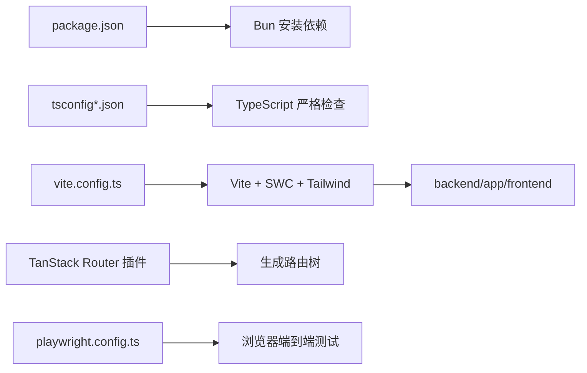

<Callout type="idea" title="配置页阅读方法">

这页把前端根目录多个配置文件集中到一起。阅读时不要把它们当成独立清单，而要理解它们共同定义了“依赖安装 → 类型检查 → Vite 构建 → Playwright 测试 → 静态文件交给 FastAPI”的工程流水线。

</Callout>

## 配置协作图



## 关键文件职责

| 文件 | 核心职责 | 常见修改时机 |
| --- | --- | --- |
| `package.json` | 脚本、运行依赖、开发依赖 | 升级框架或新增工具 |
| `vite.config.ts` | 插件、别名、输出目录 | 接入插件或调整构建 |
| `tsconfig.json` | TypeScript 严格度与路径映射 | 修改类型规则或别名 |
| `playwright.config.ts` | E2E 浏览器、重试、认证状态 | 增加浏览器或 CI 策略 |
| `components.json` | shadcn/ui 生成器约定 | 更换组件风格与别名 |
| `biome.json` | 格式化和静态检查 | 调整代码规范 |

<Callout type="warn" title="输出目录跨越前后端边界">

Vite 将生产文件输出到 `../backend/app/frontend`，随后 FastAPI 挂载并提供静态页面。修改 `outDir` 时必须同步检查 Dockerfile 与 `app.main` 的静态文件挂载逻辑。

</Callout>

---

The original files are consolidated here for easier reading. Their contents are preserved verbatim inside code blocks.

## `.dockerignore`

> Original file: `frontend/.dockerignore`

```text title=".dockerignore"
node_modules
dist

```

## `.env`

> Original file: `frontend/.env`

```text title=".env"
VITE_API_URL=http://localhost:8000
MAILCATCHER_HOST=http://localhost:1080

```

## `.gitignore`

> Original file: `frontend/.gitignore`

```text title=".gitignore"
# Logs
logs
*.log
npm-debug.log*
yarn-debug.log*
yarn-error.log*
pnpm-debug.log*
lerna-debug.log*

node_modules
dist
dist-ssr
*.local
openapi.json

# Editor directories and files
.vscode/*
!.vscode/extensions.json
.idea
.DS_Store
*.suo
*.ntvs*
*.njsproj
*.sln
*.sw?
/test-results/
/playwright-report/
/blob-report/
/playwright/.cache/
/playwright/.auth/

```

## `biome.json`

> Original file: `frontend/biome.json`

```json title="biome.json"
{
  "$schema": "https://biomejs.dev/schemas/2.3.14/schema.json",
  "assist": { "actions": { "source": { "organizeImports": "on" } } },
  "files": {
    "includes": [
      "**",
      "!**/dist/**/*",
      "!**/node_modules/**/*",
      "!**/src/routeTree.gen.ts",
      "!**/src/client/**/*",
      "!**/src/components/ui/**/*",
      "!**/playwright-report",
      "!**/playwright.config.ts"
    ]
  },
  "linter": {
    "enabled": true,
    "rules": {
      "recommended": true,
      "suspicious": {
        "noExplicitAny": "off",
        "noArrayIndexKey": "off"
      },
      "style": {
        "noNonNullAssertion": "off",
        "noParameterAssign": "error",
        "useSelfClosingElements": "error",
        "noUselessElse": "error"
      }
    }
  },
  "formatter": {
    "indentStyle": "space"
  },
  "javascript": {
    "formatter": {
      "quoteStyle": "double",
      "semicolons": "asNeeded"
    }
  },
  "css": {
    "parser": {
      "tailwindDirectives": true
    }
  }
}

```

## `components.json`

> Original file: `frontend/components.json`

```json title="components.json"
{
  "$schema": "https://ui.shadcn.com/schema.json",
  "style": "new-york",
  "rsc": false,
  "tsx": true,
  "tailwind": {
    "config": "",
    "css": "src/index.css",
    "baseColor": "neutral",
    "cssVariables": true,
    "prefix": ""
  },
  "iconLibrary": "lucide",
  "aliases": {
    "components": "@/components",
    "utils": "@/lib/utils",
    "ui": "@/components/ui",
    "lib": "@/lib",
    "hooks": "@/hooks"
  },
  "registries": {}
}

```

## `Dockerfile.playwright`

> Original file: `frontend/Dockerfile.playwright`

```dockerfile title="Dockerfile.playwright"
FROM mcr.microsoft.com/playwright:v1.61.1-noble

WORKDIR /app

RUN apt-get update && apt-get install -y unzip \
    && rm -rf /var/lib/apt/lists/*

RUN curl -fsSL https://bun.sh/install | bash
ENV PATH="/root/.bun/bin:$PATH"

COPY package.json bun.lock /app/

COPY frontend/package.json /app/frontend/

WORKDIR /app/frontend

RUN bun install

COPY ./frontend /app/frontend

```

## `index.html`

> Original file: `frontend/index.html`

```html title="index.html"
<!DOCTYPE html>
<html lang="en">
  <head>
    <meta charset="UTF-8" />
    <link rel="icon" type="image/svg+xml" href="/vite.svg" />
    <meta name="viewport" content="width=device-width, initial-scale=1.0" />
    <title>Full Stack FastAPI Project</title>
    <link rel="icon" type="image/x-icon" href="/assets/images/favicon.png" />
  </head>
  <body>
    <div id="root"></div>
    <script type="module" src="./src/main.tsx"></script>
  </body>
</html>

```

## `openapi-ts.config.ts`

> Original file: `frontend/openapi-ts.config.ts`

```ts title="openapi-ts.config.ts"
import { defineConfig } from "@hey-api/openapi-ts"

export default defineConfig({
  input: "./openapi.json",
  output: "./src/client",

  plugins: [
    "legacy/axios",
    {
      name: "@hey-api/sdk",
      // NOTE: this doesn't allow tree-shaking
      asClass: true,
      operationId: true,
      classNameBuilder: "{{name}}Service",
      methodNameBuilder: (operation) => {
        // @ts-expect-error
        let name: string = operation.name
        // @ts-expect-error
        const service: string = operation.service

        if (service && name.toLowerCase().startsWith(service.toLowerCase())) {
          name = name.slice(service.length)
        }

        return name.charAt(0).toLowerCase() + name.slice(1)
      },
    },
    {
      name: "@hey-api/schemas",
      type: "json",
    },
  ],
})

```

## `package.json`

> Original file: `frontend/package.json`

```json title="package.json"
{
  "name": "frontend",
  "private": true,
  "version": "0.0.0",
  "type": "module",
  "scripts": {
    "dev": "vite",
    "build": "tsc -p tsconfig.build.json && vite build",
    "lint": "biome check --write --unsafe --no-errors-on-unmatched --files-ignore-unknown=true ./",
    "preview": "vite preview",
    "generate-client": "openapi-ts",
    "test": "bunx playwright test",
    "test:ui": "bunx playwright test --ui"
  },
  "dependencies": {
    "@hookform/resolvers": "^5.4.0",
    "@radix-ui/react-avatar": "^1.1.12",
    "@radix-ui/react-checkbox": "^1.3.4",
    "@radix-ui/react-dialog": "^1.1.16",
    "@radix-ui/react-dropdown-menu": "^2.1.17",
    "@radix-ui/react-label": "^2.1.9",
    "@radix-ui/react-radio-group": "^1.4.0",
    "@radix-ui/react-scroll-area": "^1.2.11",
    "@radix-ui/react-select": "^2.3.0",
    "@radix-ui/react-separator": "^1.1.9",
    "@radix-ui/react-slot": "^1.2.4",
    "@radix-ui/react-tabs": "^1.1.14",
    "@radix-ui/react-tooltip": "^1.2.9",
    "@tailwindcss/vite": "^4.3.0",
    "@tanstack/react-query": "^5.101.0",
    "@tanstack/react-query-devtools": "^5.101.0",
    "@tanstack/react-router": "^1.170.15",
    "@tanstack/react-router-devtools": "^1.167.0",
    "@tanstack/react-table": "^8.21.3",
    "axios": "1.18.0",
    "class-variance-authority": "^0.7.1",
    "clsx": "^2.1.1",
    "form-data": "4.0.6",
    "lucide-react": "^1.17.0",
    "next-themes": "^0.4.6",
    "react": "^19.2.7",
    "react-dom": "^19.2.7",
    "react-error-boundary": "^6.1.2",
    "react-hook-form": "^7.78.0",
    "react-icons": "^5.6.0",
    "sonner": "^2.0.7",
    "tailwind-merge": "^3.6.0",
    "tailwindcss": "^4.2.1",
    "zod": "^4.4.3"
  },
  "devDependencies": {
    "@biomejs/biome": "^2.4.16",
    "@hey-api/openapi-ts": "0.73.0",
    "@playwright/test": "1.61.1",
    "@tanstack/router-devtools": "^1.167.0",
    "@tanstack/router-plugin": "^1.168.18",
    "@types/node": "^25.9.2",
    "@types/react": "^19.2.17",
    "@types/react-dom": "^19.2.3",
    "@vitejs/plugin-react-swc": "^4.3.1",
    "dotenv": "^17.4.2",
    "tw-animate-css": "^1.4.0",
    "typescript": "^5.9.3",
    "vite": "^8.0.16"
  }
}

```

## `playwright.config.ts`

> Original file: `frontend/playwright.config.ts`

```ts title="playwright.config.ts"
import { defineConfig, devices } from '@playwright/test';
import 'dotenv/config'

const baseURL = process.env.PLAYWRIGHT_BASE_URL ?? 'http://localhost:5173'

/**
 * Read environment variables from file.
 * https://github.com/motdotla/dotenv
 */

/**
 * See https://playwright.dev/docs/test-configuration.
 */
export default defineConfig({
  testDir: './tests',
  /* Run tests in files in parallel */
  fullyParallel: true,
  /* Fail the build on CI if you accidentally left test.only in the source code. */
  forbidOnly: !!process.env.CI,
  /* Retry on CI only */
  retries: process.env.CI ? 2 : 0,
  /* Opt out of parallel tests on CI. */
  workers: process.env.CI ? 1 : undefined,
  /* Reporter to use. See https://playwright.dev/docs/test-reporters */
  reporter: process.env.CI ? 'blob' : 'html',
  /* Shared settings for all the projects below. See https://playwright.dev/docs/api/class-testoptions. */
  use: {
    /* Base URL to use in actions like `await page.goto('/')`. */
    baseURL,

    /* Collect trace when retrying the failed test. See https://playwright.dev/docs/trace-viewer */
    trace: 'on-first-retry',
  },

  /* Configure projects for major browsers */
  projects: [
    { name: 'setup', testMatch: /.*\.setup\.ts/ },

    {
      name: 'chromium',
      use: {
        ...devices['Desktop Chrome'],
        storageState: 'playwright/.auth/user.json',
      },
      dependencies: ['setup'],
    },

    // {
    //   name: 'firefox',
    //   use: {
    //     ...devices['Desktop Firefox'],
    //     storageState: 'playwright/.auth/user.json',
    //   },
    //   dependencies: ['setup'],
    // },

    // {
    //   name: 'webkit',
    //   use: {
    //     ...devices['Desktop Safari'],
    //     storageState: 'playwright/.auth/user.json',
    //   },
    //   dependencies: ['setup'],
    // },

    /* Test against mobile viewports. */
    // {
    //   name: 'Mobile Chrome',
    //   use: { ...devices['Pixel 5'] },
    // },
    // {
    //   name: 'Mobile Safari',
    //   use: { ...devices['iPhone 12'] },
    // },

    /* Test against branded browsers. */
    // {
    //   name: 'Microsoft Edge',
    //   use: { ...devices['Desktop Edge'], channel: 'msedge' },
    // },
    // {
    //   name: 'Google Chrome',
    //   use: { ...devices['Desktop Chrome'], channel: 'chrome' },
    // },
  ],

  /* Run your local dev server before starting the tests */
  webServer: process.env.PLAYWRIGHT_BASE_URL
    ? undefined
    : {
        command: 'bun run dev',
        url: baseURL,
        reuseExistingServer: !process.env.CI,
      },
});

```

## `tsconfig.build.json`

> Original file: `frontend/tsconfig.build.json`

```json title="tsconfig.build.json"
{
  "extends": "./tsconfig.json",
  "exclude": ["tests/**/*.ts"]
}

```

## `tsconfig.json`

> Original file: `frontend/tsconfig.json`

```json title="tsconfig.json"
{
  "compilerOptions": {
    "target": "ES2020",
    "useDefineForClassFields": true,
    "lib": ["ES2020", "DOM", "DOM.Iterable"],
    "module": "ESNext",
    "skipLibCheck": true,
    /* Bundler mode */
    "moduleResolution": "bundler",
    "allowImportingTsExtensions": true,
    "resolveJsonModule": true,
    "isolatedModules": true,
    "noEmit": true,
    "jsx": "react-jsx",
    /* Linting */
    "strict": true,
    "noUnusedLocals": true,
    "noUnusedParameters": true,
    "noFallthroughCasesInSwitch": true,
    "baseUrl": ".",
    "paths": {
      "@/*": ["./src/*"]
    }
  },
  "include": ["src", "tests", "playwright.config.ts"],
  "references": [
    {
      "path": "./tsconfig.node.json"
    }
  ]
}

```

## `tsconfig.node.json`

> Original file: `frontend/tsconfig.node.json`

```json title="tsconfig.node.json"
{
  "compilerOptions": {
    "composite": true,
    "skipLibCheck": true,
    "module": "ESNext",
    "moduleResolution": "bundler",
    "allowSyntheticDefaultImports": true
  },
  "include": ["vite.config.ts"]
}

```

## `vite.config.ts`

> Original file: `frontend/vite.config.ts`

```ts title="vite.config.ts"
import path from "node:path"
import tailwindcss from "@tailwindcss/vite"
import { tanstackRouter } from "@tanstack/router-plugin/vite"
import react from "@vitejs/plugin-react-swc"
import { defineConfig } from "vite"

// https://vitejs.dev/config/
export default defineConfig({
  build: {
    outDir: "../backend/app/frontend",
    emptyOutDir: true,
  },
  resolve: {
    alias: {
      "@": path.resolve(__dirname, "./src"),
    },
  },
  plugins: [
    tanstackRouter({
      target: "react",
      autoCodeSplitting: true,
    }),
    react(),
    tailwindcss(),
  ],
})

```
