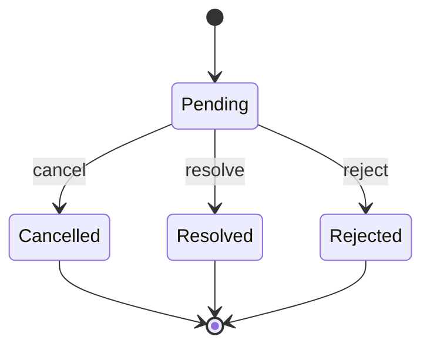

<Callout type="idea" title="文件定位">

HTTP 请求可能在页面卸载、参数变化或用户主动操作时失去意义。这个类保持 `then/catch/finally` 兼容，同时允许请求层注册取消处理器，例如调用 AbortController 或 Axios cancel。

</Callout>

## 这个文件负责什么

- 提供可识别的 CancelError。
- 跟踪 resolved、rejected 与 cancelled 三种终态。
- 允许 executor 注册多个清理函数。
- 把 then/catch/finally 转发给内部 Promise。
- 取消时执行清理并拒绝 Promise。

## 执行思路

1. 构造时创建内部 Promise。
2. executor 发起请求并注册取消处理器。
3. 正常完成时只允许 resolve/reject 一次。
4. 调用 cancel() 时执行清理回调并抛出 CancelError。

## 与其他模块的关系

| 模块 | 关系 |
| --- | --- |
| `request.ts` | 创建 CancelablePromise 并注册请求取消逻辑。 |
| `TanStack Query` | 查询失效或组件变化时可能触发取消。 |
| `AbortController/Axios` | 真正中止底层网络请求的实现。 |

## 状态机



## 带注释源码

> 原始路径：`frontend/src/client/core/CancelablePromise.ts`。以下仅增加学习性注释，不改变程序行为。

```ts title="CancelablePromise.ts" lineNumbers
// 取消不是普通网络失败：使用独立错误类型让调用方能够区分。
export class CancelError extends Error {
	constructor(message: string) {
		super(message);
		this.name = 'CancelError';
	}

	public get isCancelled(): boolean {
		return true;
	}
}

export interface OnCancel {
	readonly isResolved: boolean;
	readonly isRejected: boolean;
	readonly isCancelled: boolean;

	(cancelHandler: () => void): void;
}

// 组合原生 Promise，并额外保存取消状态与清理回调。
export class CancelablePromise<T> implements Promise<T> {
	private _isResolved: boolean;
	private _isRejected: boolean;
	private _isCancelled: boolean;
	readonly cancelHandlers: (() => void)[];
	readonly promise: Promise<T>;
	private _resolve?: (value: T | PromiseLike<T>) => void;
	private _reject?: (reason?: unknown) => void;

	constructor(
		executor: (
			resolve: (value: T | PromiseLike<T>) => void,
			reject: (reason?: unknown) => void,
			onCancel: OnCancel
		) => void
	) {
		this._isResolved = false;
		this._isRejected = false;
		this._isCancelled = false;
		this.cancelHandlers = [];
		this.promise = new Promise<T>((resolve, reject) => {
			this._resolve = resolve;
			this._reject = reject;

			const onResolve = (value: T | PromiseLike<T>): void => {
				if (this._isResolved || this._isRejected || this._isCancelled) {
					return;
				}
				this._isResolved = true;
				if (this._resolve) this._resolve(value);
			};

			const onReject = (reason?: unknown): void => {
				if (this._isResolved || this._isRejected || this._isCancelled) {
					return;
				}
				this._isRejected = true;
				if (this._reject) this._reject(reason);
			};

			const onCancel = (cancelHandler: () => void): void => {
				if (this._isResolved || this._isRejected || this._isCancelled) {
					return;
				}
				this.cancelHandlers.push(cancelHandler);
			};

			Object.defineProperty(onCancel, 'isResolved', {
				get: (): boolean => this._isResolved,
			});

			Object.defineProperty(onCancel, 'isRejected', {
				get: (): boolean => this._isRejected,
			});

			Object.defineProperty(onCancel, 'isCancelled', {
				get: (): boolean => this._isCancelled,
			});

			return executor(onResolve, onReject, onCancel as OnCancel);
		});
	}

	get [Symbol.toStringTag]() {
		return "Cancellable Promise";
	}

	public then<TResult1 = T, TResult2 = never>(
		onFulfilled?: ((value: T) => TResult1 | PromiseLike<TResult1>) | null,
		onRejected?: ((reason: unknown) => TResult2 | PromiseLike<TResult2>) | null
	): Promise<TResult1 | TResult2> {
		return this.promise.then(onFulfilled, onRejected);
	}

	public catch<TResult = never>(
		onRejected?: ((reason: unknown) => TResult | PromiseLike<TResult>) | null
	): Promise<T | TResult> {
		return this.promise.catch(onRejected);
	}

	public finally(onFinally?: (() => void) | null): Promise<T> {
		return this.promise.finally(onFinally);
	}

	// cancel() 只允许执行一次，并按注册顺序释放网络或订阅资源。
	public cancel(): void {
		if (this._isResolved || this._isRejected || this._isCancelled) {
			return;
		}
		this._isCancelled = true;
		if (this.cancelHandlers.length) {
			try {
				for (const cancelHandler of this.cancelHandlers) {
					cancelHandler();
				}
			} catch (error) {
				console.warn('Cancellation threw an error', error);
				return;
			}
		}
		this.cancelHandlers.length = 0;
		if (this._reject) this._reject(new CancelError('Request aborted'));
	}

	public get isCancelled(): boolean {
		return this._isCancelled;
	}
}
```

## 阅读重点

- 取消是第三种终态，必须阻止之后再次 resolve/reject。
- 取消回调应幂等，且不应抛出影响其他清理函数的异常。
- 现代实现也可直接围绕 AbortSignal 设计；生成代码保留该抽象用于兼容。

## Twoslash：Promise 兼容性

```ts twoslash
class Box<T> implements PromiseLike<T> {
  then<TResult1 = T>(
    onfulfilled?: ((value: T) => TResult1 | PromiseLike<TResult1>) | null,
  ): PromiseLike<TResult1> {
    return Promise.resolve(undefined as T).then(onfulfilled ?? undefined)
  }
}

const value = new Box<number>()
//    ^?
```
