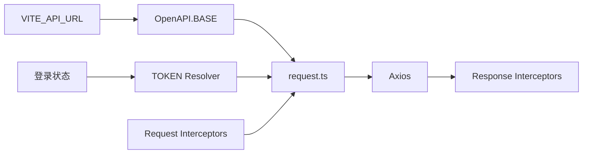

<Callout type="idea" title="文件定位">

生成 SDK 的所有请求都读取同一份 `OpenAPI` 配置。它把构建时生成的端点代码与运行时环境解耦：开发环境可以设置远程 API，登录后可以动态解析 token，也可以安装请求/响应拦截器。

</Callout>

## 这个文件负责什么

- 定义 BASE、版本和凭据策略。
- 支持静态值或异步 Resolver 形式的 token、用户名、密码和 headers。
- 维护请求与响应拦截器列表。
- 提供路径编码和跨域凭据开关。

## 执行思路

1. 应用启动时配置 BASE。
2. 登录状态变化时 TOKEN resolver 读取最新凭据。
3. request.ts 合并请求参数和全局配置。
4. 拦截器依次修改 Axios request/response。

## 与其他模块的关系

| 模块 | 关系 |
| --- | --- |
| `request.ts` | 读取配置并执行拦截器。 |
| `src/main.tsx / hooks` | 在应用层设置 base URL 或鉴权。 |
| `sdk.gen.ts` | 所有生成端点共享该配置。 |

## 配置解析链



## 带注释源码

> 原始路径：`frontend/src/client/core/OpenAPI.ts`。以下仅增加学习性注释，不改变程序行为。

```ts title="OpenAPI.ts" lineNumbers
import type { AxiosRequestConfig, AxiosResponse } from 'axios';
import type { ApiRequestOptions } from './ApiRequestOptions';

type Headers = Record<string, string>;
type Middleware<T> = (value: T) => T | Promise<T>;
type Resolver<T> = (options: ApiRequestOptions<T>) => Promise<T>;

// 轻量拦截器容器：按注册顺序保存请求或响应中间件。
export class Interceptors<T> {
  _fns: Middleware<T>[];

  constructor() {
    this._fns = [];
  }

  eject(fn: Middleware<T>): void {
    const index = this._fns.indexOf(fn);
    if (index !== -1) {
      this._fns = [...this._fns.slice(0, index), ...this._fns.slice(index + 1)];
    }
  }

  use(fn: Middleware<T>): void {
    this._fns = [...this._fns, fn];
  }
}

export type OpenAPIConfig = {
	BASE: string;
	CREDENTIALS: 'include' | 'omit' | 'same-origin';
	ENCODE_PATH?: ((path: string) => string) | undefined;
	HEADERS?: Headers | Resolver<Headers> | undefined;
	PASSWORD?: string | Resolver<string> | undefined;
	TOKEN?: string | Resolver<string> | undefined;
	USERNAME?: string | Resolver<string> | undefined;
	VERSION: string;
	WITH_CREDENTIALS: boolean;
	interceptors: {
		request: Interceptors<AxiosRequestConfig>;
		response: Interceptors<AxiosResponse>;
	};
};

// 全局运行时配置；应用启动时通常会写入 BASE 或 TOKEN resolver。
export const OpenAPI: OpenAPIConfig = {
	BASE: '',
	CREDENTIALS: 'include',
	ENCODE_PATH: undefined,
	HEADERS: undefined,
	PASSWORD: undefined,
	TOKEN: undefined,
	USERNAME: undefined,
	VERSION: '0.1.0',
	WITH_CREDENTIALS: false,
	interceptors: {
		request: new Interceptors(),
		response: new Interceptors(),
	},
};
```

## 阅读重点

- Resolver 比静态 token 更适合登录状态变化，避免保存过期快照。
- `WITH_CREDENTIALS` 与 `CREDENTIALS` 必须配合后端 CORS 和 Cookie 策略。
- 拦截器应有明确注册/卸载生命周期，避免热更新后重复添加。

## Twoslash：Resolver 的类型

```ts twoslash
type Resolver<T> = () => Promise<T>
type Token = string | Resolver<string>

const token: Token = async () => 'jwt'
//    ^?
```
