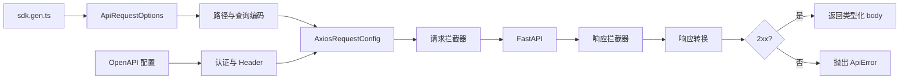

<Callout type="idea" title="文件定位">

这是生成客户端最关键的运行时文件。`sdk.gen.ts` 只描述“调用哪个端点”，而这里负责把端点描述真正转换为 HTTP 请求，并把传输层响应还原为类型化结果。

</Callout>

<Callout type="warn" title="自动生成文件">

该文件由 OpenAPI 客户端生成器维护。本文在代码块中增加的注释只用于学习；实际项目重新运行生成脚本时，手工改动可能被覆盖。需要改变长期行为时，应优先修改 OpenAPI 描述、生成器配置或生成模板。

</Callout>

## 这个文件负责什么

- 编码路径参数、查询参数和嵌套对象。
- 按 Bearer、Basic Auth 或自定义 Header 组装认证信息。
- 区分 JSON、文本、Blob 与 FormData 请求体。
- 用 AbortController 接入 CancelablePromise 的取消机制。
- 执行请求/响应拦截器与可选响应转换器。
- 把非成功状态转换为包含上下文的 ApiError。

## 执行思路

1. 从 OpenAPI 配置与 ApiRequestOptions 构造最终 URL。
2. 并行解析 token、用户名、密码和动态 headers。
3. 构造 AxiosRequestConfig，并注册取消回调。
4. 执行请求拦截器后发送请求。
5. 执行响应拦截器和 responseTransformer。
6. 检查状态码；成功时 resolve，失败时抛出 ApiError。

## 与其他模块的关系

| 模块 | 关系 |
| --- | --- |
| `sdk.gen.ts` | 为每个端点生成 ApiRequestOptions 并调用 request。 |
| `OpenAPI.ts` | 提供 BASE、认证解析器、凭据策略和拦截器。 |
| `CancelablePromise.ts` | 提供请求取消与 Promise 接口。 |
| `ApiError.ts / ApiResult.ts` | 统一失败信息和响应快照。 |
| `Axios` | 实际执行浏览器 HTTP 请求。 |

## 请求管线



<Tabs items={['查询参数', '请求体', '认证']}>
  <Tab>

数组会重复键名，日期使用 ISO 字符串，嵌套对象采用 `parent[child]` 形式递归展开。

  </Tab>
  <Tab>

普通对象默认按 JSON 发送；字符串按文本发送；Blob 保留自身 MIME；FormData 由浏览器负责边界参数。

  </Tab>
  <Tab>

Bearer token 优先从动态 resolver 获取；若同时存在用户名和密码，Basic Auth 会覆盖 Authorization Header。

  </Tab>
</Tabs>

## 带注释源码

> 原始路径：`frontend/src/client/core/request.ts`。以下仅增加学习性注释，不改变程序行为。

```ts title="request.ts" lineNumbers
import axios from 'axios';
import type { AxiosError, AxiosRequestConfig, AxiosResponse, AxiosInstance } from 'axios';

import { ApiError } from './ApiError';
import type { ApiRequestOptions } from './ApiRequestOptions';
import type { ApiResult } from './ApiResult';
import { CancelablePromise } from './CancelablePromise';
import type { OnCancel } from './CancelablePromise';
import type { OpenAPIConfig } from './OpenAPI';

// 基础类型守卫：后续序列化与 Header 处理依赖这些收窄结果。
export const isString = (value: unknown): value is string => {
	return typeof value === 'string';
};

export const isStringWithValue = (value: unknown): value is string => {
	return isString(value) && value !== '';
};

export const isBlob = (value: any): value is Blob => {
	return value instanceof Blob;
};

export const isFormData = (value: unknown): value is FormData => {
	return value instanceof FormData;
};

export const isSuccess = (status: number): boolean => {
	return status >= 200 && status < 300;
};

// 同时兼容浏览器 btoa 与 Node Buffer，方便测试和 SSR 环境。
export const base64 = (str: string): string => {
	try {
		return btoa(str);
	} catch (err) {
		// @ts-ignore
		return Buffer.from(str).toString('base64');
	}
};

// 递归编码数组、日期与嵌套对象，最终生成 URL 查询字符串。
export const getQueryString = (params: Record<string, unknown>): string => {
	const qs: string[] = [];

	const append = (key: string, value: unknown) => {
		qs.push(`${encodeURIComponent(key)}=${encodeURIComponent(String(value))}`);
	};

	const encodePair = (key: string, value: unknown) => {
		if (value === undefined || value === null) {
			return;
		}

		if (value instanceof Date) {
			append(key, value.toISOString());
		} else if (Array.isArray(value)) {
			value.forEach(v => encodePair(key, v));
		} else if (typeof value === 'object') {
			Object.entries(value).forEach(([k, v]) => encodePair(`${key}[${k}]`, v));
		} else {
			append(key, value);
		}
	};

	Object.entries(params).forEach(([key, value]) => encodePair(key, value));

	return qs.length ? `?${qs.join('&')}` : '';
};

// 把 OpenAPI 路径模板、路径参数、Base URL 和 query 组合为最终地址。
const getUrl = (config: OpenAPIConfig, options: ApiRequestOptions): string => {
	const encoder = config.ENCODE_PATH || encodeURI;

	const path = options.url
		.replace('{api-version}', config.VERSION)
		.replace(/{(.*?)}/g, (substring: string, group: string) => {
			if (options.path?.hasOwnProperty(group)) {
				return encoder(String(options.path[group]));
			}
			return substring;
		});

	const url = config.BASE + path;
	return options.query ? url + getQueryString(options.query) : url;
};

// 将 formData 描述转换为真正的 FormData；对象值退化为 JSON 字符串。
export const getFormData = (options: ApiRequestOptions): FormData | undefined => {
	if (options.formData) {
		const formData = new FormData();

		const process = (key: string, value: unknown) => {
			if (isString(value) || isBlob(value)) {
				formData.append(key, value);
			} else {
				formData.append(key, JSON.stringify(value));
			}
		};

		Object.entries(options.formData)
			.filter(([, value]) => value !== undefined && value !== null)
			.forEach(([key, value]) => {
				if (Array.isArray(value)) {
					value.forEach(v => process(key, v));
				} else {
					process(key, value);
				}
			});

		return formData;
	}
	return undefined;
};

type Resolver<T> = (options: ApiRequestOptions<T>) => Promise<T>;

// 配置项既可以是静态值，也可以是按请求动态计算的异步 resolver。
export const resolve = async <T>(options: ApiRequestOptions<T>, resolver?: T | Resolver<T>): Promise<T | undefined> => {
	if (typeof resolver === 'function') {
		return (resolver as Resolver<T>)(options);
	}
	return resolver;
};

// 并行解析认证与额外 Header，再根据请求体类型补充 Content-Type。
export const getHeaders = async <T>(config: OpenAPIConfig, options: ApiRequestOptions<T>): Promise<Record<string, string>> => {
	const [token, username, password, additionalHeaders] = await Promise.all([
		// @ts-ignore
		resolve(options, config.TOKEN),
		// @ts-ignore
		resolve(options, config.USERNAME),
		// @ts-ignore
		resolve(options, config.PASSWORD),
		// @ts-ignore
		resolve(options, config.HEADERS),
	]);

	const headers = Object.entries({
		Accept: 'application/json',
		...additionalHeaders,
		...options.headers,
	})
	.filter(([, value]) => value !== undefined && value !== null)
	.reduce((headers, [key, value]) => ({
		...headers,
		[key]: String(value),
	}), {} as Record<string, string>);

	if (isStringWithValue(token)) {
		headers['Authorization'] = `Bearer ${token}`;
	}

	if (isStringWithValue(username) && isStringWithValue(password)) {
		const credentials = base64(`${username}:${password}`);
		headers['Authorization'] = `Basic ${credentials}`;
	}

	if (options.body !== undefined) {
		if (options.mediaType) {
			headers['Content-Type'] = options.mediaType;
		} else if (isBlob(options.body)) {
			headers['Content-Type'] = options.body.type || 'application/octet-stream';
		} else if (isString(options.body)) {
			headers['Content-Type'] = 'text/plain';
		} else if (!isFormData(options.body)) {
			headers['Content-Type'] = 'application/json';
		}
	} else if (options.formData !== undefined) {
		if (options.mediaType) {
			headers['Content-Type'] = options.mediaType;
		}
	}

	return headers;
};

export const getRequestBody = (options: ApiRequestOptions): unknown => {
	if (options.body) {
		return options.body;
	}
	return undefined;
};

// 构造 Axios 配置、绑定 AbortController，并依次执行请求拦截器。
export const sendRequest = async <T>(
	config: OpenAPIConfig,
	options: ApiRequestOptions<T>,
	url: string,
	body: unknown,
	formData: FormData | undefined,
	headers: Record<string, string>,
	onCancel: OnCancel,
	axiosClient: AxiosInstance
): Promise<AxiosResponse<T>> => {
	const controller = new AbortController();

	let requestConfig: AxiosRequestConfig = {
		data: body ?? formData,
		headers,
		method: options.method,
		signal: controller.signal,
		url,
		withCredentials: config.WITH_CREDENTIALS,
	};

	onCancel(() => controller.abort());

	for (const fn of config.interceptors.request._fns) {
		requestConfig = await fn(requestConfig);
	}

	try {
		return await axiosClient.request(requestConfig);
	} catch (error) {
		const axiosError = error as AxiosError<T>;
		if (axiosError.response) {
			return axiosError.response;
		}
		throw error;
	}
};

export const getResponseHeader = (response: AxiosResponse<unknown>, responseHeader?: string): string | undefined => {
	if (responseHeader) {
		const content = response.headers[responseHeader];
		if (isString(content)) {
			return content;
		}
	}
	return undefined;
};

export const getResponseBody = (response: AxiosResponse<unknown>): unknown => {
	if (response.status !== 204) {
		return response.data;
	}
	return undefined;
};

// 先合并通用状态码与端点自定义错误，再统一抛出结构化 ApiError。
export const catchErrorCodes = (options: ApiRequestOptions, result: ApiResult): void => {
	const errors: Record<number, string> = {
		400: 'Bad Request',
		401: 'Unauthorized',
		402: 'Payment Required',
		403: 'Forbidden',
		404: 'Not Found',
		405: 'Method Not Allowed',
		406: 'Not Acceptable',
		407: 'Proxy Authentication Required',
		408: 'Request Timeout',
		409: 'Conflict',
		410: 'Gone',
		411: 'Length Required',
		412: 'Precondition Failed',
		413: 'Payload Too Large',
		414: 'URI Too Long',
		415: 'Unsupported Media Type',
		416: 'Range Not Satisfiable',
		417: 'Expectation Failed',
		418: 'Im a teapot',
		421: 'Misdirected Request',
		422: 'Unprocessable Content',
		423: 'Locked',
		424: 'Failed Dependency',
		425: 'Too Early',
		426: 'Upgrade Required',
		428: 'Precondition Required',
		429: 'Too Many Requests',
		431: 'Request Header Fields Too Large',
		451: 'Unavailable For Legal Reasons',
		500: 'Internal Server Error',
		501: 'Not Implemented',
		502: 'Bad Gateway',
		503: 'Service Unavailable',
		504: 'Gateway Timeout',
		505: 'HTTP Version Not Supported',
		506: 'Variant Also Negotiates',
		507: 'Insufficient Storage',
		508: 'Loop Detected',
		510: 'Not Extended',
		511: 'Network Authentication Required',
		...options.errors,
	}

	const error = errors[result.status];
	if (error) {
		throw new ApiError(options, result, error);
	}

	if (!result.ok) {
		const errorStatus = result.status ?? 'unknown';
		const errorStatusText = result.statusText ?? 'unknown';
		const errorBody = (() => {
			try {
				return JSON.stringify(result.body, null, 2);
			} catch (e) {
				return undefined;
			}
		})();

		throw new ApiError(options, result,
			`Generic Error: status: ${errorStatus}; status text: ${errorStatusText}; body: ${errorBody}`
		);
	}
};

/**
 * Request method
 * @param config The OpenAPI configuration object
 * @param options The request options from the service
 * @param axiosClient The axios client instance to use
 * @returns CancelablePromise<T>
 * @throws ApiError
 */
// 顶层编排器：完成 URL、Header、请求、响应转换和错误处理的完整生命周期。
export const request = <T>(config: OpenAPIConfig, options: ApiRequestOptions<T>, axiosClient: AxiosInstance = axios): CancelablePromise<T> => {
	return new CancelablePromise(async (resolve, reject, onCancel) => {
		try {
			const url = getUrl(config, options);
			const formData = getFormData(options);
			const body = getRequestBody(options);
			const headers = await getHeaders(config, options);

			if (!onCancel.isCancelled) {
				let response = await sendRequest<T>(config, options, url, body, formData, headers, onCancel, axiosClient);

				for (const fn of config.interceptors.response._fns) {
					response = await fn(response);
				}

				const responseBody = getResponseBody(response);
				const responseHeader = getResponseHeader(response, options.responseHeader);

				let transformedBody = responseBody;
				if (options.responseTransformer && isSuccess(response.status)) {
					transformedBody = await options.responseTransformer(responseBody)
				}

				const result: ApiResult = {
					url,
					ok: isSuccess(response.status),
					status: response.status,
					statusText: response.statusText,
					body: responseHeader ?? transformedBody,
				};

				catchErrorCodes(options, result);

				resolve(result.body);
			}
		} catch (error) {
			reject(error);
		}
	});
};
```

## 阅读重点

- `getRequestBody()` 使用 truthy 判断，若业务需要发送 `0`、`false` 或空字符串，应确认生成器版本是否满足预期。
- 手动设置 FormData 的 `Content-Type` 可能丢失 boundary；当前实现只在显式 mediaType 时设置。
- 错误处理先匹配端点自定义状态码，再退回通用错误，便于生成准确消息。
- 响应拦截器可改变整个 AxiosResponse；应保持返回结构兼容。
- 请求取消只阻止后续解析，不应被当成普通业务失败展示。

## Twoslash：类型守卫如何收窄

```ts twoslash
function isString(value: unknown): value is string {
  return typeof value === 'string'
}

function normalize(value: unknown) {
  if (isString(value)) {
    value.toUpperCase()
    // ^?
  }
}
```

## 易错点检查

<Accordions type="single">
  <Accordion title="为什么嵌套查询参数需要递归？">OpenAPI 参数可能包含数组或对象；只调用一次 `String(value)` 会得到 `[object Object]`，丢失结构。</Accordion>
  <Accordion title="为什么错误响应仍然从 Axios catch 中返回？">Axios 默认会对非 2xx reject。这里取出 `axiosError.response`，再交给统一状态码映射，避免网络错误与业务 HTTP 错误混在一起。</Accordion>
  <Accordion title="为什么使用 AbortController？">它是浏览器标准取消机制，能够把上层 `CancelablePromise.cancel()` 传递到底层网络请求。</Accordion>
</Accordions>
