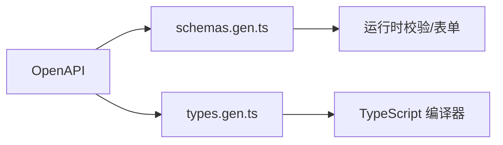

<Callout type="idea" title="文件定位">

TypeScript 类型在编译后会被擦除，而这些 `as const` 对象会保留在运行时。它们可用于表单生成、运行时校验、文档展示或其他需要检查字段结构的工具。

</Callout>

<Callout type="warn" title="自动生成文件">

该文件由 OpenAPI 客户端生成器维护。本文在代码块中增加的注释只用于学习；实际项目重新运行生成脚本时，手工改动可能被覆盖。需要改变长期行为时，应优先修改 OpenAPI 描述、生成器配置或生成模板。

</Callout>

## 这个文件负责什么

- 描述请求和响应对象的 properties、required 与 title。
- 保留 email、password、date-time、uuid 等格式信息。
- 使用 `$ref` 连接复合模型。
- 通过 `as const` 保留字符串字面量和只读结构。

## 执行思路

1. FastAPI/Pydantic 生成 OpenAPI Schema。
2. 客户端生成器把 components.schemas 转成 TypeScript 常量。
3. 运行时代码可读取字段、格式和必填信息。
4. 静态 TypeScript 类型由 types.gen.ts 单独提供。

## 与其他模块的关系

| 模块 | 关系 |
| --- | --- |
| `FastAPI models.py` | Schema 的源头。 |
| `types.gen.ts` | 同一契约的静态类型版本。 |
| `OpenAPI tooling` | 可消费这些对象生成表单或校验逻辑。 |
| `sdk.gen.ts` | 使用相同模型定义请求与响应。 |

## Schema 与 Type 的区别

| 维度 | `schemas.gen.ts` | `types.gen.ts` |
| --- | --- | --- |
| 存在时间 | 运行时仍存在 | 编译后被擦除 |
| 主要用途 | 校验、表单、文档、反射 | 编辑器提示、编译检查 |
| 表达内容 | 格式、默认值、required、`$ref` | 联合类型、可选属性、字段类型 |



## 带注释源码

> 原始路径：`frontend/src/client/schemas-gen.ts`。以下仅增加学习性注释，不改变程序行为。

```ts title="schemas.gen.ts" lineNumbers
// This file is auto-generated by @hey-api/openapi-ts

// OAuth2 密码登录表单：运行时描述字段、格式、默认值和必填项。
export const Body_login_login_access_tokenSchema = {
    properties: {
        grant_type: {
            anyOf: [
                {
                    type: 'string',
                    pattern: '^password$'
                },
                {
                    type: 'null'
                }
            ],
            title: 'Grant Type'
        },
        username: {
            type: 'string',
            title: 'Username'
        },
        password: {
            type: 'string',
            format: 'password',
            title: 'Password'
        },
        scope: {
            type: 'string',
            title: 'Scope',
            default: ''
        },
        client_id: {
            anyOf: [
                {
                    type: 'string'
                },
                {
                    type: 'null'
                }
            ],
            title: 'Client Id'
        },
        client_secret: {
            anyOf: [
                {
                    type: 'string'
                },
                {
                    type: 'null'
                }
            ],
            format: 'password',
            title: 'Client Secret'
        }
    },
    type: 'object',
    required: ['username', 'password'],
    title: 'Body_login-login_access_token'
} as const;

// FastAPI 422 校验错误的外层结构。
export const HTTPValidationErrorSchema = {
    properties: {
        detail: {
            items: {
                '$ref': '#/components/schemas/ValidationError'
            },
            type: 'array',
            title: 'Detail'
        }
    },
    type: 'object',
    title: 'HTTPValidationError'
} as const;

// Item 领域：创建、公开响应、更新与分页集合。
export const ItemCreateSchema = {
    properties: {
        title: {
            type: 'string',
            maxLength: 255,
            minLength: 1,
            title: 'Title'
        },
        description: {
            anyOf: [
                {
                    type: 'string',
                    maxLength: 255
                },
                {
                    type: 'null'
                }
            ],
            title: 'Description'
        }
    },
    type: 'object',
    required: ['title'],
    title: 'ItemCreate'
} as const;

export const ItemPublicSchema = {
    properties: {
        title: {
            type: 'string',
            maxLength: 255,
            minLength: 1,
            title: 'Title'
        },
        description: {
            anyOf: [
                {
                    type: 'string',
                    maxLength: 255
                },
                {
                    type: 'null'
                }
            ],
            title: 'Description'
        },
        id: {
            type: 'string',
            format: 'uuid',
            title: 'Id'
        },
        owner_id: {
            type: 'string',
            format: 'uuid',
            title: 'Owner Id'
        },
        created_at: {
            anyOf: [
                {
                    type: 'string',
                    format: 'date-time'
                },
                {
                    type: 'null'
                }
            ],
            title: 'Created At'
        }
    },
    type: 'object',
    required: ['title', 'id', 'owner_id'],
    title: 'ItemPublic'
} as const;

export const ItemUpdateSchema = {
    properties: {
        title: {
            anyOf: [
                {
                    type: 'string',
                    maxLength: 255,
                    minLength: 1
                },
                {
                    type: 'null'
                }
            ],
            title: 'Title'
        },
        description: {
            anyOf: [
                {
                    type: 'string',
                    maxLength: 255
                },
                {
                    type: 'null'
                }
            ],
            title: 'Description'
        }
    },
    type: 'object',
    title: 'ItemUpdate'
} as const;

export const ItemsPublicSchema = {
    properties: {
        data: {
            items: {
                '$ref': '#/components/schemas/ItemPublic'
            },
            type: 'array',
            title: 'Data'
        },
        count: {
            type: 'integer',
            title: 'Count'
        }
    },
    type: 'object',
    required: ['data', 'count'],
    title: 'ItemsPublic'
} as const;

// 通用消息响应。
export const MessageSchema = {
    properties: {
        message: {
            type: 'string',
            title: 'Message'
        }
    },
    type: 'object',
    required: ['message'],
    title: 'Message'
} as const;

// 密码恢复与认证相关模型。
export const NewPasswordSchema = {
    properties: {
        token: {
            type: 'string',
            title: 'Token'
        },
        new_password: {
            type: 'string',
            maxLength: 128,
            minLength: 8,
            title: 'New Password'
        }
    },
    type: 'object',
    required: ['token', 'new_password'],
    title: 'NewPassword'
} as const;

// User 领域：私有创建、公开模型、注册与更新。
export const PrivateUserCreateSchema = {
    properties: {
        email: {
            type: 'string',
            title: 'Email'
        },
        password: {
            type: 'string',
            title: 'Password'
        },
        full_name: {
            type: 'string',
            title: 'Full Name'
        },
        is_verified: {
            type: 'boolean',
            title: 'Is Verified',
            default: false
        }
    },
    type: 'object',
    required: ['email', 'password', 'full_name'],
    title: 'PrivateUserCreate'
} as const;

export const TokenSchema = {
    properties: {
        access_token: {
            type: 'string',
            title: 'Access Token'
        },
        token_type: {
            type: 'string',
            title: 'Token Type',
            default: 'bearer'
        }
    },
    type: 'object',
    required: ['access_token'],
    title: 'Token'
} as const;

export const UpdatePasswordSchema = {
    properties: {
        current_password: {
            type: 'string',
            maxLength: 128,
            minLength: 8,
            title: 'Current Password'
        },
        new_password: {
            type: 'string',
            maxLength: 128,
            minLength: 8,
            title: 'New Password'
        }
    },
    type: 'object',
    required: ['current_password', 'new_password'],
    title: 'UpdatePassword'
} as const;

export const UserCreateSchema = {
    properties: {
        email: {
            type: 'string',
            maxLength: 255,
            format: 'email',
            title: 'Email'
        },
        is_active: {
            type: 'boolean',
            title: 'Is Active',
            default: true
        },
        is_superuser: {
            type: 'boolean',
            title: 'Is Superuser',
            default: false
        },
        full_name: {
            anyOf: [
                {
                    type: 'string',
                    maxLength: 255
                },
                {
                    type: 'null'
                }
            ],
            title: 'Full Name'
        },
        password: {
            type: 'string',
            maxLength: 128,
            minLength: 8,
            title: 'Password'
        }
    },
    type: 'object',
    required: ['email', 'password'],
    title: 'UserCreate'
} as const;

export const UserPublicSchema = {
    properties: {
        email: {
            type: 'string',
            maxLength: 255,
            format: 'email',
            title: 'Email'
        },
        is_active: {
            type: 'boolean',
            title: 'Is Active',
            default: true
        },
        is_superuser: {
            type: 'boolean',
            title: 'Is Superuser',
            default: false
        },
        full_name: {
            anyOf: [
                {
                    type: 'string',
                    maxLength: 255
                },
                {
                    type: 'null'
                }
            ],
            title: 'Full Name'
        },
        id: {
            type: 'string',
            format: 'uuid',
            title: 'Id'
        },
        created_at: {
            anyOf: [
                {
                    type: 'string',
                    format: 'date-time'
                },
                {
                    type: 'null'
                }
            ],
            title: 'Created At'
        }
    },
    type: 'object',
    required: ['email', 'id'],
    title: 'UserPublic'
} as const;

export const UserRegisterSchema = {
    properties: {
        email: {
            type: 'string',
            maxLength: 255,
            format: 'email',
            title: 'Email'
        },
        password: {
            type: 'string',
            maxLength: 128,
            minLength: 8,
            title: 'Password'
        },
        full_name: {
            anyOf: [
                {
                    type: 'string',
                    maxLength: 255
                },
                {
                    type: 'null'
                }
            ],
            title: 'Full Name'
        }
    },
    type: 'object',
    required: ['email', 'password'],
    title: 'UserRegister'
} as const;

export const UserUpdateSchema = {
    properties: {
        email: {
            anyOf: [
                {
                    type: 'string',
                    maxLength: 255,
                    format: 'email'
                },
                {
                    type: 'null'
                }
            ],
            title: 'Email'
        },
        is_active: {
            anyOf: [
                {
                    type: 'boolean'
                },
                {
                    type: 'null'
                }
            ],
            title: 'Is Active'
        },
        is_superuser: {
            anyOf: [
                {
                    type: 'boolean'
                },
                {
                    type: 'null'
                }
            ],
            title: 'Is Superuser'
        },
        full_name: {
            anyOf: [
                {
                    type: 'string',
                    maxLength: 255
                },
                {
                    type: 'null'
                }
            ],
            title: 'Full Name'
        },
        password: {
            anyOf: [
                {
                    type: 'string',
                    maxLength: 128,
                    minLength: 8
                },
                {
                    type: 'null'
                }
            ],
            title: 'Password'
        }
    },
    type: 'object',
    title: 'UserUpdate'
} as const;

export const UserUpdateMeSchema = {
    properties: {
        full_name: {
            anyOf: [
                {
                    type: 'string',
                    maxLength: 255
                },
                {
                    type: 'null'
                }
            ],
            title: 'Full Name'
        },
        email: {
            anyOf: [
                {
                    type: 'string',
                    maxLength: 255,
                    format: 'email'
                },
                {
                    type: 'null'
                }
            ],
            title: 'Email'
        }
    },
    type: 'object',
    title: 'UserUpdateMe'
} as const;

export const UsersPublicSchema = {
    properties: {
        data: {
            items: {
                '$ref': '#/components/schemas/UserPublic'
            },
            type: 'array',
            title: 'Data'
        },
        count: {
            type: 'integer',
            title: 'Count'
        }
    },
    type: 'object',
    required: ['data', 'count'],
    title: 'UsersPublic'
} as const;

// 单个字段校验错误，loc 指向请求中的具体位置。
export const ValidationErrorSchema = {
    properties: {
        loc: {
            items: {
                anyOf: [
                    {
                        type: 'string'
                    },
                    {
                        type: 'integer'
                    }
                ]
            },
            type: 'array',
            title: 'Location'
        },
        msg: {
            type: 'string',
            title: 'Message'
        },
        type: {
            type: 'string',
            title: 'Error Type'
        },
        input: {
            title: 'Input'
        },
        ctx: {
            type: 'object',
            title: 'Context'
        }
    },
    type: 'object',
    required: ['loc', 'msg', 'type'],
    title: 'ValidationError'
} as const;
```

## 阅读重点

- JSON Schema 中 `format` 是语义提示，是否真正校验取决于消费它的验证器。
- `$ref` 避免重复嵌套定义，解析时需要 components 上下文。
- `as const` 让属性值保持精确字面量，便于后续泛型推导。
- 不要把运行时 Schema 与 Zod Schema 混为一谈；两者需要适配器或独立生成。

## Twoslash：`as const` 保留字面量

```ts twoslash
const schema = {
  type: 'object',
  required: ['email'],
} as const

schema.type
//     ^?
schema.required
//     ^?
```
