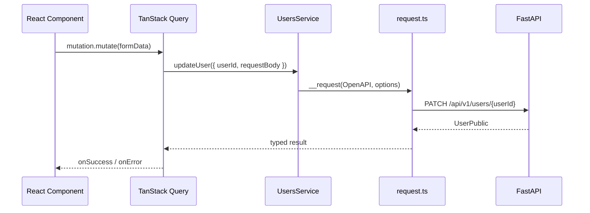

<Callout type="idea" title="文件定位">

这是业务组件最常调用的生成文件。每个后端 operation 会变成一个静态方法；方法负责声明 HTTP 方法、URL、path/query/body/formData 与错误映射，具体网络细节交给 `request.ts`。

</Callout>

<Callout type="warn" title="自动生成文件">

该文件由 OpenAPI 客户端生成器维护。本文在代码块中增加的注释只用于学习；实际项目重新运行生成脚本时，手工改动可能被覆盖。需要改变长期行为时，应优先修改 OpenAPI 描述、生成器配置或生成模板。

</Callout>

## 这个文件负责什么

- 按 Items、Login、Private、Users、Utils 划分服务类。
- 为每个端点提供精确输入参数和返回类型。
- 把路径、查询、表单和 JSON 请求体放入统一 options。
- 声明 422 等端点特定错误。
- 返回 CancelablePromise，保留取消能力。

## 执行思路

1. 业务层调用静态服务方法。
2. 方法把参数映射到 path/query/body/formData。
3. 调用统一 `__request(OpenAPI, options)`。
4. 请求执行器返回类型化响应或抛出 ApiError。

## 与其他模块的关系

| 模块 | 关系 |
| --- | --- |
| `types.gen.ts` | 提供方法输入和返回类型。 |
| `core/request.ts` | 执行所有网络请求。 |
| `core/OpenAPI.ts` | 提供运行时 Base URL 与认证。 |
| `React Query mutations/queries` | 负责缓存、加载状态和失效。 |
| `FastAPI routers` | 每个 SDK 方法对应一个后端 operation。 |

## 服务与后端领域映射

| 服务类 | 主要职责 | 典型调用方 |
| --- | --- | --- |
| `ItemsService` | Item CRUD | Items 页面与弹窗 |
| `LoginService` | 登录、令牌测试、密码恢复 | 认证 hooks 与路由 |
| `PrivateService` | 受控用户创建 | 初始化或内部流程 |
| `UsersService` | 当前用户和管理员用户管理 | 设置页、Admin 页面 |
| `UtilsService` | 健康检查、测试邮件 | 运维或调试功能 |

## 从组件到后端



## 带注释源码

> 原始路径：`frontend/src/client/sdk-gen.ts`。以下仅增加学习性注释，不改变程序行为。

```ts title="sdk.gen.ts" lineNumbers
// This file is auto-generated by @hey-api/openapi-ts

import type { CancelablePromise } from './core/CancelablePromise';
import { OpenAPI } from './core/OpenAPI';
import { request as __request } from './core/request';
import type { ItemsReadItemsData, ItemsReadItemsResponse, ItemsCreateItemData, ItemsCreateItemResponse, ItemsReadItemData, ItemsReadItemResponse, ItemsUpdateItemData, ItemsUpdateItemResponse, ItemsDeleteItemData, ItemsDeleteItemResponse, LoginLoginAccessTokenData, LoginLoginAccessTokenResponse, LoginTestTokenResponse, LoginRecoverPasswordData, LoginRecoverPasswordResponse, LoginResetPasswordData, LoginResetPasswordResponse, LoginRecoverPasswordHtmlContentData, LoginRecoverPasswordHtmlContentResponse, PrivateCreateUserData, PrivateCreateUserResponse, UsersReadUsersData, UsersReadUsersResponse, UsersCreateUserData, UsersCreateUserResponse, UsersReadUserMeResponse, UsersDeleteUserMeResponse, UsersUpdateUserMeData, UsersUpdateUserMeResponse, UsersUpdatePasswordMeData, UsersUpdatePasswordMeResponse, UsersRegisterUserData, UsersRegisterUserResponse, UsersReadUserByIdData, UsersReadUserByIdResponse, UsersUpdateUserData, UsersUpdateUserResponse, UsersDeleteUserData, UsersDeleteUserResponse, UtilsTestEmailData, UtilsTestEmailResponse, UtilsHealthCheckResponse } from './types.gen';

// Item 资源的列表、创建、读取、更新和删除端点。
export class ItemsService {
    /**
     * Read Items
     * Retrieve items.
     * @param data The data for the request.
     * @param data.skip
     * @param data.limit
     * @returns ItemsPublic Successful Response
     * @throws ApiError
     */
    public static readItems(data: ItemsReadItemsData = {}): CancelablePromise<ItemsReadItemsResponse> {
        // 每个方法只声明端点元数据，序列化和错误处理交给统一 request。
        return __request(OpenAPI, {
            method: 'GET',
            url: '/api/v1/items/',
            query: {
                skip: data.skip,
                limit: data.limit
            },
            errors: {
                422: 'Validation Error'
            }
        });
    }
    
    /**
     * Create Item
     * Create new item.
     * @param data The data for the request.
     * @param data.requestBody
     * @returns ItemPublic Successful Response
     * @throws ApiError
     */
    public static createItem(data: ItemsCreateItemData): CancelablePromise<ItemsCreateItemResponse> {
        return __request(OpenAPI, {
            method: 'POST',
            url: '/api/v1/items/',
            body: data.requestBody,
            mediaType: 'application/json',
            errors: {
                422: 'Validation Error'
            }
        });
    }
    
    /**
     * Read Item
     * Get item by ID.
     * @param data The data for the request.
     * @param data.id
     * @returns ItemPublic Successful Response
     * @throws ApiError
     */
    public static readItem(data: ItemsReadItemData): CancelablePromise<ItemsReadItemResponse> {
        return __request(OpenAPI, {
            method: 'GET',
            url: '/api/v1/items/{id}',
            path: {
                id: data.id
            },
            errors: {
                422: 'Validation Error'
            }
        });
    }
    
    /**
     * Update Item
     * Update an item.
     * @param data The data for the request.
     * @param data.id
     * @param data.requestBody
     * @returns ItemPublic Successful Response
     * @throws ApiError
     */
    public static updateItem(data: ItemsUpdateItemData): CancelablePromise<ItemsUpdateItemResponse> {
        return __request(OpenAPI, {
            method: 'PUT',
            url: '/api/v1/items/{id}',
            path: {
                id: data.id
            },
            body: data.requestBody,
            mediaType: 'application/json',
            errors: {
                422: 'Validation Error'
            }
        });
    }
    
    /**
     * Delete Item
     * Delete an item.
     * @param data The data for the request.
     * @param data.id
     * @returns Message Successful Response
     * @throws ApiError
     */
    public static deleteItem(data: ItemsDeleteItemData): CancelablePromise<ItemsDeleteItemResponse> {
        return __request(OpenAPI, {
            method: 'DELETE',
            url: '/api/v1/items/{id}',
            path: {
                id: data.id
            },
            errors: {
                422: 'Validation Error'
            }
        });
    }
}

// 登录、令牌验证和密码恢复端点。
export class LoginService {
    /**
     * Login Access Token
     * OAuth2 compatible token login, get an access token for future requests
     * @param data The data for the request.
     * @param data.formData
     * @returns Token Successful Response
     * @throws ApiError
     */
    public static loginAccessToken(data: LoginLoginAccessTokenData): CancelablePromise<LoginLoginAccessTokenResponse> {
        return __request(OpenAPI, {
            method: 'POST',
            url: '/api/v1/login/access-token',
            formData: data.formData,
            mediaType: 'application/x-www-form-urlencoded',
            errors: {
                422: 'Validation Error'
            }
        });
    }
    
    /**
     * Test Token
     * Test access token
     * @returns UserPublic Successful Response
     * @throws ApiError
     */
    public static testToken(): CancelablePromise<LoginTestTokenResponse> {
        return __request(OpenAPI, {
            method: 'POST',
            url: '/api/v1/login/test-token'
        });
    }
    
    /**
     * Recover Password
     * Password Recovery
     * @param data The data for the request.
     * @param data.email
     * @returns Message Successful Response
     * @throws ApiError
     */
    public static recoverPassword(data: LoginRecoverPasswordData): CancelablePromise<LoginRecoverPasswordResponse> {
        return __request(OpenAPI, {
            method: 'POST',
            url: '/api/v1/password-recovery/{email}',
            path: {
                email: data.email
            },
            errors: {
                422: 'Validation Error'
            }
        });
    }
    
    /**
     * Reset Password
     * Reset password
     * @param data The data for the request.
     * @param data.requestBody
     * @returns Message Successful Response
     * @throws ApiError
     */
    public static resetPassword(data: LoginResetPasswordData): CancelablePromise<LoginResetPasswordResponse> {
        return __request(OpenAPI, {
            method: 'POST',
            url: '/api/v1/reset-password/',
            body: data.requestBody,
            mediaType: 'application/json',
            errors: {
                422: 'Validation Error'
            }
        });
    }
    
    /**
     * Recover Password Html Content
     * HTML Content for Password Recovery
     * @param data The data for the request.
     * @param data.email
     * @returns string Successful Response
     * @throws ApiError
     */
    public static recoverPasswordHtmlContent(data: LoginRecoverPasswordHtmlContentData): CancelablePromise<LoginRecoverPasswordHtmlContentResponse> {
        return __request(OpenAPI, {
            method: 'POST',
            url: '/api/v1/password-recovery-html-content/{email}',
            path: {
                email: data.email
            },
            errors: {
                422: 'Validation Error'
            }
        });
    }
}

// 仅供受控内部流程使用的私有端点。
export class PrivateService {
    /**
     * Create User
     * Create a new user.
     * @param data The data for the request.
     * @param data.requestBody
     * @returns UserPublic Successful Response
     * @throws ApiError
     */
    public static createUser(data: PrivateCreateUserData): CancelablePromise<PrivateCreateUserResponse> {
        return __request(OpenAPI, {
            method: 'POST',
            url: '/api/v1/private/users/',
            body: data.requestBody,
            mediaType: 'application/json',
            errors: {
                422: 'Validation Error'
            }
        });
    }
}

// 用户自助操作与管理员用户管理端点。
export class UsersService {
    /**
     * Read Users
     * Retrieve users.
     * @param data The data for the request.
     * @param data.skip
     * @param data.limit
     * @returns UsersPublic Successful Response
     * @throws ApiError
     */
    public static readUsers(data: UsersReadUsersData = {}): CancelablePromise<UsersReadUsersResponse> {
        return __request(OpenAPI, {
            method: 'GET',
            url: '/api/v1/users/',
            query: {
                skip: data.skip,
                limit: data.limit
            },
            errors: {
                422: 'Validation Error'
            }
        });
    }
    
    /**
     * Create User
     * Create new user.
     * @param data The data for the request.
     * @param data.requestBody
     * @returns UserPublic Successful Response
     * @throws ApiError
     */
    public static createUser(data: UsersCreateUserData): CancelablePromise<UsersCreateUserResponse> {
        return __request(OpenAPI, {
            method: 'POST',
            url: '/api/v1/users/',
            body: data.requestBody,
            mediaType: 'application/json',
            errors: {
                422: 'Validation Error'
            }
        });
    }
    
    /**
     * Read User Me
     * Get current user.
     * @returns UserPublic Successful Response
     * @throws ApiError
     */
    public static readUserMe(): CancelablePromise<UsersReadUserMeResponse> {
        return __request(OpenAPI, {
            method: 'GET',
            url: '/api/v1/users/me'
        });
    }
    
    /**
     * Delete User Me
     * Delete own user.
     * @returns Message Successful Response
     * @throws ApiError
     */
    public static deleteUserMe(): CancelablePromise<UsersDeleteUserMeResponse> {
        return __request(OpenAPI, {
            method: 'DELETE',
            url: '/api/v1/users/me'
        });
    }
    
    /**
     * Update User Me
     * Update own user.
     * @param data The data for the request.
     * @param data.requestBody
     * @returns UserPublic Successful Response
     * @throws ApiError
     */
    public static updateUserMe(data: UsersUpdateUserMeData): CancelablePromise<UsersUpdateUserMeResponse> {
        return __request(OpenAPI, {
            method: 'PATCH',
            url: '/api/v1/users/me',
            body: data.requestBody,
            mediaType: 'application/json',
            errors: {
                422: 'Validation Error'
            }
        });
    }
    
    /**
     * Update Password Me
     * Update own password.
     * @param data The data for the request.
     * @param data.requestBody
     * @returns Message Successful Response
     * @throws ApiError
     */
    public static updatePasswordMe(data: UsersUpdatePasswordMeData): CancelablePromise<UsersUpdatePasswordMeResponse> {
        return __request(OpenAPI, {
            method: 'PATCH',
            url: '/api/v1/users/me/password',
            body: data.requestBody,
            mediaType: 'application/json',
            errors: {
                422: 'Validation Error'
            }
        });
    }
    
    /**
     * Register User
     * Create new user without the need to be logged in.
     * @param data The data for the request.
     * @param data.requestBody
     * @returns UserPublic Successful Response
     * @throws ApiError
     */
    public static registerUser(data: UsersRegisterUserData): CancelablePromise<UsersRegisterUserResponse> {
        return __request(OpenAPI, {
            method: 'POST',
            url: '/api/v1/users/signup',
            body: data.requestBody,
            mediaType: 'application/json',
            errors: {
                422: 'Validation Error'
            }
        });
    }
    
    /**
     * Read User By Id
     * Get a specific user by id.
     * @param data The data for the request.
     * @param data.userId
     * @returns UserPublic Successful Response
     * @throws ApiError
     */
    public static readUserById(data: UsersReadUserByIdData): CancelablePromise<UsersReadUserByIdResponse> {
        return __request(OpenAPI, {
            method: 'GET',
            url: '/api/v1/users/{user_id}',
            path: {
                user_id: data.userId
            },
            errors: {
                422: 'Validation Error'
            }
        });
    }
    
    /**
     * Update User
     * Update a user.
     * @param data The data for the request.
     * @param data.userId
     * @param data.requestBody
     * @returns UserPublic Successful Response
     * @throws ApiError
     */
    public static updateUser(data: UsersUpdateUserData): CancelablePromise<UsersUpdateUserResponse> {
        return __request(OpenAPI, {
            method: 'PATCH',
            url: '/api/v1/users/{user_id}',
            path: {
                user_id: data.userId
            },
            body: data.requestBody,
            mediaType: 'application/json',
            errors: {
                422: 'Validation Error'
            }
        });
    }
    
    /**
     * Delete User
     * Delete a user.
     * @param data The data for the request.
     * @param data.userId
     * @returns Message Successful Response
     * @throws ApiError
     */
    public static deleteUser(data: UsersDeleteUserData): CancelablePromise<UsersDeleteUserResponse> {
        return __request(OpenAPI, {
            method: 'DELETE',
            url: '/api/v1/users/{user_id}',
            path: {
                user_id: data.userId
            },
            errors: {
                422: 'Validation Error'
            }
        });
    }
}

// 健康检查与测试邮件等辅助端点。
export class UtilsService {
    /**
     * Test Email
     * Test emails.
     * @param data The data for the request.
     * @param data.emailTo
     * @returns Message Successful Response
     * @throws ApiError
     */
    public static testEmail(data: UtilsTestEmailData): CancelablePromise<UtilsTestEmailResponse> {
        return __request(OpenAPI, {
            method: 'POST',
            url: '/api/v1/utils/test-email/',
            query: {
                email_to: data.emailTo
            },
            errors: {
                422: 'Validation Error'
            }
        });
    }
    
    /**
     * Health Check
     * @returns boolean Successful Response
     * @throws ApiError
     */
    public static healthCheck(): CancelablePromise<UtilsHealthCheckResponse> {
        return __request(OpenAPI, {
            method: 'GET',
            url: '/api/v1/utils/health-check/'
        });
    }
}
```

## 阅读重点

- 服务类不保存状态；缓存与请求生命周期由 TanStack Query 等上层工具管理。
- 端点方法参数统一包装成 `data` 对象，便于未来添加 path/query/body 字段。
- 方法名来自 OpenAPI operationId；后端命名质量会直接影响生成 SDK 可读性。
- 生成 SDK 只表达传输契约，不应承载页面跳转、Toast 或业务编排。

## Twoslash：端点返回类型会传播到调用方

```ts twoslash
type User = { id: string; email: string }
type UpdateUserData = { userId: string; requestBody: Partial<User> }

class UsersService {
  static async updateUser(data: UpdateUserData): Promise<User> {
    return { id: data.userId, email: data.requestBody.email ?? '' }
  }
}

const result = UsersService.updateUser({
  userId: 'u1',
  requestBody: { email: 'new@example.com' },
})
//    ^?
```
