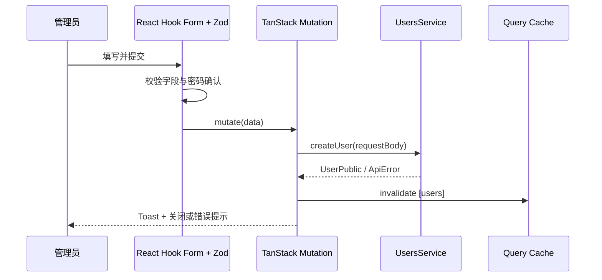

<Callout type="idea" title="文件定位">

这个组件只面向管理员页面。它把字段校验、密码确认、权限开关、提交状态、Toast 和用户列表缓存刷新封装在一个弹窗中。

</Callout>

## 这个文件负责什么

- 收集邮箱、姓名、密码、超级管理员和启用状态。
- 在客户端验证邮箱、密码长度和两次密码一致性。
- 调用 UsersService.createUser 创建用户。
- 在成功后重置表单并关闭弹窗。
- 无论成功或失败都重新验证 users 查询缓存。

## 执行思路

1. 管理员打开 Add User 弹窗。
2. 用户离开字段时触发 Zod 校验。
3. 提交通过后调用 createUser。
4. 成功时显示提示、重置表单并关闭。
5. 请求结束后刷新 users 列表。

## 与其他模块的关系

| 模块 | 关系 |
| --- | --- |
| `UsersService.createUser` | 后端用户创建端点。 |
| `Admin/columns.tsx` | 创建完成后表格会显示新用户。 |
| `useCustomToast` | 统一成功与失败反馈。 |
| `handleError` | 把 ApiError 转成可读消息。 |
| `ui/form + ui/dialog` | 表单语义与弹窗结构。 |

## 状态与数据

| 名称 | 作用 |
| --- | --- |
| `isOpen` | 控制 Dialog 是否显示。 |
| `form` | 保存字段值、校验错误和提交处理器。 |
| `mutation` | 保存创建请求的 pending/success/error 状态。 |
| `queryClient` | 使用户列表缓存失效。 |

## 校验规则

| 字段 | 规则 |
| --- | --- |
| `email` | 必须是合法邮箱。 |
| `password` | 必填且至少 8 个字符。 |
| `confirm_password` | 必填并与 password 相同。 |
| `is_superuser` | 布尔值，决定管理员权限。 |
| `is_active` | 布尔值，决定账户是否可用。 |



## 带注释源码

> 原始路径：`frontend/src/components/Admin/AddUser.tsx`。以下仅增加学习性注释，不改变程序行为。

```tsx title="AddUser.tsx" lineNumbers
import { zodResolver } from "@hookform/resolvers/zod"
import { useMutation, useQueryClient } from "@tanstack/react-query"
import { Plus } from "lucide-react"
import { useState } from "react"
import { useForm } from "react-hook-form"
import { z } from "zod"

import { type UserCreate, UsersService } from "@/client"
import { Button } from "@/components/ui/button"
import { Checkbox } from "@/components/ui/checkbox"
import {
  Dialog,
  DialogClose,
  DialogContent,
  DialogDescription,
  DialogFooter,
  DialogHeader,
  DialogTitle,
  DialogTrigger,
} from "@/components/ui/dialog"
import {
  Form,
  FormControl,
  FormField,
  FormItem,
  FormLabel,
  FormMessage,
} from "@/components/ui/form"
import { Input } from "@/components/ui/input"
import { LoadingButton } from "@/components/ui/loading-button"
import useCustomToast from "@/hooks/useCustomToast"
import { handleError } from "@/utils"

// 表单 Schema 同时承担运行时校验与 FormData 类型推导。
const formSchema = z
  .object({
    email: z.email({ message: "Invalid email address" }),
    full_name: z.string().optional(),
    password: z
      .string()
      .min(1, { message: "Password is required" })
      .min(8, { message: "Password must be at least 8 characters" }),
    confirm_password: z
      .string()
      .min(1, { message: "Please confirm your password" }),
    is_superuser: z.boolean(),
    is_active: z.boolean(),
  })
  .refine((data) => data.password === data.confirm_password, {
    message: "The passwords don't match",
    path: ["confirm_password"],
  })

// 让 React Hook Form 与 Zod 共用一份字段定义，避免重复声明。
type FormData = z.infer<typeof formSchema>

const AddUser = () => {
  // 使用受控 Dialog，成功后可主动关闭并重置表单。
  const [isOpen, setIsOpen] = useState(false)
  const queryClient = useQueryClient()
  const { showSuccessToast, showErrorToast } = useCustomToast()

  // onBlur 提供较温和的即时校验；criteriaMode=all 可收集全部规则。
  const form = useForm<FormData>({
    resolver: zodResolver(formSchema),
    mode: "onBlur",
    criteriaMode: "all",
    defaultValues: {
      email: "",
      full_name: "",
      password: "",
      confirm_password: "",
      is_superuser: false,
      is_active: false,
    },
  })

  // Mutation 只处理服务端写入；成功提示、错误提示和缓存失效集中在回调中。
  const mutation = useMutation({
    mutationFn: (data: UserCreate) =>
      UsersService.createUser({ requestBody: data }),
    onSuccess: () => {
      showSuccessToast("User created successfully")
      form.reset()
      setIsOpen(false)
    },
    onError: handleError.bind(showErrorToast),
    onSettled: () => {
      queryClient.invalidateQueries({ queryKey: ["users"] })
    },
  })

  // Zod 已保证密码确认一致，提交时服务端只会使用 UserCreate 字段。
  const onSubmit = (data: FormData) => {
    mutation.mutate(data)
  }

  // 受控弹窗：按钮打开，创建成功后由 mutation 回调关闭。
  return (
    <Dialog open={isOpen} onOpenChange={setIsOpen}>
      <DialogTrigger asChild>
        <Button className="my-4">
          <Plus className="mr-2" />
          Add User
        </Button>
      </DialogTrigger>
      <DialogContent className="sm:max-w-md">
        <DialogHeader>
          <DialogTitle>Add User</DialogTitle>
          <DialogDescription>
            Fill in the form below to add a new user to the system.
          </DialogDescription>
        </DialogHeader>
        <Form {...form}>
          <form onSubmit={form.handleSubmit(onSubmit)}>
            <div className="grid gap-4 py-4">
              <FormField
                control={form.control}
                name="email"
                render={({ field }) => (
                  <FormItem>
                    <FormLabel>
                      Email <span className="text-destructive">*</span>
                    </FormLabel>
                    <FormControl>
                      <Input
                        placeholder="Email"
                        type="email"
                        {...field}
                        required
                      />
                    </FormControl>
                    <FormMessage />
                  </FormItem>
                )}
              />

              <FormField
                control={form.control}
                name="full_name"
                render={({ field }) => (
                  <FormItem>
                    <FormLabel>Full Name</FormLabel>
                    <FormControl>
                      <Input placeholder="Full name" type="text" {...field} />
                    </FormControl>
                    <FormMessage />
                  </FormItem>
                )}
              />

              <FormField
                control={form.control}
                name="password"
                render={({ field }) => (
                  <FormItem>
                    <FormLabel>
                      Set Password <span className="text-destructive">*</span>
                    </FormLabel>
                    <FormControl>
                      <Input
                        placeholder="Password"
                        type="password"
                        {...field}
                        required
                      />
                    </FormControl>
                    <FormMessage />
                  </FormItem>
                )}
              />

              <FormField
                control={form.control}
                name="confirm_password"
                render={({ field }) => (
                  <FormItem>
                    <FormLabel>
                      Confirm Password{" "}
                      <span className="text-destructive">*</span>
                    </FormLabel>
                    <FormControl>
                      <Input
                        placeholder="Password"
                        type="password"
                        {...field}
                        required
                      />
                    </FormControl>
                    <FormMessage />
                  </FormItem>
                )}
              />

              {/* 管理员权限是高风险字段，只应出现在受保护的管理界面。 */}
              <FormField
                control={form.control}
                name="is_superuser"
                render={({ field }) => (
                  <FormItem className="flex items-center gap-3 space-y-0">
                    <FormControl>
                      <Checkbox
                        checked={field.value}
                        onCheckedChange={field.onChange}
                      />
                    </FormControl>
                    <FormLabel className="font-normal">Is superuser?</FormLabel>
                  </FormItem>
                )}
              />

              <FormField
                control={form.control}
                name="is_active"
                render={({ field }) => (
                  <FormItem className="flex items-center gap-3 space-y-0">
                    <FormControl>
                      <Checkbox
                        checked={field.value}
                        onCheckedChange={field.onChange}
                      />
                    </FormControl>
                    <FormLabel className="font-normal">Is active?</FormLabel>
                  </FormItem>
                )}
              />
            </div>

            <DialogFooter>
              <DialogClose asChild>
                <Button variant="outline" disabled={mutation.isPending}>
                  Cancel
                </Button>
              </DialogClose>
              <LoadingButton type="submit" loading={mutation.isPending}>
                Save
              </LoadingButton>
            </DialogFooter>
          </form>
        </Form>
      </DialogContent>
    </Dialog>
  )
}

export default AddUser
```

## 阅读重点

- 默认 `is_active: false` 意味着新用户创建后不可登录；应确认这是否符合产品策略。
- `confirm_password` 不属于后端 UserCreate 类型，当前调用依赖 TypeScript 结构兼容；更严谨的实现可在提交前显式剔除。
- 管理员权限开关必须由后端再次授权，不能只依赖前端路由隐藏。
- `onSettled` 会在失败时也刷新列表，通常安全但可能产生额外请求。

## Twoslash：从 Zod 风格 Schema 推导表单类型

```ts twoslash
type SchemaOutput = {
  email: string
  password: string
  is_active: boolean
}

type FormData = SchemaOutput
const submit = (data: FormData) => data.email
//             ^?
```
