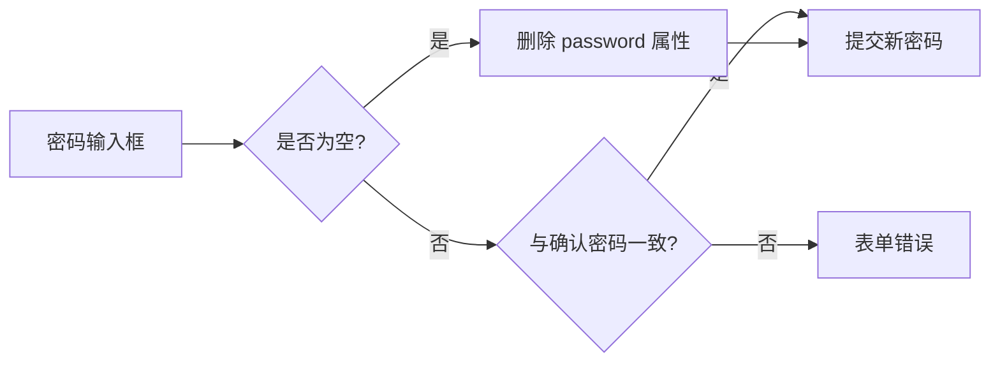

<Callout type="idea" title="文件定位">

编辑用户与创建用户最大的区别是“未填写”必须表示“不更新”。该组件特别处理空密码与 confirm_password，避免把空字符串提交给后端而意外重置密码。

</Callout>

## 这个文件负责什么

- 用 UserPublic 预填邮箱、姓名、角色和状态。
- 允许密码留空；填写时验证长度和确认值。
- 在提交前删除 confirm_password 和空 password。
- 调用 UsersService.updateUser。
- 成功后关闭弹窗、父菜单并刷新 users 缓存。

## 执行思路

1. 管理员从某行操作菜单打开编辑弹窗。
2. 表单使用当前用户数据作为默认值。
3. 可选填写新密码；Zod 验证确认值。
4. 提交前清理表单专用字段和空密码。
5. 后端更新后刷新列表。

## 与其他模块的关系

| 模块 | 关系 |
| --- | --- |
| `UserActionsMenu` | 提供目标用户并管理外层菜单。 |
| `UsersService.updateUser` | 管理员更新端点。 |
| `UserPublic / UserUpdate` | 读取模型与更新请求模型。 |
| `React Hook Form + Zod` | 默认值、校验和提交。 |

## 状态与数据

| 名称 | 作用 |
| --- | --- |
| `user` | 当前被编辑用户及默认值来源。 |
| `form` | 编辑字段和校验状态。 |
| `isOpen` | 控制编辑 Dialog。 |
| `mutation` | 执行 PATCH/更新请求。 |

## “留空不更新”语义



<Callout type="info" title="为什么删除属性而不是提交空字符串？">

更新接口通常把“字段不存在”解释为保持原值，把“字段存在且为空”解释为显式覆盖。两者语义不同，尤其是密码、邮箱和权限字段。

</Callout>

## 带注释源码

> 原始路径：`frontend/src/components/Admin/EditUser.tsx`。以下仅增加学习性注释，不改变程序行为。

```tsx title="EditUser.tsx" lineNumbers
import { zodResolver } from "@hookform/resolvers/zod"
import { useMutation, useQueryClient } from "@tanstack/react-query"
import { Pencil } from "lucide-react"
import { useState } from "react"
import { useForm } from "react-hook-form"
import { z } from "zod"

import { type UserPublic, UsersService } from "@/client"
import { Button } from "@/components/ui/button"
import { Checkbox } from "@/components/ui/checkbox"
import {
  Dialog,
  DialogClose,
  DialogContent,
  DialogDescription,
  DialogFooter,
  DialogHeader,
  DialogTitle,
} from "@/components/ui/dialog"
import { DropdownMenuItem } from "@/components/ui/dropdown-menu"
import {
  Form,
  FormControl,
  FormField,
  FormItem,
  FormLabel,
  FormMessage,
} from "@/components/ui/form"
import { Input } from "@/components/ui/input"
import { LoadingButton } from "@/components/ui/loading-button"
import useCustomToast from "@/hooks/useCustomToast"
import { handleError } from "@/utils"

// 密码在编辑场景中允许留空；只有填写时才要求至少 8 位并校验确认。
const formSchema = z
  .object({
    email: z.email({ message: "Invalid email address" }),
    full_name: z.string().optional(),
    password: z
      .string()
      .min(8, { message: "Password must be at least 8 characters" })
      .optional()
      .or(z.literal("")),
    confirm_password: z.string().optional(),
    is_superuser: z.boolean().optional(),
    is_active: z.boolean().optional(),
  })
  .refine((data) => !data.password || data.password === data.confirm_password, {
    message: "The passwords don't match",
    path: ["confirm_password"],
  })

type FormData = z.infer<typeof formSchema>

// user 提供默认值；onSuccess 用于关闭父级 DropdownMenu。
interface EditUserProps {
  user: UserPublic
  onSuccess: () => void
}

const EditUser = ({ user, onSuccess }: EditUserProps) => {
  const [isOpen, setIsOpen] = useState(false)
  const queryClient = useQueryClient()
  const { showSuccessToast, showErrorToast } = useCustomToast()

  // 默认值来自当前行数据，nullable 字段转换为 undefined 以适配输入控件。
  const form = useForm<FormData>({
    resolver: zodResolver(formSchema),
    mode: "onBlur",
    criteriaMode: "all",
    defaultValues: {
      email: user.email,
      full_name: user.full_name ?? undefined,
      is_superuser: user.is_superuser,
      is_active: user.is_active,
    },
  })

  // 更新成功后关闭弹窗和父菜单，并使 users 缓存失效。
  const mutation = useMutation({
    mutationFn: (data: FormData) =>
      UsersService.updateUser({ userId: user.id, requestBody: data }),
    onSuccess: () => {
      showSuccessToast("User updated successfully")
      setIsOpen(false)
      onSuccess()
    },
    onError: handleError.bind(showErrorToast),
    onSettled: () => {
      queryClient.invalidateQueries({ queryKey: ["users"] })
    },
  })

  // confirm_password 仅用于客户端校验；空密码必须删除，避免覆盖现有密码。
  const onSubmit = (data: FormData) => {
    // exclude confirm_password from submission data and remove password if empty
    const { confirm_password: _, ...submitData } = data
    if (!submitData.password) {
      delete submitData.password
    }
    mutation.mutate(submitData)
  }

  return (
    <Dialog open={isOpen} onOpenChange={setIsOpen}>
      {/* 阻止下拉菜单立即卸载，以便 Dialog 保持打开。 */}
      <DropdownMenuItem
        onSelect={(e) => e.preventDefault()}
        onClick={() => setIsOpen(true)}
      >
        <Pencil />
        Edit User
      </DropdownMenuItem>
      <DialogContent className="sm:max-w-md">
        <Form {...form}>
          <form onSubmit={form.handleSubmit(onSubmit)}>
            <DialogHeader>
              <DialogTitle>Edit User</DialogTitle>
              <DialogDescription>
                Update the user details below.
              </DialogDescription>
            </DialogHeader>
            <div className="grid gap-4 py-4">
              <FormField
                control={form.control}
                name="email"
                render={({ field }) => (
                  <FormItem>
                    <FormLabel>
                      Email <span className="text-destructive">*</span>
                    </FormLabel>
                    <FormControl>
                      <Input
                        placeholder="Email"
                        type="email"
                        {...field}
                        required
                      />
                    </FormControl>
                    <FormMessage />
                  </FormItem>
                )}
              />

              <FormField
                control={form.control}
                name="full_name"
                render={({ field }) => (
                  <FormItem>
                    <FormLabel>Full Name</FormLabel>
                    <FormControl>
                      <Input placeholder="Full name" type="text" {...field} />
                    </FormControl>
                    <FormMessage />
                  </FormItem>
                )}
              />

              <FormField
                control={form.control}
                name="password"
                render={({ field }) => (
                  <FormItem>
                    <FormLabel>Set Password</FormLabel>
                    <FormControl>
                      <Input
                        placeholder="Password"
                        type="password"
                        {...field}
                      />
                    </FormControl>
                    <FormMessage />
                  </FormItem>
                )}
              />

              <FormField
                control={form.control}
                name="confirm_password"
                render={({ field }) => (
                  <FormItem>
                    <FormLabel>Confirm Password</FormLabel>
                    <FormControl>
                      <Input
                        placeholder="Password"
                        type="password"
                        {...field}
                      />
                    </FormControl>
                    <FormMessage />
                  </FormItem>
                )}
              />

              <FormField
                control={form.control}
                name="is_superuser"
                render={({ field }) => (
                  <FormItem className="flex items-center gap-3 space-y-0">
                    <FormControl>
                      <Checkbox
                        checked={field.value}
                        onCheckedChange={field.onChange}
                      />
                    </FormControl>
                    <FormLabel className="font-normal">Is superuser?</FormLabel>
                  </FormItem>
                )}
              />

              <FormField
                control={form.control}
                name="is_active"
                render={({ field }) => (
                  <FormItem className="flex items-center gap-3 space-y-0">
                    <FormControl>
                      <Checkbox
                        checked={field.value}
                        onCheckedChange={field.onChange}
                      />
                    </FormControl>
                    <FormLabel className="font-normal">Is active?</FormLabel>
                  </FormItem>
                )}
              />
            </div>

            <DialogFooter>
              <DialogClose asChild>
                <Button variant="outline" disabled={mutation.isPending}>
                  Cancel
                </Button>
              </DialogClose>
              <LoadingButton type="submit" loading={mutation.isPending}>
                Save
              </LoadingButton>
            </DialogFooter>
          </form>
        </Form>
      </DialogContent>
    </Dialog>
  )
}

export default EditUser
```

## 阅读重点

- React Hook Form 的 defaultValues 只在初始化时读取；若同一组件实例切换 user，需要调用 `form.reset(newValues)`。
- `delete submitData.password` 会修改局部对象，当前安全；更函数式的写法也可通过条件展开构造新对象。
- 权限和启用状态均是敏感字段，后端应记录审计日志。
- 密码字段不应回填现有值，当前实现正确地保持为空。

## Twoslash：从表单数据中剔除字段

```ts twoslash
type FormData = {
  email: string
  password?: string
  confirm_password?: string
}

function toRequest(data: FormData) {
  const { confirm_password: _, ...request } = data
  if (!request.password) delete request.password
  return request
}

const payload = toRequest({ email: 'a@example.com', password: '' })
//    ^?
```
