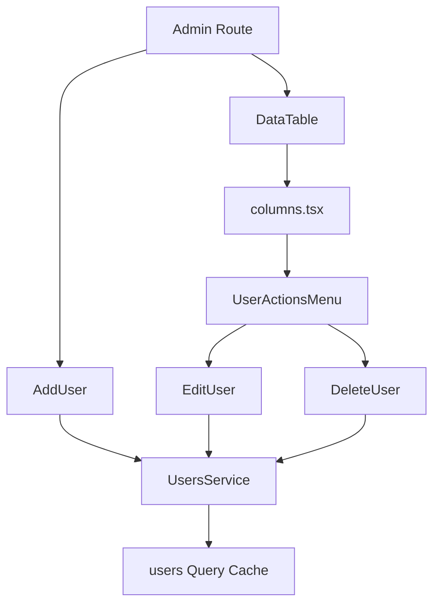

<Callout type="idea" title="目录定位">

`components/Admin/` 聚合只有管理员才应访问的用户管理组件。目录按“表格列定义 → 行操作菜单 → 具体创建/编辑/删除弹窗”拆分，避免把整个管理页面写成一个巨型组件。

</Callout>

## 目录结构

<Files>
  <Folder name="Admin" defaultOpen>
    <File name="columns.tsx — 用户表格列定义" />
    <File name="UserActionsMenu.tsx — 行操作协调层" />
    <File name="AddUser.tsx — 创建用户弹窗" />
    <File name="EditUser.tsx — 编辑用户弹窗" />
    <File name="DeleteUser.tsx — 删除确认弹窗" />
  </Folder>
</Files>

## 组件协作

## 学习导航

<Cards>
  <Card href="./columns-tsx" title="表格列">先理解数据如何转换成可读单元格。</Card>
  <Card href="./UserActionsMenu-tsx" title="行操作菜单">理解嵌套 Dropdown 与 Dialog。</Card>
  <Card href="./AddUser-tsx" title="创建用户">学习 Zod + React Hook Form + Mutation。</Card>
  <Card href="./EditUser-tsx" title="编辑用户">学习“留空不更新”和表单清理。</Card>
  <Card href="./DeleteUser-tsx" title="删除用户">学习危险操作确认和级联删除提示。</Card>
</Cards>

<Callout type="warn" title="前端权限不是授权">

管理员路由、按钮隐藏和当前用户保护都只改善体验。最终权限必须由 FastAPI dependencies 和数据库规则执行，前端传来的 `is_superuser`、`userId` 等值都不能被信任。

</Callout>

## 组织原则

- 表格展示、操作菜单和表单弹窗分层，使每个文件只承担一种变化原因。
- 所有写操作通过 TanStack Query mutation 执行，并在结束后刷新 users 缓存。
- 高风险字段和删除行为需要后端授权、审计与事务保障。
- 创建与编辑共享大量字段，规模扩大后可抽取 UserFormFields，但不要过早抽象。
