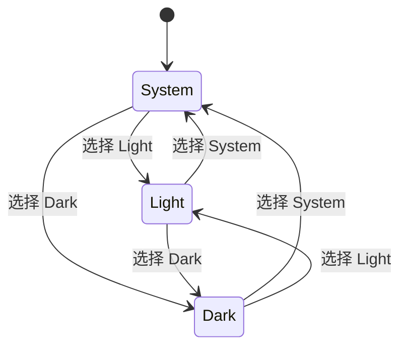

<Callout type="idea" title="文件定位">

主题状态由 `theme-provider` 统一管理，这个文件只负责呈现两个不同使用场景的入口：侧边栏菜单项和独立图标按钮。二者共享同一套主题选项。

</Callout>

## 这个文件负责什么

- 把 Theme 字面量映射到 Lucide 图标。
- 在侧边栏中显示当前选择的主题图标。
- 根据移动端状态改变 DropdownMenu 方向。
- 提供紧凑图标按钮版本。
- 调用 setTheme 写入用户选择。

## 执行思路

1. 组件读取当前主题设置。
2. 用户打开 DropdownMenu。
3. 点击某个选项调用 setTheme。
4. ThemeProvider 更新 DOM class 与持久化值。
5. 所有使用 dark 变体的组件同步切换。

## 与其他模块的关系

| 模块 | 关系 |
| --- | --- |
| `theme-provider.tsx` | 主题状态、系统偏好解析与持久化。 |
| `ui/sidebar` | 侧边栏布局与移动端检测。 |
| `ui/dropdown-menu` | 可访问的选项菜单。 |
| `AuthLayout / Sidebar` | 分别消费两个版本。 |

## 状态与数据

| 名称 | 作用 |
| --- | --- |
| `theme` | 用户选择：light/dark/system。 |
| `setTheme` | 更新并持久化主题。 |
| `isMobile` | 决定侧边栏菜单向上还是向右展开。 |
| `ICON_MAP` | 主题值到图标组件的穷尽映射。 |

## 两个导出组件

<Tabs items={['SidebarAppearance', 'Appearance']}>
  <Tab>

显示文字、当前主题图标和 tooltip，适合侧边栏底部；移动端菜单向上弹出，桌面端向右弹出。

  </Tab>
  <Tab>

只显示太阳/月亮图标，适合认证页顶部等紧凑位置；通过 CSS 过渡表现明暗切换。

  </Tab>
</Tabs>

## 主题状态模型



## 带注释源码

> 原始路径：`frontend/src/components/Common/Appearance.tsx`。以下仅增加学习性注释，不改变程序行为。

```tsx title="Appearance.tsx" lineNumbers
import { Monitor, Moon, Sun } from "lucide-react"

import { type Theme, useTheme } from "@/components/theme-provider"
import { Button } from "@/components/ui/button"
import {
  DropdownMenu,
  DropdownMenuContent,
  DropdownMenuItem,
  DropdownMenuTrigger,
} from "@/components/ui/dropdown-menu"
import {
  SidebarMenuButton,
  SidebarMenuItem,
  useSidebar,
} from "@/components/ui/sidebar"

// 统一图标组件签名，使主题到图标的映射具有完整类型检查。
type LucideIcon = React.FC<React.SVGProps<SVGSVGElement>>

// Record<Theme, ...> 保证 system/light/dark 三种主题都配置图标。
const ICON_MAP: Record<Theme, LucideIcon> = {
  system: Monitor,
  light: Sun,
  dark: Moon,
}

// 侧边栏版本会根据移动端状态调整菜单弹出方向。
export const SidebarAppearance = () => {
  const { isMobile } = useSidebar()
  const { setTheme, theme } = useTheme()
  // 当前“选择值”使用 theme，而实际显示色彩由 resolvedTheme 决定。
  const Icon = ICON_MAP[theme]

  return (
    <SidebarMenuItem>
      <DropdownMenu modal={false}>
        <DropdownMenuTrigger asChild>
          <SidebarMenuButton tooltip="Appearance" data-testid="theme-button">
            <Icon className="size-4 text-muted-foreground" />
            <span>Appearance</span>
            <span className="sr-only">Toggle theme</span>
          </SidebarMenuButton>
        </DropdownMenuTrigger>
        <DropdownMenuContent
          side={isMobile ? "top" : "right"}
          align="end"
          className="w-(--radix-dropdown-menu-trigger-width) min-w-56"
        >
          <DropdownMenuItem
            data-testid="light-mode"
            onClick={() => setTheme("light")}
          >
            <Sun className="mr-2 h-4 w-4" />
            Light
          </DropdownMenuItem>
          <DropdownMenuItem
            data-testid="dark-mode"
            onClick={() => setTheme("dark")}
          >
            <Moon className="mr-2 h-4 w-4" />
            Dark
          </DropdownMenuItem>
          <DropdownMenuItem onClick={() => setTheme("system")}>
            <Monitor className="mr-2 h-4 w-4" />
            System
          </DropdownMenuItem>
        </DropdownMenuContent>
      </DropdownMenu>
    </SidebarMenuItem>
  )
}

// 紧凑按钮版本适用于登录、注册等非侧边栏页面。
export const Appearance = () => {
  const { setTheme } = useTheme()

  return (
    <div className="flex items-center justify-center">
      <DropdownMenu modal={false}>
        <DropdownMenuTrigger asChild>
          {/* 两个图标通过 dark 变体旋转和缩放切换，不需要额外 JS 动画状态。 */}
          <Button data-testid="theme-button" variant="outline" size="icon">
            <Sun className="h-[1.2rem] w-[1.2rem] rotate-0 scale-100 transition-all dark:-rotate-90 dark:scale-0" />
            <Moon className="absolute h-[1.2rem] w-[1.2rem] rotate-90 scale-0 transition-all dark:rotate-0 dark:scale-100" />
            <span className="sr-only">Toggle theme</span>
          </Button>
        </DropdownMenuTrigger>
        <DropdownMenuContent align="end">
          <DropdownMenuItem
            data-testid="light-mode"
            onClick={() => setTheme("light")}
          >
            <Sun className="mr-2 h-4 w-4" />
            Light
          </DropdownMenuItem>
          <DropdownMenuItem
            data-testid="dark-mode"
            onClick={() => setTheme("dark")}
          >
            <Moon className="mr-2 h-4 w-4" />
            Dark
          </DropdownMenuItem>
          <DropdownMenuItem onClick={() => setTheme("system")}>
            <Monitor className="mr-2 h-4 w-4" />
            System
          </DropdownMenuItem>
        </DropdownMenuContent>
      </DropdownMenu>
    </div>
  )
}
```

## 阅读重点

- `theme` 表示用户选择，`resolvedTheme` 表示 system 解析后的真实明暗；两者用途不同。
- `Record<Theme, LucideIcon>` 会在新增主题值时强制补全映射。
- `modal={false}` 允许与其他浮层组合，但应测试焦点管理。
- `data-testid` 为 Playwright 提供稳定选择器，不应依赖易变样式类。

## Twoslash：穷尽映射

```ts twoslash
type Theme = 'light' | 'dark' | 'system'
type Icon = (props: { size?: number }) => unknown

declare const Sun: Icon
declare const Moon: Icon
declare const Monitor: Icon

const icons: Record<Theme, Icon> = {
  light: Sun,
  dark: Moon,
  system: Monitor,
}

icons.system
//    ^?
```
