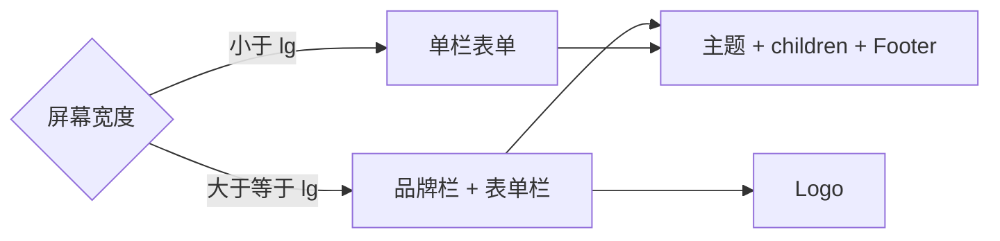

<Callout type="idea" title="文件定位">

认证路由的业务表单各不相同，但页面骨架一致。这个布局通过 `children` 插槽复用外壳，并在大屏采用双栏、小屏采用单栏。

</Callout>

## 这个文件负责什么

- 在桌面端显示 FastAPI 品牌区域。
- 在右侧提供主题切换。
- 将认证表单限制在可读宽度并垂直居中。
- 固定共享 Footer。
- 适配 svh，降低移动浏览器地址栏造成的高度跳动。

## 执行思路

1. 认证路由把表单作为 children 传入。
2. 布局在大屏渲染品牌列。
3. 右侧列顶部显示主题按钮。
4. 中部居中渲染表单。
5. 底部渲染共享 Footer。

## 与其他模块的关系

| 模块 | 关系 |
| --- | --- |
| `Appearance` | 主题入口。 |
| `Logo` | 品牌图形。 |
| `Footer` | 共享外链与版权。 |
| `login/signup/recover routes` | 提供具体 children。 |

## 状态与数据

| 名称 | 作用 |
| --- | --- |
| `children` | 由具体认证路由传入的表单。 |
| `lg:grid-cols-2` | 大屏切换双栏布局。 |
| `min-h-svh` | 使用小视口高度覆盖整屏。 |

## 响应式结构



## 带注释源码

> 原始路径：`frontend/src/components/Common/AuthLayout.tsx`。以下仅增加学习性注释，不改变程序行为。

```tsx title="AuthLayout.tsx" lineNumbers
import { Appearance } from "@/components/Common/Appearance"
import { Logo } from "@/components/Common/Logo"
import { Footer } from "./Footer"

// children 是登录、注册、找回密码等页面的具体表单。
interface AuthLayoutProps {
  children: React.ReactNode
}

// 认证页共享外壳：品牌区、主题入口、居中表单和页脚。
export function AuthLayout({ children }: AuthLayoutProps) {
  return (
    <div className="grid min-h-svh lg:grid-cols-2">
      {/* 大屏显示品牌面板，小屏隐藏以优先保证表单空间。 */}
      <div className="bg-muted dark:bg-zinc-900 relative hidden lg:flex lg:items-center lg:justify-center">
        <Logo variant="full" className="h-16" asLink={false} />
      </div>
      <div className="flex flex-col gap-4 p-6 md:p-10">
        <div className="flex justify-end">
          <Appearance />
        </div>
        {/* max-w-xs 保持认证表单行长和输入宽度稳定。 */}
        <div className="flex flex-1 items-center justify-center">
          <div className="w-full max-w-xs">{children}</div>
        </div>
        <Footer />
      </div>
    </div>
  )
}
```

## 阅读重点

- `svh` 比传统 `vh` 更适合移动浏览器动态工具栏。
- 品牌图片使用 `asLink={false}`，避免认证页左侧出现不必要的交互。
- 布局组件不应知道具体表单字段，保持 children 边界。
- 登录和注册页应复用这一布局，确保主题、间距与可访问性一致。
