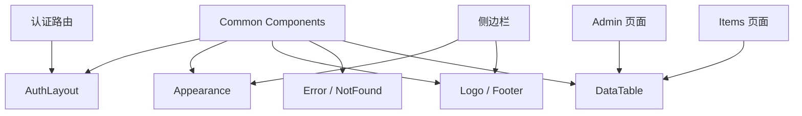

<Callout type="idea" title="目录定位">

`components/Common/` 存放不属于单一业务领域的共享组件。它们主要处理页面骨架、主题入口、品牌资产、通用状态和可复用数据展示，避免 Admin、Items、认证页面各自重复实现。

</Callout>

## 目录结构

<Files>
  <Folder name="Common" defaultOpen>
    <File name="Appearance.tsx — 主题切换" />
    <File name="AuthLayout.tsx — 认证页外壳" />
    <File name="DataTable.tsx — 通用分页表格" />
    <File name="ErrorComponent.tsx — 错误兜底" />
    <File name="NotFound.tsx — 404 页面" />
    <File name="Logo.tsx — 主题感知品牌标志" />
    <File name="Footer.tsx — 页脚与外链" />
  </Folder>
</Files>

## 复用边界

## 学习导航

<Cards>
  <Card href="./DataTable-tsx" title="DataTable">学习泛型、无头表格和客户端分页。</Card>
  <Card href="./Appearance-tsx" title="Appearance">学习主题状态与两个呈现入口。</Card>
  <Card href="./AuthLayout-tsx" title="AuthLayout">学习 children 插槽与响应式骨架。</Card>
  <Card href="./Logo-tsx" title="Logo">学习主题感知资源与 variant。</Card>
  <Card href="./ErrorComponent-tsx" title="Error">学习错误边界的安全文案。</Card>
  <Card href="./NotFound-tsx" title="Not Found">区分 404 与运行时错误。</Card>
</Cards>

## 组织原则

- Common 组件应避免导入具体业务服务，防止公共层反向依赖 Admin 或 Items。
- 共享不等于万能；只有出现稳定重复模式时才抽取。
- 布局与状态组件应轻依赖、可独立渲染，尤其是错误页。
- 可访问性和响应式行为应在公共层统一处理，减少每个页面重复修复。
