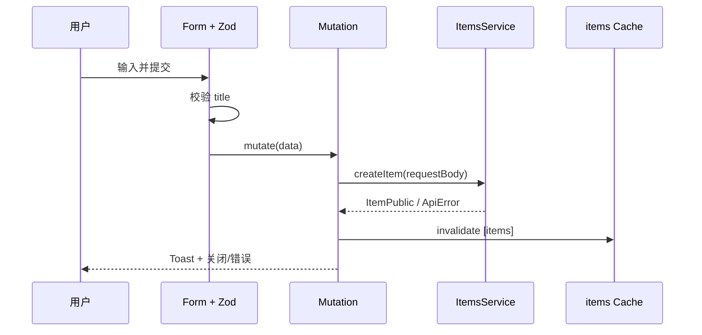

<Callout type="idea" title="文件定位">

这是 Item CRUD 的创建入口。组件保持字段简单，但完整展示了现代 React 表单的典型组合：Schema 校验、受控 Dialog、Mutation、Toast 和缓存失效。

</Callout>

## 这个文件负责什么

- 收集必填 title 和可选 description。
- 在客户端阻止空标题提交。
- 调用 ItemsService.createItem。
- 成功后重置表单并关闭 Dialog。
- 使 items 查询缓存失效以刷新列表。

## 执行思路

1. 用户点击 Add Item。
2. 填写标题和描述。
3. Zod 验证标题非空。
4. mutation 调用生成 SDK。
5. 成功提示、重置、关闭并刷新列表。

## 与其他模块的关系

| 模块 | 关系 |
| --- | --- |
| `ItemsService.createItem` | 后端创建端点。 |
| `ItemCreate` | 生成的请求体类型。 |
| `Items route` | 展示创建按钮与数据表格。 |
| `useCustomToast / handleError` | 统一用户反馈。 |

## 状态与数据

| 名称 | 作用 |
| --- | --- |
| `isOpen` | 创建弹窗状态。 |
| `form` | 字段值、错误和提交处理器。 |
| `mutation` | 创建请求状态。 |
| `queryClient` | 刷新 items 缓存。 |

## 写入流程



## 带注释源码

> 原始路径：`frontend/src/components/Items/AddItem.tsx`。以下仅增加学习性注释，不改变程序行为。

```tsx title="AddItem.tsx" lineNumbers
import { zodResolver } from "@hookform/resolvers/zod"
import { useMutation, useQueryClient } from "@tanstack/react-query"
import { Plus } from "lucide-react"
import { useState } from "react"
import { useForm } from "react-hook-form"
import { z } from "zod"

import { type ItemCreate, ItemsService } from "@/client"
import { Button } from "@/components/ui/button"
import {
  Dialog,
  DialogClose,
  DialogContent,
  DialogDescription,
  DialogFooter,
  DialogHeader,
  DialogTitle,
  DialogTrigger,
} from "@/components/ui/dialog"
import {
  Form,
  FormControl,
  FormField,
  FormItem,
  FormLabel,
  FormMessage,
} from "@/components/ui/form"
import { Input } from "@/components/ui/input"
import { LoadingButton } from "@/components/ui/loading-button"
import useCustomToast from "@/hooks/useCustomToast"
import { handleError } from "@/utils"

// Item 创建只需要标题；描述允许留空。
const formSchema = z.object({
  title: z.string().min(1, { message: "Title is required" }),
  description: z.string().optional(),
})

// 表单类型由校验 Schema 推导，避免字段定义漂移。
type FormData = z.infer<typeof formSchema>

const AddItem = () => {
  // 受控 Dialog 便于成功后主动关闭。
  const [isOpen, setIsOpen] = useState(false)
  const queryClient = useQueryClient()
  const { showSuccessToast, showErrorToast } = useCustomToast()

  const form = useForm<FormData>({
    resolver: zodResolver(formSchema),
    mode: "onBlur",
    criteriaMode: "all",
    defaultValues: {
      title: "",
      description: "",
    },
  })

  // Mutation 负责调用生成 SDK，并在结束后使 items 查询失效。
  const mutation = useMutation({
    mutationFn: (data: ItemCreate) =>
      ItemsService.createItem({ requestBody: data }),
    onSuccess: () => {
      showSuccessToast("Item created successfully")
      form.reset()
      setIsOpen(false)
    },
    onError: handleError.bind(showErrorToast),
    onSettled: () => {
      queryClient.invalidateQueries({ queryKey: ["items"] })
    },
  })

  // 表单数据结构与 ItemCreate 一致，可直接提交为 requestBody。
  const onSubmit = (data: FormData) => {
    mutation.mutate(data)
  }

  // 创建成功会 reset 表单并关闭弹窗。
  return (
    <Dialog open={isOpen} onOpenChange={setIsOpen}>
      <DialogTrigger asChild>
        <Button className="my-4">
          <Plus className="mr-2" />
          Add Item
        </Button>
      </DialogTrigger>
      <DialogContent className="sm:max-w-md">
        <DialogHeader>
          <DialogTitle>Add Item</DialogTitle>
          <DialogDescription>
            Fill in the details to add a new item.
          </DialogDescription>
        </DialogHeader>
        <Form {...form}>
          <form onSubmit={form.handleSubmit(onSubmit)}>
            <div className="grid gap-4 py-4">
              <FormField
                control={form.control}
                name="title"
                render={({ field }) => (
                  <FormItem>
                    <FormLabel>
                      Title <span className="text-destructive">*</span>
                    </FormLabel>
                    <FormControl>
                      <Input
                        placeholder="Title"
                        type="text"
                        {...field}
                        required
                      />
                    </FormControl>
                    <FormMessage />
                  </FormItem>
                )}
              />

              <FormField
                control={form.control}
                name="description"
                render={({ field }) => (
                  <FormItem>
                    <FormLabel>Description</FormLabel>
                    <FormControl>
                      <Input placeholder="Description" type="text" {...field} />
                    </FormControl>
                    <FormMessage />
                  </FormItem>
                )}
              />
            </div>

            <DialogFooter>
              <DialogClose asChild>
                <Button variant="outline" disabled={mutation.isPending}>
                  Cancel
                </Button>
              </DialogClose>
              <LoadingButton type="submit" loading={mutation.isPending}>
                Save
              </LoadingButton>
            </DialogFooter>
          </form>
        </Form>
      </DialogContent>
    </Dialog>
  )
}

export default AddItem
```

## 阅读重点

- 前端校验改善体验，后端仍必须校验 title。
- description 的空字符串与 null 语义可能不同；当前创建表单会提交空字符串。
- 写操作结束后按 `queryKey: ["items"]` 精确失效，比刷新所有查询更高效。
- 成功后先 reset 再关闭，下一次打开时不会残留旧值。

## Twoslash：表单数据满足创建类型

```ts twoslash
type ItemCreate = { title: string; description?: string | null }
type FormData = { title: string; description?: string }

const submit = (data: FormData): ItemCreate => data
const item = submit({ title: 'Read docs' })
//    ^?
```
