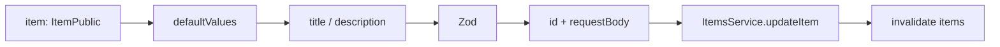

<Callout type="idea" title="文件定位">

这个组件把一行 `ItemPublic` 转换为可编辑表单。它保留 id 作为路径参数，只允许修改 title 和 description，并在成功后协调 Dialog、Dropdown 与缓存。

</Callout>

## 这个文件负责什么

- 用现有 Item 预填 title 和 description。
- 校验 title 不能为空。
- 调用 ItemsService.updateItem。
- 成功后关闭编辑 Dialog 和父菜单。
- 使 items 查询缓存失效。

## 执行思路

1. 用户从某行打开 Edit Item。
2. 表单读取当前 title/description。
3. 修改并提交。
4. SDK 发送 id + requestBody。
5. 成功后刷新列表并关闭浮层。

## 与其他模块的关系

| 模块 | 关系 |
| --- | --- |
| `ItemActionsMenu` | 传入目标 item。 |
| `ItemsService.updateItem` | 后端更新端点。 |
| `ItemPublic / ItemUpdate` | 读取与提交契约。 |
| `React Hook Form` | 默认值和提交。 |

## 状态与数据

| 名称 | 作用 |
| --- | --- |
| `item` | 目标 Item 与默认值来源。 |
| `form` | 编辑字段与校验状态。 |
| `isOpen` | 编辑 Dialog 状态。 |
| `mutation` | 更新请求生命周期。 |

## 数据映射



<Callout type="info" title="为什么把 null 转为 undefined？">

React 文本输入通常期望字符串或 undefined。直接把 `null` 传给受控 input 会产生类型和受控状态问题，因此默认值使用 `item.description ?? undefined`。

</Callout>

## 带注释源码

> 原始路径：`frontend/src/components/Items/EditItem.tsx`。以下仅增加学习性注释，不改变程序行为。

```tsx title="EditItem.tsx" lineNumbers
import { zodResolver } from "@hookform/resolvers/zod"
import { useMutation, useQueryClient } from "@tanstack/react-query"
import { Pencil } from "lucide-react"
import { useState } from "react"
import { useForm } from "react-hook-form"
import { z } from "zod"

import { type ItemPublic, ItemsService } from "@/client"
import { Button } from "@/components/ui/button"
import {
  Dialog,
  DialogClose,
  DialogContent,
  DialogDescription,
  DialogFooter,
  DialogHeader,
  DialogTitle,
} from "@/components/ui/dialog"
import { DropdownMenuItem } from "@/components/ui/dropdown-menu"
import {
  Form,
  FormControl,
  FormField,
  FormItem,
  FormLabel,
  FormMessage,
} from "@/components/ui/form"
import { Input } from "@/components/ui/input"
import { LoadingButton } from "@/components/ui/loading-button"
import useCustomToast from "@/hooks/useCustomToast"
import { handleError } from "@/utils"

// 编辑与创建共享字段规则：标题必填，描述可选。
const formSchema = z.object({
  title: z.string().min(1, { message: "Title is required" }),
  description: z.string().optional(),
})

type FormData = z.infer<typeof formSchema>

// item 提供 id 与表单默认值，onSuccess 关闭父级菜单。
interface EditItemProps {
  item: ItemPublic
  onSuccess: () => void
}

const EditItem = ({ item, onSuccess }: EditItemProps) => {
  const [isOpen, setIsOpen] = useState(false)
  const queryClient = useQueryClient()
  const { showSuccessToast, showErrorToast } = useCustomToast()

  // 将 nullable description 转成 undefined，避免受控输入收到 null。
  const form = useForm<FormData>({
    resolver: zodResolver(formSchema),
    mode: "onBlur",
    criteriaMode: "all",
    defaultValues: {
      title: item.title,
      description: item.description ?? undefined,
    },
  })

  // id 来自 props，表单只提交允许编辑的字段。
  const mutation = useMutation({
    mutationFn: (data: FormData) =>
      ItemsService.updateItem({ id: item.id, requestBody: data }),
    onSuccess: () => {
      showSuccessToast("Item updated successfully")
      setIsOpen(false)
      onSuccess()
    },
    onError: handleError.bind(showErrorToast),
    onSettled: () => {
      queryClient.invalidateQueries({ queryKey: ["items"] })
    },
  })

  const onSubmit = (data: FormData) => {
    mutation.mutate(data)
  }

  return (
    <Dialog open={isOpen} onOpenChange={setIsOpen}>
      {/* 保持 Dropdown 挂载，让编辑 Dialog 能稳定打开。 */}
      <DropdownMenuItem
        onSelect={(e) => e.preventDefault()}
        onClick={() => setIsOpen(true)}
      >
        <Pencil />
        Edit Item
      </DropdownMenuItem>
      <DialogContent className="sm:max-w-md">
        <Form {...form}>
          <form onSubmit={form.handleSubmit(onSubmit)}>
            <DialogHeader>
              <DialogTitle>Edit Item</DialogTitle>
              <DialogDescription>
                Update the item details below.
              </DialogDescription>
            </DialogHeader>
            <div className="grid gap-4 py-4">
              <FormField
                control={form.control}
                name="title"
                render={({ field }) => (
                  <FormItem>
                    <FormLabel>
                      Title <span className="text-destructive">*</span>
                    </FormLabel>
                    <FormControl>
                      <Input placeholder="Title" type="text" {...field} />
                    </FormControl>
                    <FormMessage />
                  </FormItem>
                )}
              />

              <FormField
                control={form.control}
                name="description"
                render={({ field }) => (
                  <FormItem>
                    <FormLabel>Description</FormLabel>
                    <FormControl>
                      <Input placeholder="Description" type="text" {...field} />
                    </FormControl>
                    <FormMessage />
                  </FormItem>
                )}
              />
            </div>

            <DialogFooter>
              <DialogClose asChild>
                <Button variant="outline" disabled={mutation.isPending}>
                  Cancel
                </Button>
              </DialogClose>
              <LoadingButton type="submit" loading={mutation.isPending}>
                Save
              </LoadingButton>
            </DialogFooter>
          </form>
        </Form>
      </DialogContent>
    </Dialog>
  )
}

export default EditItem
```

## 阅读重点

- 如果父组件在 Dialog 打开期间替换 item，defaultValues 不会自动更新，需要 `form.reset`。
- 更新接口类型允许字段可选，但当前表单总会提交 title 和 description。
- 若 description 清空后需要保存 null 而非空字符串，应在 onSubmit 中规范化。
- 成功回调同时关闭 Dialog 和 Dropdown，避免残留浮层。

## Twoslash：只从公开模型提取可编辑字段

```ts twoslash
type ItemPublic = {
  id: string
  owner_id: string
  title: string
  description?: string | null
}

type ItemForm = Pick<ItemPublic, 'title' | 'description'>
const form: ItemForm = { title: 'Updated' }
//    ^?
```
