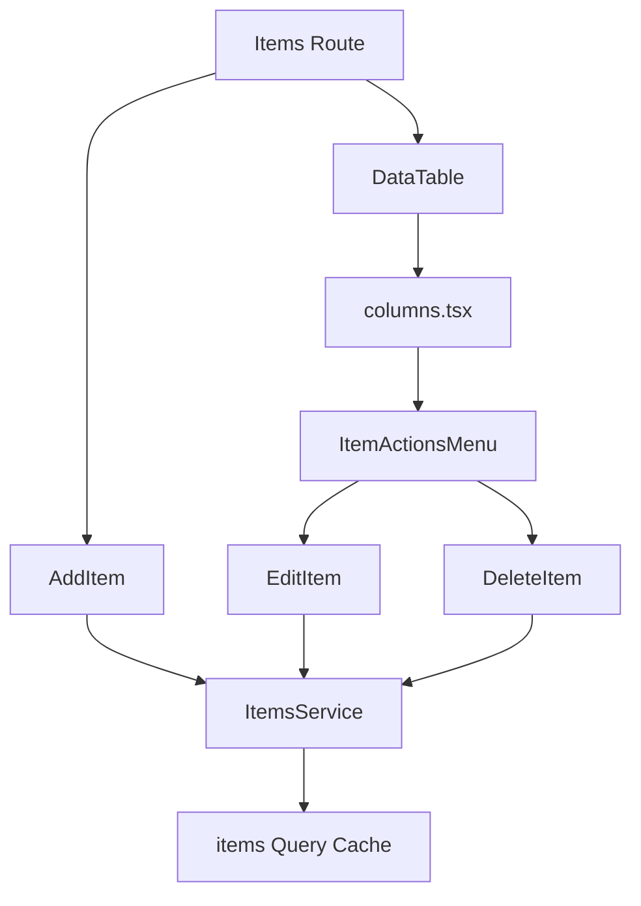

<Callout type="idea" title="目录定位">

`components/Items/` 围绕单一资源组织 UI。目录将列表呈现、行操作协调和每种写操作拆开，所有 API 调用都通过生成的 `ItemsService`，所有服务端状态都通过 TanStack Query 同步。

</Callout>

## 目录结构

<Files>
  <Folder name="Items" defaultOpen>
    <File name="columns.tsx — Item 表格列与复制 ID" />
    <File name="ItemActionsMenu.tsx — 行操作菜单" />
    <File name="AddItem.tsx — 创建 Item" />
    <File name="EditItem.tsx — 编辑 Item" />
    <File name="DeleteItem.tsx — 删除确认" />
  </Folder>
</Files>

## CRUD 组件图

## 学习导航

<Cards>
  <Card href="./columns-tsx" title="表格列">学习复制交互和业务列呈现。</Card>
  <Card href="./ItemActionsMenu-tsx" title="操作菜单">学习轻量组合层。</Card>
  <Card href="./AddItem-tsx" title="创建">学习表单与 Mutation。</Card>
  <Card href="./EditItem-tsx" title="编辑">学习默认值和 nullable 字段。</Card>
  <Card href="./DeleteItem-tsx" title="删除">学习危险操作确认。</Card>
</Cards>

## 组织原则

- 每个写操作独立封装，便于测试、复用和控制浮层生命周期。
- columns 只负责呈现，不直接发请求。
- Mutation 结束后统一使 items 查询失效，保持服务端为真实来源。
- 后端仍需验证 Item 所有权和字段规则，前端组件不是安全边界。
