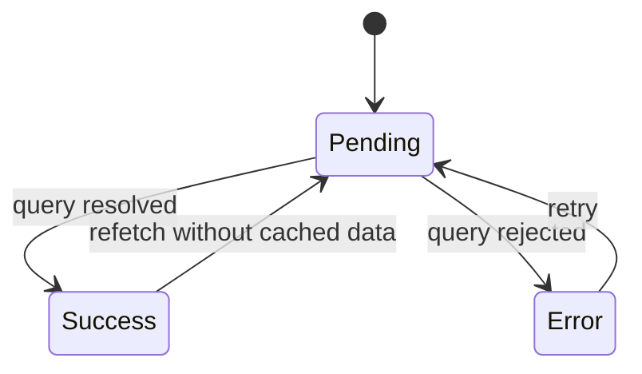

<Callout type="idea" title="目录定位">

`components/Pending/` 将加载状态从业务页面和真实表格中拆出。每个骨架组件都应镜像对应表格的列数、顺序、形状和大致尺寸，而不是使用通用旋转图标。

</Callout>

## 目录结构

<Files>
  <Folder name="Pending" defaultOpen>
    <File name="PendingItems.tsx — Item 表格骨架" />
    <File name="PendingUsers.tsx — 用户表格骨架" />
  </Folder>
</Files>

## 为什么使用结构化骨架

<Cards>
  <Card title="稳定布局">数据返回前就占据最终高度和列宽。</Card>
  <Card title="传达结构">用户能预期页面将显示表格而不是空白。</Card>
  <Card title="降低感知等待">连续视觉反馈比整页 Spinner 更自然。</Card>
  <Card title="独立维护">加载状态不会挤进真实业务组件的渲染逻辑。</Card>
</Cards>

<Callout type="info" title="骨架只代表 Pending">

加载失败必须进入 Error 状态；空数组必须进入 Empty 状态。不要让 Skeleton 同时承担加载、错误和空数据三种语义。

</Callout>

## 组织原则

- 骨架必须与真实表格同步，否则切换时仍会发生明显位移。
- 初始加载、后台刷新和分页加载可以采用不同反馈策略。
- 动画与闪烁应尊重减少动态效果的系统偏好。
- 静态占位数组可以使用索引 key，因为元素不会排序或持久化。
