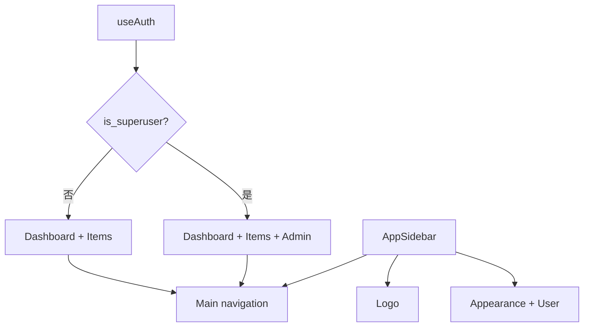

<Callout type="idea" title="文件定位">

这是侧边栏业务层的顶级组件。它不实现折叠、移动端抽屉或菜单细节，而是把 `Logo`、`Main`、`SidebarAppearance` 和 `User` 放入底层 Sidebar 原语提供的结构槽位。

</Callout>

## 这个文件负责什么

- 读取当前登录用户。
- 维护普通用户的基础导航配置。
- 为超级管理员追加 Admin 入口。
- 组织 Header、Content 与 Footer 三个区域。
- 启用桌面端 icon 折叠模式。

## 执行思路

1. `useAuth()` 从查询缓存取得当前用户。
2. 根据 `is_superuser` 生成最终导航数组。
3. Header 渲染响应式 Logo。
4. Content 将导航数组交给 `Main`。
5. Footer 提供主题切换和用户菜单。

## 与其他模块的关系

| 模块 | 关系 |
| --- | --- |
| `useAuth` | 提供 currentUser 与认证状态。 |
| `Main.tsx` | 根据 Item[] 渲染主导航。 |
| `User.tsx` | 展示当前用户菜单与退出入口。 |
| `Common/Appearance` | 切换 light、dark、system。 |
| `ui/sidebar` | 提供响应式侧边栏状态与结构原语。 |

## 组件装配图



<Callout type="warn" title="可见性不等于授权">

即使前端不显示 `/admin`，用户仍可能手工访问 URL 或直接调用 API。权限必须在 FastAPI 路由依赖中再次验证。

</Callout>

## 带注释源码

> 原始路径：`frontend/src/components/Sidebar/AppSidebar.tsx`。以下仅增加学习性注释，不改变程序行为。

```tsx title="AppSidebar.tsx" lineNumbers
import { Briefcase, Home, Users } from "lucide-react"

import { SidebarAppearance } from "@/components/Common/Appearance"
import { Logo } from "@/components/Common/Logo"
import {
  Sidebar,
  SidebarContent,
  SidebarFooter,
  SidebarHeader,
} from "@/components/ui/sidebar"
import useAuth from "@/hooks/useAuth"
import { type Item, Main } from "./Main"
import { User } from "./User"

// 普通用户始终可见的基础导航；管理员入口在运行时按权限追加。
const baseItems: Item[] = [
  { icon: Home, title: "Dashboard", path: "/" },
  { icon: Briefcase, title: "Items", path: "/items" },
]

// 应用级组合组件：只决定“展示哪些区域”，具体交互由子组件负责。
export function AppSidebar() {
  const { user: currentUser } = useAuth()

  // 权限只影响导航可见性；真正的授权仍必须由 FastAPI 后端执行。
  const items = currentUser?.is_superuser
    ? [...baseItems, { icon: Users, title: "Admin", path: "/admin" }]
    : baseItems

  return (
    {/* icon 模式在桌面端折叠为图标栏，移动端会由底层 Sidebar 切换为 Sheet。 */}
    <Sidebar collapsible="icon">
      <SidebarHeader className="px-4 py-6 group-data-[collapsible=icon]:px-0 group-data-[collapsible=icon]:items-center">
        <Logo variant="responsive" />
      </SidebarHeader>
      <SidebarContent>
        <Main items={items} />
      </SidebarContent>
      <SidebarFooter>
        <SidebarAppearance />
        <User user={currentUser} />
      </SidebarFooter>
    </Sidebar>
  )
}

export default AppSidebar
```

## 阅读重点

- 前端隐藏 Admin 菜单只能改善体验，不能代替后端权限校验。
- `baseItems` 定义在组件外，避免每次渲染都创建相同数组。
- 追加管理员菜单使用新数组，不修改共享常量。
- 布局组件保持“组合优先”，不把菜单内部实现复制到这里。

## Twoslash：权限驱动的数组类型

```ts twoslash
type Item = { title: string; path: string }
type User = { is_superuser: boolean }

const baseItems: Item[] = [{ title: 'Dashboard', path: '/' }]

function getItems(user: User | undefined) {
  return user?.is_superuser
    ? [...baseItems, { title: 'Admin', path: '/admin' }]
    : baseItems
}

const items = getItems({ is_superuser: true })
//    ^?
```
