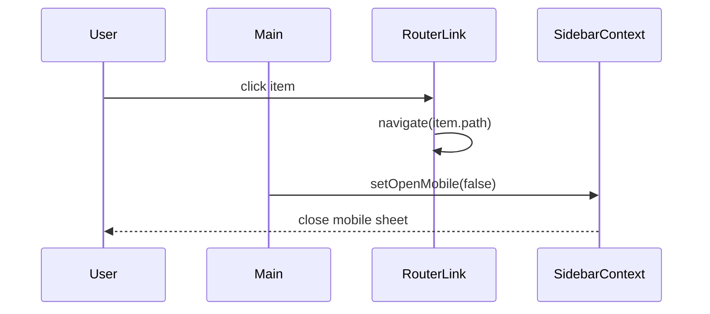

<Callout type="idea" title="文件定位">

该组件是“导航数据”与“Sidebar UI 原语”之间的适配层。它从路由状态读取当前路径，把每个 Item 渲染成可折叠、带 Tooltip 的菜单按钮。

</Callout>

## 这个文件负责什么

- 定义导航项的强类型契约。
- 读取当前 pathname。
- 计算每个菜单项的激活状态。
- 渲染图标、标题和路由链接。
- 移动端导航后自动关闭侧边栏。

## 执行思路

1. 接收 `Item[]`。
2. 从 `useRouterState()` 读取当前路径。
3. 逐项执行精确路径匹配。
4. `SidebarMenuButton` 根据 `isActive` 设置样式。
5. 点击后由 Router 导航，并在移动端关闭 Sheet。

## 与其他模块的关系

| 模块 | 关系 |
| --- | --- |
| `AppSidebar` | 构造并传入 items。 |
| `@tanstack/react-router` | 提供 Link 与当前位置。 |
| `ui/sidebar` | 提供菜单结构、Tooltip 与移动状态。 |
| `lucide-react` | Item.icon 的组件类型来源。 |

## 导航项契约

| 字段 | 类型 | 作用 |
| --- | --- | --- |
| `icon` | `LucideIcon` | 可直接作为 JSX 组件渲染的图标。 |
| `title` | `string` | 菜单文本与折叠态 Tooltip。 |
| `path` | `string` | TanStack Router 目标路径。 |

## 点击时序



## 带注释源码

> 原始路径：`frontend/src/components/Sidebar/Main.tsx`。以下仅增加学习性注释，不改变程序行为。

```tsx title="Main.tsx" lineNumbers
import { Link as RouterLink, useRouterState } from "@tanstack/react-router"
import type { LucideIcon } from "lucide-react"

import {
  SidebarGroup,
  SidebarGroupContent,
  SidebarMenu,
  SidebarMenuButton,
  SidebarMenuItem,
  useSidebar,
} from "@/components/ui/sidebar"

// 导航配置使用稳定的数据结构，让 AppSidebar 只需提供数据。
export type Item = {
  icon: LucideIcon
  title: string
  path: string
}

interface MainProps {
  items: Item[]
}

// Main 负责把纯配置转换为路由链接，并处理激活态与移动端关闭。
export function Main({ items }: MainProps) {
  const { isMobile, setOpenMobile } = useSidebar()
  const router = useRouterState()
  const currentPath = router.location.pathname

  // 移动端点击链接后主动收起 Sheet；桌面端保持当前折叠状态。
  const handleMenuClick = () => {
    if (isMobile) {
      setOpenMobile(false)
    }
  }

  return (
    <SidebarGroup>
      <SidebarGroupContent>
        <SidebarMenu>
          {items.map((item) => {
            // 当前实现只做精确匹配；存在子路由时可改为 startsWith 或路由匹配 API。
            const isActive = currentPath === item.path

            return (
              <SidebarMenuItem key={item.title}>
                <SidebarMenuButton
                  tooltip={item.title}
                  isActive={isActive}
                  asChild
                >
                  <RouterLink to={item.path} onClick={handleMenuClick}>
                    <item.icon />
                    <span>{item.title}</span>
                  </RouterLink>
                </SidebarMenuButton>
              </SidebarMenuItem>
            )
          })}
        </SidebarMenu>
      </SidebarGroupContent>
    </SidebarGroup>
  )
}
```

## 阅读重点

- `key` 更稳妥的选择是 `path`，因为标题可能国际化或重复。
- 精确匹配使 `/items/123` 不会激活 `/items`；需要根据路由层级决定策略。
- `asChild` 让 RouterLink 成为真实交互节点，避免嵌套 button/a。
- 移动端收起逻辑集中在导航层，不需要每个页面处理。

## Twoslash：图标组件也是类型的一部分

```ts twoslash
type Icon = (props: { size?: number }) => unknown

type Item = {
  icon: Icon
  title: string
  path: string
}

const Home: Icon = () => null
const item: Item = { icon: Home, title: 'Home', path: '/' }
item.icon
//   ^?
```
