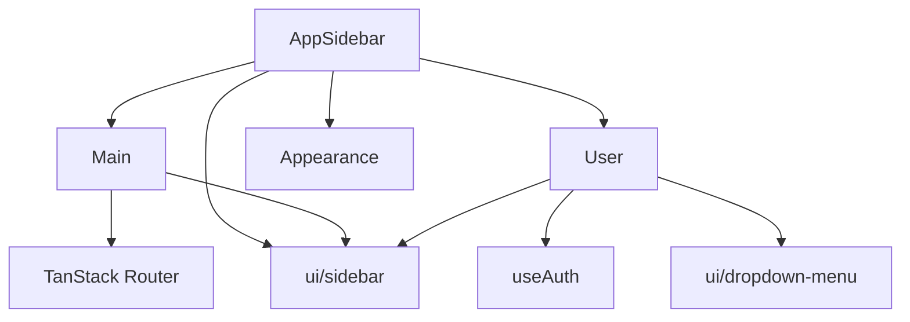

<Callout type="idea" title="目录定位">

`components/Sidebar/` 只保存应用特定的导航内容。响应式折叠、Sheet、Tooltip 和菜单结构由 `components/ui/sidebar.tsx` 提供，从而把业务配置与低层交互机制分离。

</Callout>

## 目录结构

<Files>
  <Folder name="Sidebar" defaultOpen>
    <File name="AppSidebar.tsx — 顶级装配与权限菜单" />
    <File name="Main.tsx — 主导航映射与激活态" />
    <File name="User.tsx — 用户摘要、设置与退出" />
  </Folder>
</Files>

## 依赖方向

## 学习导航

<Cards>
  <Card href="./AppSidebar-tsx" title="总装配">先看权限如何影响导航配置。</Card>
  <Card href="./Main-tsx" title="主导航">再看配置如何转换为路由链接。</Card>
  <Card href="./User-tsx" title="用户菜单">最后看会话动作与响应式菜单。</Card>
  <Card href="../ui/sidebar-tsx" title="底层 Sidebar">深入折叠、移动端和 Context 实现。</Card>
</Cards>

## 组织原则

- 业务侧边栏只描述“显示什么”，UI 原语负责“如何折叠和交互”。
- 前端权限菜单是体验层，后端授权才是安全边界。
- 共享的用户摘要提取成 `UserInfo`，避免重复 DOM 与样式。
- 导航后关闭移动端 Sheet，避免页面已切换但遮罩仍停留。
