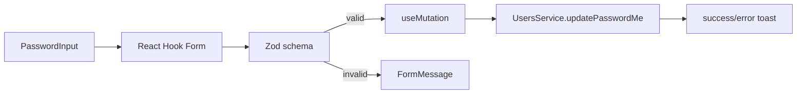

<Callout type="idea" title="文件定位">

该组件处理一个典型的安全敏感表单：客户端先验证必填、最小长度和两次新密码一致，再将符合 `UpdatePassword` 契约的数据交给生成客户端。

</Callout>

## 这个文件负责什么

- 定义密码表单 schema。
- 从 schema 推导 FormData。
- 管理三个密码字段与错误消息。
- 提交 `updatePasswordMe` Mutation。
- 成功后清空密码输入。
- 统一展示成功或错误 Toast。

## 执行思路

1. 用户填写当前密码、新密码和确认密码。
2. Zod 执行字段级校验与跨字段 refine。
3. React Hook Form 阻止非法提交。
4. Mutation 调用 UsersService。
5. 成功后显示 Toast 并 `form.reset()`。

## 与其他模块的关系

| 模块 | 关系 |
| --- | --- |
| `zod + zodResolver` | 运行时校验与类型推导。 |
| `react-hook-form` | 字段注册、提交和错误状态。 |
| `UsersService` | 调用当前用户修改密码 API。 |
| `LoadingButton` | 提交期间禁用并显示进度。 |
| `PasswordInput` | 密码可见性切换。 |
| `useCustomToast / handleError` | 统一用户反馈。 |

## 校验层次

<Steps>
  <Step>字段级：三个字段必须填写，当前密码和新密码至少 8 个字符。</Step>
  <Step>对象级：`new_password` 必须等于 `confirm_password`。</Step>
  <Step>服务端级：后端再次验证当前密码、密码策略和用户状态。</Step>
</Steps>



<Callout type="warn" title="后端必须重复验证">

客户端校验可以被绕过。当前密码是否正确、密码是否与旧密码相同、是否满足服务端策略，都必须由 FastAPI 端决定。

</Callout>

## 带注释源码

> 原始路径：`frontend/src/components/UserSettings/ChangePassword.tsx`。以下仅增加学习性注释，不改变程序行为。

```tsx title="ChangePassword.tsx" lineNumbers
import { zodResolver } from "@hookform/resolvers/zod"
import { useMutation } from "@tanstack/react-query"
import { useForm } from "react-hook-form"
import { z } from "zod"

import { type UpdatePassword, UsersService } from "@/client"
import {
  Form,
  FormControl,
  FormField,
  FormItem,
  FormLabel,
  FormMessage,
} from "@/components/ui/form"
import { LoadingButton } from "@/components/ui/loading-button"
import { PasswordInput } from "@/components/ui/password-input"
import useCustomToast from "@/hooks/useCustomToast"
import { handleError } from "@/utils"

// Zod 同时承担运行时校验与 FormData 类型来源。
const formSchema = z
  .object({
    current_password: z
      .string()
      .min(1, { message: "Password is required" })
      .min(8, { message: "Password must be at least 8 characters" }),
    new_password: z
      .string()
      .min(1, { message: "Password is required" })
      .min(8, { message: "Password must be at least 8 characters" }),
    confirm_password: z
      .string()
      .min(1, { message: "Password confirmation is required" }),
  })
  .refine((data) => data.new_password === data.confirm_password, {
    message: "The passwords don't match",
    path: ["confirm_password"],
  })

type FormData = z.infer<typeof formSchema>

// 组件把表单状态、Mutation 生命周期和用户反馈组织在一起。
const ChangePassword = () => {
  const { showSuccessToast, showErrorToast } = useCustomToast()
  const form = useForm<FormData>({
    resolver: zodResolver(formSchema),
    mode: "onSubmit",
    criteriaMode: "all",
    defaultValues: {
      current_password: "",
      new_password: "",
      confirm_password: "",
    },
  })

  // 服务端状态交给 TanStack Query；成功后清空敏感字段。
  const mutation = useMutation({
    mutationFn: (data: UpdatePassword) =>
      UsersService.updatePasswordMe({ requestBody: data }),
    onSuccess: () => {
      showSuccessToast("Password updated successfully")
      form.reset()
    },
    onError: handleError.bind(showErrorToast),
  })

  // react-hook-form 已保证 data 通过 schema 校验。
  const onSubmit = async (data: FormData) => {
    mutation.mutate(data)
  }

  return (
    <div className="max-w-md">
      <h3 className="text-lg font-semibold py-4">Change Password</h3>
      <Form {...form}>
        <form
          onSubmit={form.handleSubmit(onSubmit)}
          className="flex flex-col gap-4"
        >
          <FormField
            control={form.control}
            name="current_password"
            render={({ field, fieldState }) => (
              <FormItem>
                <FormLabel>Current Password</FormLabel>
                <FormControl>
                  <PasswordInput
                    data-testid="current-password-input"
                    placeholder="••••••••"
                    aria-invalid={fieldState.invalid}
                    {...field}
                  />
                </FormControl>
                <FormMessage />
              </FormItem>
            )}
          />

          <FormField
            control={form.control}
            name="new_password"
            render={({ field, fieldState }) => (
              <FormItem>
                <FormLabel>New Password</FormLabel>
                <FormControl>
                  <PasswordInput
                    data-testid="new-password-input"
                    placeholder="••••••••"
                    aria-invalid={fieldState.invalid}
                    {...field}
                  />
                </FormControl>
                <FormMessage />
              </FormItem>
            )}
          />

          <FormField
            control={form.control}
            name="confirm_password"
            render={({ field, fieldState }) => (
              <FormItem>
                <FormLabel>Confirm Password</FormLabel>
                <FormControl>
                  <PasswordInput
                    data-testid="confirm-password-input"
                    placeholder="••••••••"
                    aria-invalid={fieldState.invalid}
                    {...field}
                  />
                </FormControl>
                <FormMessage />
              </FormItem>
            )}
          />

          <LoadingButton
            type="submit"
            loading={mutation.isPending}
            className="self-start"
          >
            Update Password
          </LoadingButton>
        </form>
      </Form>
    </div>
  )
}

export default ChangePassword
```

## 阅读重点

- 确认密码只用于客户端校验，通常不应发送给后端；当前类型结构需确认生成的 `UpdatePassword` 是否会忽略该字段。
- 前端最小长度规则必须与后端保持一致，否则会出现客户端允许但服务端拒绝。
- 成功后清空所有密码字段，避免敏感数据残留在内存和界面。
- `onSubmit` 没有 await，可省略 async。

## Twoslash：跨字段约束后的提交类型

```ts twoslash
type PasswordForm = {
  current_password: string
  new_password: string
  confirm_password: string
}

type UpdatePassword = Pick<PasswordForm, 'current_password' | 'new_password'>

function toRequest(data: PasswordForm): UpdatePassword {
  return {
    current_password: data.current_password,
    new_password: data.new_password,
  }
}

const payload = toRequest({
  current_password: 'old-password',
  new_password: 'new-password',
  confirm_password: 'new-password',
})
//    ^?
```
