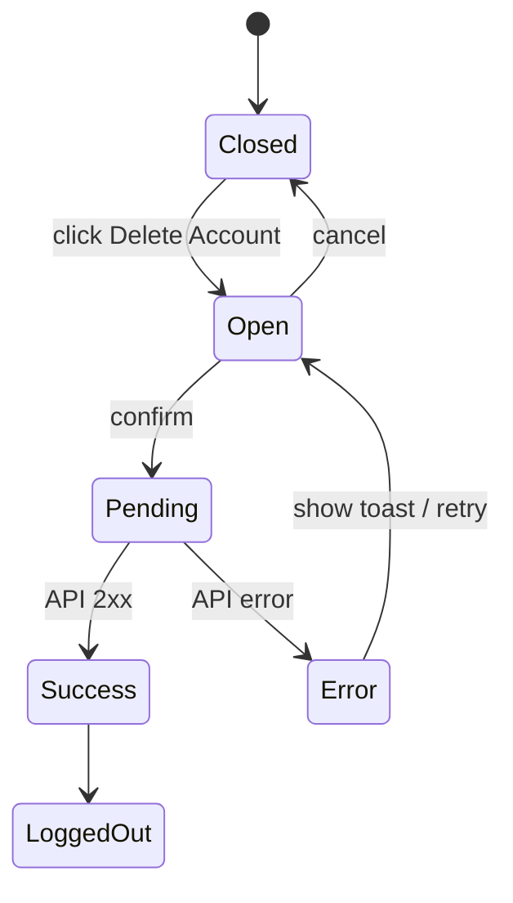

<Callout type="idea" title="文件定位">

该文件实现设置页最危险的写操作。它把不可逆性明确写入文案，用二次确认降低误触，并在删除成功后清理认证状态。

</Callout>

## 这个文件负责什么

- 打开账户删除确认对话框。
- 展示不可恢复警告。
- 提交 `deleteUserMe()`。
- pending 时阻止重复操作。
- 成功后提示并退出登录。
- settled 后刷新当前用户查询。

## 执行思路

1. 用户点击 Delete Account。
2. Dialog 展示永久删除说明。
3. 提交表单触发 Mutation。
4. 按钮进入 loading，取消按钮禁用。
5. 成功时 Toast + logout。
6. 结束时使 currentUser 查询失效。

## 与其他模块的关系

| 模块 | 关系 |
| --- | --- |
| `UsersService.deleteUserMe` | 删除当前用户 API。 |
| `useAuth.logout` | 清理本地认证状态。 |
| `TanStack Query` | 管理 Mutation 与 currentUser 缓存。 |
| `ui/dialog` | 焦点锁定、遮罩与关闭语义。 |
| `LoadingButton` | 防止重复提交。 |

## 状态机



<Callout type="error" title="不可逆操作设计">

确认框必须说明影响范围、不可恢复性和最终动作。仅把按钮染成红色不足以构成安全确认。

</Callout>

## 带注释源码

> 原始路径：`frontend/src/components/UserSettings/DeleteConfirmation.tsx`。以下仅增加学习性注释，不改变程序行为。

```tsx title="DeleteConfirmation.tsx" lineNumbers
import { useMutation, useQueryClient } from "@tanstack/react-query"
import { useForm } from "react-hook-form"

import { UsersService } from "@/client"
import { Button } from "@/components/ui/button"
import {
  Dialog,
  DialogClose,
  DialogContent,
  DialogDescription,
  DialogFooter,
  DialogHeader,
  DialogTitle,
  DialogTrigger,
} from "@/components/ui/dialog"
import { LoadingButton } from "@/components/ui/loading-button"
import useAuth from "@/hooks/useAuth"
import useCustomToast from "@/hooks/useCustomToast"
import { handleError } from "@/utils"

// 不可逆操作使用 Dialog 作为明确的二次确认边界。
const DeleteConfirmation = () => {
  const queryClient = useQueryClient()
  const { showSuccessToast, showErrorToast } = useCustomToast()
  const { handleSubmit } = useForm()
  const { logout } = useAuth()

  // 删除成功后立即退出；无论成功失败都刷新 currentUser 相关状态。
  const mutation = useMutation({
    mutationFn: () => UsersService.deleteUserMe(),
    onSuccess: () => {
      showSuccessToast("Your account has been successfully deleted")
      logout()
    },
    onError: handleError.bind(showErrorToast),
    onSettled: () => {
      queryClient.invalidateQueries({ queryKey: ["currentUser"] })
    },
  })

  // 表单提交统一支持 Enter 与按钮点击，并交给 Mutation 防重复处理。
  const onSubmit = async () => {
    mutation.mutate()
  }

  return (
    <Dialog>
      <DialogTrigger asChild>
        <Button variant="destructive" className="mt-3">
          Delete Account
        </Button>
      </DialogTrigger>
      <DialogContent>
        <form onSubmit={handleSubmit(onSubmit)}>
          <DialogHeader>
            <DialogTitle>Confirmation Required</DialogTitle>
            <DialogDescription>
              All your account data will be{" "}
              <strong>permanently deleted.</strong> If you are sure, please
              click <strong>"Confirm"</strong> to proceed. This action cannot be
              undone.
            </DialogDescription>
          </DialogHeader>

          <DialogFooter className="mt-4">
            <DialogClose asChild>
              <Button variant="outline" disabled={mutation.isPending}>
                Cancel
              </Button>
            </DialogClose>
            {/* pending 时禁用取消和确认，避免并发提交与状态竞争。 */}
            <LoadingButton
              variant="destructive"
              type="submit"
              loading={mutation.isPending}
            >
              Delete
            </LoadingButton>
          </DialogFooter>
        </form>
      </DialogContent>
    </Dialog>
  )
}

export default DeleteConfirmation
```

## 阅读重点

- 删除接口应在后端处理关联数据、审计记录和级联策略。
- `invalidateQueries` 在 logout 后是否仍需要，取决于 logout 是否清空整个 QueryClient。
- 重要删除通常可要求重新输入密码或账户邮箱，提高确认强度。
- `useForm()` 没有字段，仅借用标准表单提交管线；也可直接处理 `onSubmit`。
