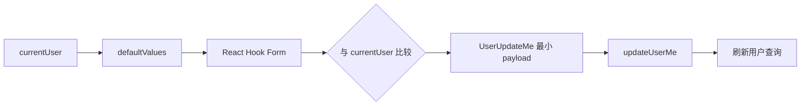

<Callout type="idea" title="文件定位">

该组件演示了“同一个表单同时承担展示与编辑”的模式。只读态展示当前字段，编辑态切换为 Input；提交时构造最小化 PATCH 数据，避免无意义覆盖。

</Callout>

## 这个文件负责什么

- 校验姓名长度与邮箱格式。
- 从 currentUser 初始化表单。
- 在 view/edit 模式间切换。
- 只提交发生变化的字段。
- 保存期间显示 loading 并禁止取消。
- 请求结束后刷新用户缓存。

## 执行思路

1. `useAuth()` 提供当前用户。
2. 表单以用户字段作为 defaultValues。
3. 点击 Edit 进入输入模式。
4. isDirty 控制 Save 是否可用。
5. onSubmit 比较原值并构造 updateData。
6. Mutation 完成后刷新查询并回到展示态。

## 与其他模块的关系

| 模块 | 关系 |
| --- | --- |
| `useAuth` | 提供当前用户。 |
| `UsersService.updateUserMe` | PATCH 当前用户资料。 |
| `react-hook-form + zod` | 表单状态与校验。 |
| `TanStack Query` | Mutation 与用户缓存同步。 |
| `cn` | 为空姓名添加 muted 样式。 |

## 最小化 PATCH

<Tabs items={['未修改', '只改姓名', '姓名和邮箱都改']}>
  <Tab>

`formState.isDirty` 为 false，Save 按钮禁用，不发请求。

  </Tab>
  <Tab>

请求体只包含 `full_name`，不会重复写入邮箱。

  </Tab>
  <Tab>

请求体同时包含两个变化字段。

  </Tab>
</Tabs>



<Callout type="info" title="defaultValues 是快照">

React Hook Form 的 `defaultValues` 在初始化时读取。若 `currentUser` 是后续异步加载的，需要显式 `reset()` 才能同步新值。

</Callout>

## 带注释源码

> 原始路径：`frontend/src/components/UserSettings/UserInformation.tsx`。以下仅增加学习性注释，不改变程序行为。

```tsx title="UserInformation.tsx" lineNumbers
import { zodResolver } from "@hookform/resolvers/zod"
import { useMutation, useQueryClient } from "@tanstack/react-query"
import { useState } from "react"
import { useForm } from "react-hook-form"
import { z } from "zod"

import { UsersService, type UserUpdateMe } from "@/client"
import { Button } from "@/components/ui/button"
import {
  Form,
  FormControl,
  FormField,
  FormItem,
  FormLabel,
  FormMessage,
} from "@/components/ui/form"
import { Input } from "@/components/ui/input"
import { LoadingButton } from "@/components/ui/loading-button"
import useAuth from "@/hooks/useAuth"
import useCustomToast from "@/hooks/useCustomToast"
import { cn } from "@/lib/utils"
import { handleError } from "@/utils"

// 编辑表单只包含允许当前用户自行修改的公开字段。
const formSchema = z.object({
  full_name: z.string().max(30).optional(),
  email: z.email({ message: "Invalid email address" }),
})

type FormData = z.infer<typeof formSchema>

// view/edit 两种模式共用同一套 FormField，避免状态与展示值分叉。
const UserInformation = () => {
  const queryClient = useQueryClient()
  const { showSuccessToast, showErrorToast } = useCustomToast()
  const [editMode, setEditMode] = useState(false)
  const { user: currentUser } = useAuth()

  const form = useForm<FormData>({
    resolver: zodResolver(formSchema),
    mode: "onBlur",
    criteriaMode: "all",
    defaultValues: {
      full_name: currentUser?.full_name ?? undefined,
      email: currentUser?.email,
    },
  })

  const toggleEditMode = () => {
    setEditMode(!editMode)
  }

  // API 成功后退出编辑模式；settled 后刷新服务端真实数据。
  const mutation = useMutation({
    mutationFn: (data: UserUpdateMe) =>
      UsersService.updateUserMe({ requestBody: data }),
    onSuccess: () => {
      showSuccessToast("User updated successfully")
      toggleEditMode()
    },
    onError: handleError.bind(showErrorToast),
    onSettled: () => {
      queryClient.invalidateQueries()
    },
  })

  // 构造 PATCH 风格 payload：只发送真正改变的字段。
  const onSubmit = (data: FormData) => {
    const updateData: UserUpdateMe = {}

    // only include fields that have changed
    if (data.full_name !== currentUser?.full_name) {
      updateData.full_name = data.full_name
    }
    if (data.email !== currentUser?.email) {
      updateData.email = data.email
    }

    mutation.mutate(updateData)
  }

  // reset 恢复 defaultValues，再退出编辑模式，丢弃未提交修改。
  const onCancel = () => {
    form.reset()
    toggleEditMode()
  }

  return (
    <div className="max-w-md">
      <h3 className="text-lg font-semibold py-4">User Information</h3>
      <Form {...form}>
        <form
          onSubmit={form.handleSubmit(onSubmit)}
          className="flex flex-col gap-4"
        >
          <FormField
            control={form.control}
            name="full_name"
            render={({ field }) =>
              editMode ? (
                <FormItem>
                  <FormLabel>Full name</FormLabel>
                  <FormControl>
                    <Input type="text" {...field} />
                  </FormControl>
                  <FormMessage />
                </FormItem>
              ) : (
                <FormItem>
                  <FormLabel>Full name</FormLabel>
                  <p
                    className={cn(
                      "py-2 truncate max-w-sm",
                      !field.value && "text-muted-foreground",
                    )}
                  >
                    {field.value || "N/A"}
                  </p>
                </FormItem>
              )
            }
          />

          <FormField
            control={form.control}
            name="email"
            render={({ field }) =>
              editMode ? (
                <FormItem>
                  <FormLabel>Email</FormLabel>
                  <FormControl>
                    <Input type="email" {...field} />
                  </FormControl>
                  <FormMessage />
                </FormItem>
              ) : (
                <FormItem>
                  <FormLabel>Email</FormLabel>
                  <p className="py-2 truncate max-w-sm">{field.value}</p>
                </FormItem>
              )
            }
          />

          <div className="flex gap-3">
            {editMode ? (
              <>
                <LoadingButton
                  type="submit"
                  loading={mutation.isPending}
                  disabled={!form.formState.isDirty}
                >
                  Save
                </LoadingButton>
                <Button
                  type="button"
                  variant="outline"
                  onClick={onCancel}
                  disabled={mutation.isPending}
                >
                  Cancel
                </Button>
              </>
            ) : (
              <Button type="button" onClick={toggleEditMode}>
                Edit
              </Button>
            )}
          </div>
        </form>
      </Form>
    </div>
  )
}

export default UserInformation
```

## 阅读重点

- currentUser 异步到达后，`defaultValues` 不会自动更新；必要时在用户变化时 `form.reset(newValues)`。
- `queryClient.invalidateQueries()` 无过滤会刷新所有活跃查询，通常应限制为 `currentUser`。
- 更新邮箱可能触发重新验证、会话失效或唯一性冲突，最终规则由后端决定。
- 空对象 Mutation 是否允许要看 API 契约；当前 Save 已通过 `isDirty` 基本避免。

## Twoslash：只提取变化字段

```ts twoslash
type User = { full_name?: string; email: string }
type UserUpdate = Partial<User>

function diff(current: User, next: User): UserUpdate {
  const update: UserUpdate = {}
  if (current.full_name !== next.full_name) update.full_name = next.full_name
  if (current.email !== next.email) update.email = next.email
  return update
}

const patch = diff(
  { full_name: 'Ada', email: 'ada@example.com' },
  { full_name: 'Ada Lovelace', email: 'ada@example.com' },
)
//    ^?
```
