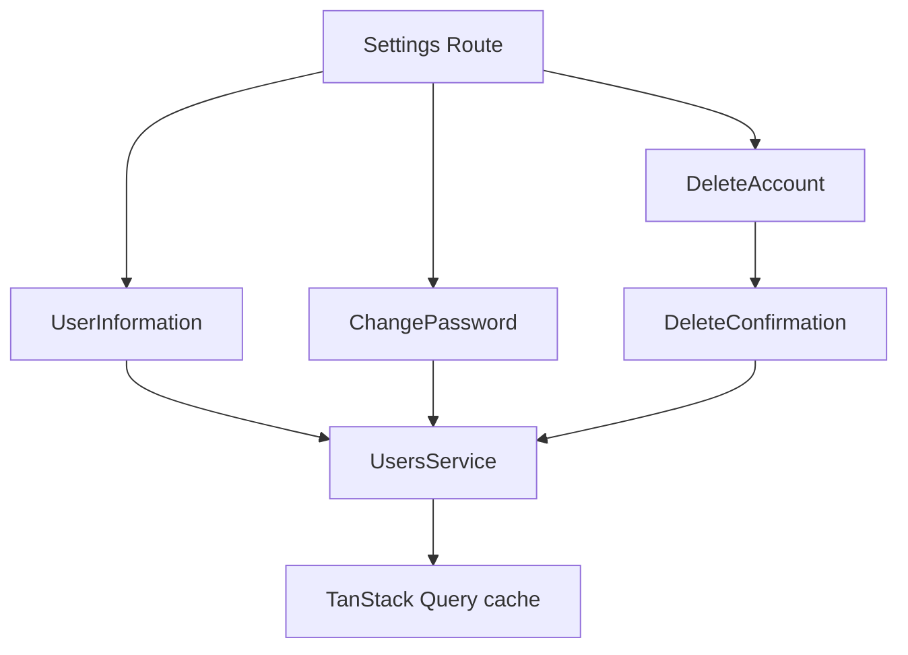

<Callout type="idea" title="目录定位">

`components/UserSettings/` 按设置领域拆分组件：普通资料更新、密码更新和永久删除分别拥有自己的表单、Mutation 与反馈。这样避免一个大型设置表单同时处理多个 API 和不同风险等级。

</Callout>

## 目录结构

<Files>
  <Folder name="UserSettings" defaultOpen>
    <File name="UserInformation.tsx — 查看与编辑姓名、邮箱" />
    <File name="ChangePassword.tsx — 当前密码与新密码" />
    <File name="DeleteAccount.tsx — 危险操作区块" />
    <File name="DeleteConfirmation.tsx — 永久删除确认流程" />
  </Folder>
</Files>

## 风险分层

| 区块 | 风险 | 交互策略 |
| --- | --- | --- |
| User Information | 中 | 显式 Edit/Save/Cancel，只提交变化字段。 |
| Change Password | 高 | 校验当前密码与两次新密码，成功后清空敏感字段。 |
| Delete Account | 极高 | 独立危险区块、二次确认、pending 防重复、成功后退出。 |

## 学习导航

<Cards>
  <Card href="./UserInformation-tsx" title="资料更新">学习 view/edit 模式和最小 PATCH。</Card>
  <Card href="./ChangePassword-tsx" title="密码更新">学习跨字段校验和敏感数据清理。</Card>
  <Card href="./DeleteConfirmation-tsx" title="账户删除">学习不可逆操作的确认状态机。</Card>
</Cards>

## 组织原则

- 不同 API、不同风险、不同提交按钮应拆成独立表单。
- 所有客户端规则都必须在 FastAPI 后端重复验证。
- 成功写入后通过查询失效重新读取服务端真实状态。
- 危险操作要明确后果、阻止重复提交，并考虑重新认证。
