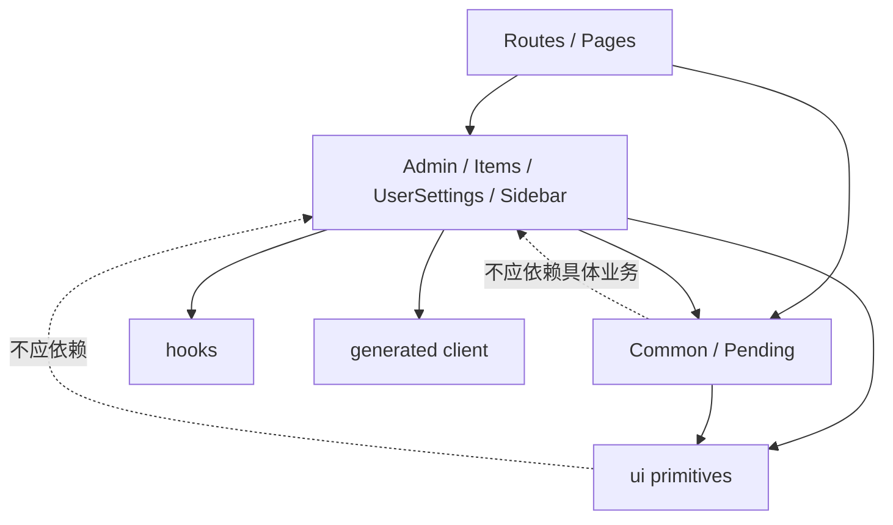

<Callout type="idea" title="目录定位">

`frontend/src/components/` 是 React 界面的主要实现目录。它同时包含业务领域组件、跨页面公共组件、加载状态、侧边栏、用户设置和低层 UI 原语。按职责分目录可以控制依赖方向，并让学习路径更清晰。

</Callout>

## 目录结构

<Files>
  <Folder name="components" defaultOpen>
    <Folder name="Admin"><File name="管理员用户管理" /></Folder>
    <Folder name="Items"><File name="Item CRUD" /></Folder>
    <Folder name="UserSettings"><File name="个人资料、密码与账户删除" /></Folder>
    <Folder name="Sidebar"><File name="应用导航与用户菜单" /></Folder>
    <Folder name="Common"><File name="布局、主题、表格、品牌和错误状态" /></Folder>
    <Folder name="Pending"><File name="结构化加载骨架" /></Folder>
    <Folder name="ui"><File name="shadcn/Base UI 原语" /></Folder>
    <File name="theme-provider.tsx — 全局主题状态" />
  </Folder>
</Files>

## 推荐依赖方向

## 本批次已整理

<Cards>
  <Card href="./Admin" title="Admin">用户管理表格和写操作。</Card>
  <Card href="./Items" title="Items">Item CRUD 与复制交互。</Card>
  <Card href="./Common" title="Common">主题、布局、DataTable 和状态页。</Card>
  <Card href="./Pending" title="Pending">用户与 Item 表格骨架。</Card>
</Cards>

## 后续阅读顺序

<Steps>
  <Step>阅读 `Sidebar/`，理解应用导航、折叠和用户菜单。</Step>
  <Step>阅读 `UserSettings/`，理解当前用户资料、密码和删除账户。</Step>
  <Step>阅读 `ui/`，理解 shadcn 组件如何基于 Base UI/Radix 封装。</Step>
  <Step>阅读 `theme-provider.tsx`，连接 Appearance 与 DOM 主题状态。</Step>
</Steps>

## 组织原则

- 业务目录可以依赖 Common、hooks、client 和 ui，但低层 ui 不应反向依赖业务目录。
- 组件按“页面领域”拆分比按 Button/Form/Table 技术类型拆分更适合业务代码。
- 生成客户端负责传输契约，TanStack Query 负责服务端状态，组件负责交互与呈现。
- 当组件开始同时处理多个不相关变化原因时，再考虑拆分；不要只按代码行数机械切文件。
