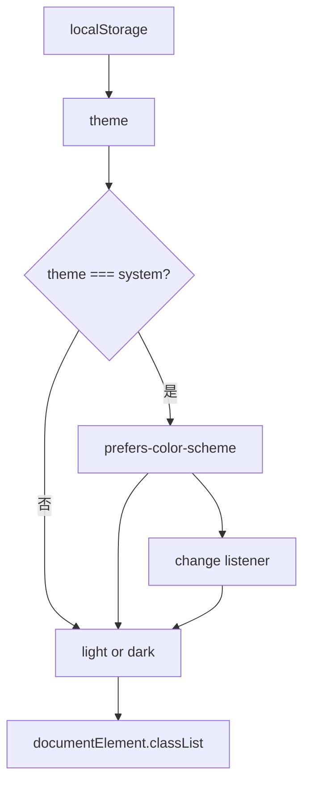

<Callout type="idea" title="文件定位">

该 Provider 把“用户选择的主题”和“当前真正生效的主题”分开保存。`theme` 可能是 `system`，而 `resolvedTheme` 始终是 `light | dark`，便于图标和业务组件直接判断。

</Callout>

## 这个文件负责什么

- 定义 Theme 三态联合类型。
- 从 localStorage 恢复用户偏好。
- 解析 system 为实际明暗主题。
- 更新 `<html>` 的 class。
- 监听系统主题变化。
- 通过 Context 暴露 setTheme。

## 执行思路

1. 初始化时读取 storageKey。
2. `getResolvedTheme` 计算实际主题。
3. Effect 更新根元素 class。
4. system 模式监听 `prefers-color-scheme`。
5. 用户调用 setTheme 后持久化并更新 state。
6. Context 后代收到 theme 与 resolvedTheme。

## 与其他模块的关系

| 模块 | 关系 |
| --- | --- |
| `SidebarAppearance` | 消费 `useTheme()` 切换主题。 |
| `localStorage` | 跨刷新保存偏好。 |
| `matchMedia` | 读取并监听系统主题。 |
| `Tailwind dark variant` | 依赖根元素 `dark` class。 |
| `React Context` | 跨组件树共享状态。 |

## 两层主题模型

| 状态 | 可取值 | 用途 |
| --- | --- | --- |
| `theme` | `light | dark | system` | 用户保存的偏好。 |
| `resolvedTheme` | `light | dark` | 当前屏幕真正生效的主题。 |



<Callout type="info" title="为什么需要 resolvedTheme">

主题选择器可以继续显示“跟随系统”，而组件又能知道当前应该显示太阳还是月亮图标；两者不是同一个状态。

</Callout>

## 带注释源码

> 原始路径：`frontend/src/components/theme-provider.tsx`。以下仅增加学习性注释，不改变程序行为。

```tsx title="theme-provider.tsx" lineNumbers
import {
  createContext,
  useCallback,
  useContext,
  useEffect,
  useState,
} from "react"

// 用户偏好保留 system，实际 DOM 只能解析为 light 或 dark。
export type Theme = "dark" | "light" | "system"

type ThemeProviderProps = {
  children: React.ReactNode
  defaultTheme?: Theme
  storageKey?: string
}

type ThemeProviderState = {
  theme: Theme
  resolvedTheme: "dark" | "light"
  setTheme: (theme: Theme) => void
}

const initialState: ThemeProviderState = {
  theme: "system",
  resolvedTheme: "light",
  setTheme: () => null,
}

// Context 向任意后代暴露原始偏好、解析结果和更新函数。
const ThemeProviderContext = createContext<ThemeProviderState>(initialState)

// Provider 同步 localStorage、系统媒体查询和 <html> class。
export function ThemeProvider({
  children,
  defaultTheme = "system",
  storageKey = "vite-ui-theme",
  ...props
}: ThemeProviderProps) {
  const [theme, setTheme] = useState<Theme>(
    () => (localStorage.getItem(storageKey) as Theme) || defaultTheme,
  )

  // 把三态偏好归一化为可直接渲染的两态主题。
  const getResolvedTheme = useCallback((theme: Theme): "dark" | "light" => {
    if (theme === "system") {
      return window.matchMedia("(prefers-color-scheme: dark)").matches
        ? "dark"
        : "light"
    }
    return theme
  }, [])

  const [resolvedTheme, setResolvedTheme] = useState<"dark" | "light">(() =>
    getResolvedTheme(theme),
  )

  // DOM 主题通过根元素 class 控制 Tailwind dark 变体。
  const updateTheme = useCallback((newTheme: Theme) => {
    const root = window.document.documentElement

    root.classList.remove("light", "dark")

    if (newTheme === "system") {
      const systemTheme = window.matchMedia("(prefers-color-scheme: dark)")
        .matches
        ? "dark"
        : "light"

      root.classList.add(systemTheme)
      return
    }

    root.classList.add(newTheme)
  }, [])

  // 主题变化时更新 DOM；system 模式还要监听操作系统偏好变化。
  useEffect(() => {
    updateTheme(theme)
    setResolvedTheme(getResolvedTheme(theme))

    const mediaQuery = window.matchMedia("(prefers-color-scheme: dark)")

    const handleChange = () => {
      if (theme === "system") {
        updateTheme("system")
        setResolvedTheme(getResolvedTheme("system"))
      }
    }

    mediaQuery.addEventListener("change", handleChange)

    return () => {
      mediaQuery.removeEventListener("change", handleChange)
    }
  }, [theme, updateTheme, getResolvedTheme])

  const value = {
    theme,
    resolvedTheme,
    setTheme: (theme: Theme) => {
      localStorage.setItem(storageKey, theme)
      setTheme(theme)
    },
  }

  return (
    <ThemeProviderContext.Provider {...props} value={value}>
      {children}
    </ThemeProviderContext.Provider>
  )
}

// 消费端 Hook 隐藏 Context 细节，并提供使用位置检查。
export const useTheme = () => {
  const context = useContext(ThemeProviderContext)

  if (context === undefined)
    throw new Error("useTheme must be used within a ThemeProvider")

  return context
}
```

## 阅读重点

- 模块直接读取 localStorage/window，适合纯客户端 Vite；若迁移 SSR 需增加环境保护。
- Context 使用 `initialState` 后永远不会是 undefined，因此当前 useTheme 的错误检查实际上不会触发。
- `setTheme` 函数每次渲染都会新建；通常影响很小，也可 useCallback + useMemo 稳定 value。
- 在页面脚本加载前注入主题 class 可进一步避免首屏闪烁。

## Twoslash：三态偏好解析为两态结果

```ts twoslash
type Theme = 'dark' | 'light' | 'system'
type ResolvedTheme = Exclude<Theme, 'system'>

function resolveTheme(theme: Theme, systemDark: boolean): ResolvedTheme {
  if (theme === 'system') return systemDark ? 'dark' : 'light'
  return theme
}

const current = resolveTheme('system', true)
//    ^?
```
