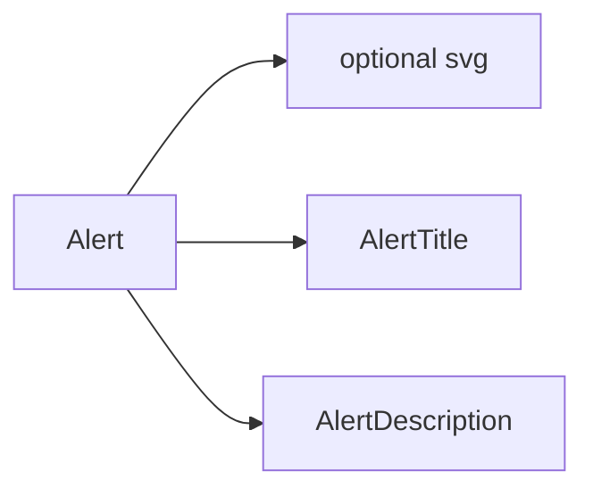

<Callout type="idea" title="文件定位">

Alert 是一个非浮层的状态提示容器。它不管理关闭或生命周期，只提供语义、布局和样式，适合表单错误、页面警告或重要说明。

</Callout>

## 这个文件负责什么

- 提供 default/destructive 变体。
- 支持可选前置图标。
- 用 Grid 对齐图标、标题和描述。
- 暴露 data-slot 便于主题覆盖。
- 保留原生 div 属性。

## 执行思路

1. 调用方选择 variant。
2. CVA 生成根节点类名。
3. 可选 SVG 触发双列 Grid。
4. Title 与 Description 固定落在第二列。

## 与其他模块的关系

| 模块 | 关系 |
| --- | --- |
| `class-variance-authority` | 变体样式。 |
| `cn` | 合并默认类与 className。 |
| `业务表单/页面` | 提供具体消息与图标。 |

## 导出 API

| 导出 | 类型 | 用途 |
| --- | --- | --- |
| `Alert` | `component` | 根容器与 alert 语义。 |
| `AlertTitle` | `component` | 短标题。 |
| `AlertDescription` | `component` | 详细文本。 |

## 组合结构



```tsx title="usage.tsx"
<Alert variant="destructive">
  <AlertTitle>Request failed</AlertTitle>
  <AlertDescription>Please retry later.</AlertDescription>
</Alert>
```

## 带注释源码

> 原始路径：`frontend/src/components/ui/alert.tsx`。以下仅增加学习性注释，不改变程序行为。

```tsx title="alert.tsx" lineNumbers
import * as React from "react"
import { cva, type VariantProps } from "class-variance-authority"

import { cn } from "@/lib/utils"

// CVA 将语义 variant 映射为稳定的 Tailwind 类集合。
const alertVariants = cva(
  "relative w-full rounded-lg border px-4 py-3 text-sm grid has-[>svg]:grid-cols-[calc(var(--spacing)*4)_1fr] grid-cols-[0_1fr] has-[>svg]:gap-x-3 gap-y-0.5 items-start [&>svg]:size-4 [&>svg]:translate-y-0.5 [&>svg]:text-current",
  {
    variants: {
      variant: {
        default: "bg-card text-card-foreground",
        destructive:
          "text-destructive bg-card [&>svg]:text-current *:data-[slot=alert-description]:text-destructive/90",
      },
    },
    defaultVariants: {
      variant: "default",
    },
  }
)

// 根节点使用 role="alert"，使重要动态消息可被辅助技术识别。
function Alert({
  className,
  variant,
  ...props
}: React.ComponentProps<"div"> & VariantProps<typeof alertVariants>) {
  return (
    <div
      data-slot="alert"
      role="alert"
      className={cn(alertVariants({ variant }), className)}
      {...props}
    />
  )
}

// 标题与描述通过 data-slot 和 CSS Grid 对齐可选图标。
function AlertTitle({ className, ...props }: React.ComponentProps<"div">) {
  return (
    <div
      data-slot="alert-title"
      className={cn(
        "col-start-2 line-clamp-1 min-h-4 font-medium tracking-tight",
        className
      )}
      {...props}
    />
  )
}

function AlertDescription({
  className,
  ...props
}: React.ComponentProps<"div">) {
  return (
    <div
      data-slot="alert-description"
      className={cn(
        "text-muted-foreground col-start-2 grid justify-items-start gap-1 text-sm [&_p]:leading-relaxed",
        className
      )}
      {...props}
    />
  )
}

export { Alert, AlertTitle, AlertDescription }
```

## 阅读重点

- `role="alert"` 会让动态插入内容较强势地播报，普通静态说明可考虑 status 或无 role。
- Title 使用 line-clamp-1，长标题会截断。
- destructive 只表达视觉和语义，不自动绑定错误对象。
- data-slot 是样式扩展点，不应作为业务数据选择器。
