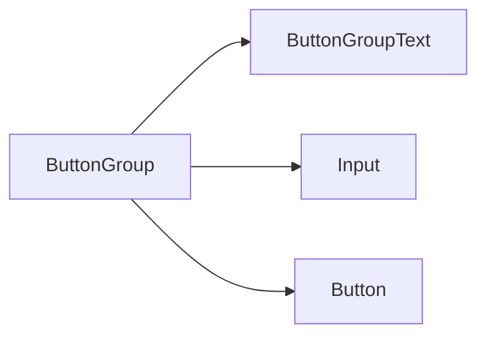

<Callout type="idea" title="文件定位">

ButtonGroup 负责相邻控件的边框、圆角和焦点层级协调。它不管理选中状态，只表达“这些控件在视觉和语义上属于同一组”。

</Callout>

## 这个文件负责什么

- 支持 horizontal/vertical 方向。
- 合并相邻控件圆角。
- 消除重复边框。
- 保证 focus-visible 元素位于上层。
- 提供文本前缀与分隔线。

## 执行思路

1. Group 选择 orientation。
2. CVA 为子元素应用位置选择器。
3. 聚焦的子元素提高 z-index。
4. Text/Separator 补充非按钮内容。

## 与其他模块的关系

| 模块 | 关系 |
| --- | --- |
| `Button/Input/Select` | 可组合的交互控件。 |
| `Separator` | 组内分隔。 |
| `CVA` | 方向变体。 |
| `Radix Slot` | ButtonGroupText 多态渲染。 |

## 导出 API

| 导出 | 类型 | 用途 |
| --- | --- | --- |
| `ButtonGroup` | `component` | 组容器。 |
| `ButtonGroupText` | `component` | 文本、图标或前后缀。 |
| `ButtonGroupSeparator` | `component` | 组内分隔线。 |
| `buttonGroupVariants` | `style factory` | 方向样式生成器。 |

## 组合结构

```tsx title="usage.tsx"
<ButtonGroup>
  <ButtonGroupText>https://</ButtonGroupText>
  <Input aria-label="Domain" />
  <Button>Copy</Button>
</ButtonGroup>
```



## 带注释源码

> 原始路径：`frontend/src/components/ui/button-group.tsx`。以下仅增加学习性注释，不改变程序行为。

```tsx title="button-group.tsx" lineNumbers
import { Slot } from "@radix-ui/react-slot"
import { cva, type VariantProps } from "class-variance-authority"

import { cn } from "@/lib/utils"
import { Separator } from "@/components/ui/separator"

// orientation 决定相邻控件如何去除重复圆角和边框。
const buttonGroupVariants = cva(
  "flex w-fit items-stretch [&>*]:focus-visible:z-10 [&>*]:focus-visible:relative [&>[data-slot=select-trigger]:not([class*='w-'])]:w-fit [&>input]:flex-1 has-[select[aria-hidden=true]:last-child]:[&>[data-slot=select-trigger]:last-of-type]:rounded-r-md has-[>[data-slot=button-group]]:gap-2",
  {
    variants: {
      orientation: {
        horizontal:
          "[&>*:not(:first-child)]:rounded-l-none [&>*:not(:first-child)]:border-l-0 [&>*:not(:last-child)]:rounded-r-none",
        vertical:
          "flex-col [&>*:not(:first-child)]:rounded-t-none [&>*:not(:first-child)]:border-t-0 [&>*:not(:last-child)]:rounded-b-none",
      },
    },
    defaultVariants: {
      orientation: "horizontal",
    },
  }
)

// role="group" 为一组相关控件提供语义容器。
function ButtonGroup({
  className,
  orientation,
  ...props
}: React.ComponentProps<"div"> & VariantProps<typeof buttonGroupVariants>) {
  return (
    <div
      role="group"
      data-slot="button-group"
      data-orientation={orientation}
      className={cn(buttonGroupVariants({ orientation }), className)}
      {...props}
    />
  )
}

// Text 可作为前后缀，也可用 asChild 复用其他元素语义。
function ButtonGroupText({
  className,
  asChild = false,
  ...props
}: React.ComponentProps<"div"> & {
  asChild?: boolean
}) {
  const Comp = asChild ? Slot : "div"

  return (
    <Comp
      className={cn(
        "bg-muted flex items-center gap-2 rounded-md border px-4 text-sm font-medium shadow-xs [&_svg]:pointer-events-none [&_svg:not([class*='size-'])]:size-4",
        className
      )}
      {...props}
    />
  )
}

// 分隔线强制贴合组高，避免默认 margin 破坏连续边界。
function ButtonGroupSeparator({
  className,
  orientation = "vertical",
  ...props
}: React.ComponentProps<typeof Separator>) {
  return (
    <Separator
      data-slot="button-group-separator"
      orientation={orientation}
      className={cn(
        "bg-input relative !m-0 self-stretch data-[orientation=vertical]:h-auto",
        className
      )}
      {...props}
    />
  )
}

export {
  ButtonGroup,
  ButtonGroupSeparator,
  ButtonGroupText,
  buttonGroupVariants,
}
```

## 阅读重点

- 视觉成组不等于表单字段关联，必要时还应使用 fieldset/legend 或 aria-label。
- 子元素顺序会影响圆角选择器。
- focus-visible 提升层级可避免焦点环被相邻控件遮挡。
- 垂直模式会去除相邻上边框而不是左边框。
